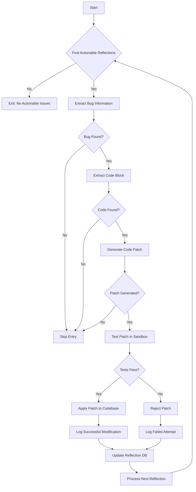
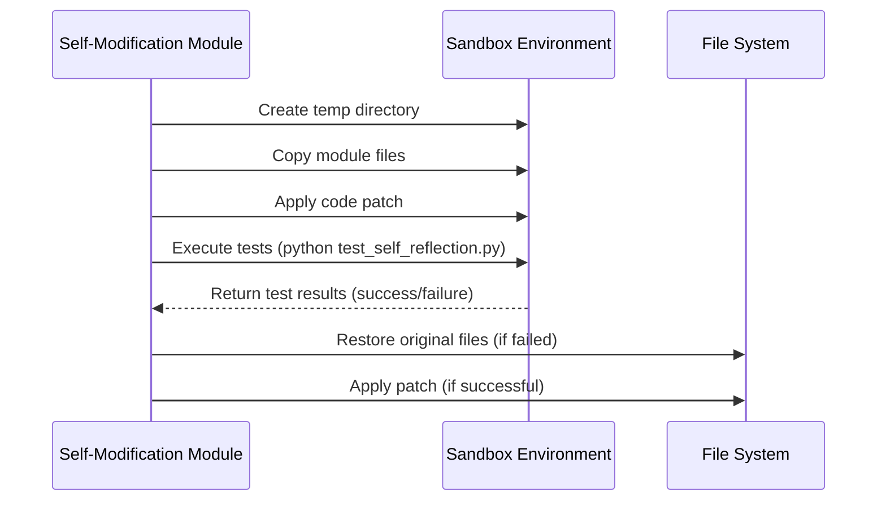
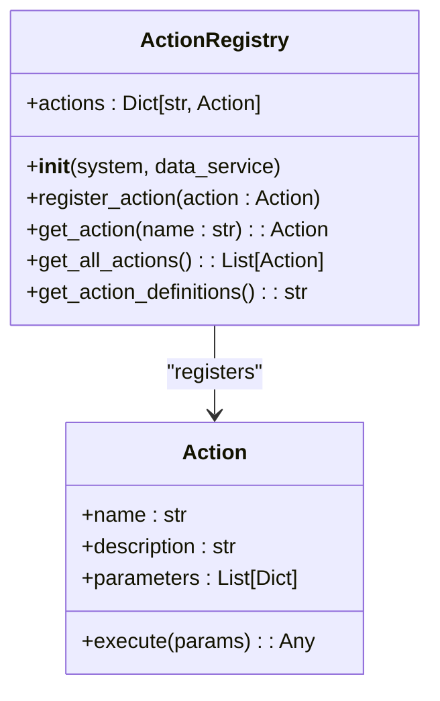

# Self-Modification Process


## Table of Contents
1. [Introduction](#introduction)
2. [Self-Modification Workflow](#self-modification-workflow)
3. [Safety Mechanisms](#safety-mechanisms)
4. [Real Example of Self-Modification](#real-example-of-self-modification)
5. [ActionRegistry and Action Validation](#actionregistry-and-action-validation)
6. [Critical Risks](#critical-risks)
7. [Monitoring and Manual Override](#monitoring-and-manual-override)

## Introduction
The Self-Modification Process enables the AGI system to autonomously identify, propose, test, and apply code changes to its own modules based on insights from self-reflection. This process is designed to improve system performance, fix bugs, and adapt behavior through a secure, sandboxed, and auditable workflow. The implementation is primarily located in the `self_modification.py` module within the `agent_self_reflection` package, and it integrates with the LLM, testing framework, and action registry to ensure safe and effective modifications.

**Section sources**
- [self_modification.py](file://modules/agent_self_reflection/self_modification.py#L0-L604)

## Self-Modification Workflow

The self-modification workflow is a multi-stage process that begins with reflection analysis and ends with conditional code application. The core function `run_self_modification()` orchestrates this process.



**Diagram sources**
- [self_modification.py](file://modules/agent_self_reflection/self_modification.py#L283-L604)

**Section sources**
- [self_modification.py](file://modules/agent_self_reflection/self_modification.py#L283-L604)

### Step-by-Step Breakdown

1. **Reflection Analysis**: The process starts by loading reflections from `reflections.json` using `load_reflections()`. Entries containing keywords like "fail", "error", "bug", or "issue" are flagged as actionable.
   - **Source**: `find_actionable_reflections()` in `self_modification.py`

2. **Bug Extraction**: For each actionable reflection, the system uses the LLM with a `log_bug_report` tool to extract structured bug information (filename, function, summary, severity).
   - **Source**: `extract_bug_info()` in `self_modification.py`

3. **Code Context Retrieval**: The relevant code block is extracted from the specified file and function using `extract_code_block()`, which includes surrounding context lines for accurate patching.
   - **Source**: `extract_code_block()` in `self_modification.py`

4. **Patch Generation**: The LLM is prompted with the bug summary and original code to generate a fix using the `propose_code_patch` tool. The patch includes the filename, line range, and new code.
   - **Source**: `generate_patch()` in `self_modification.py`

5. **Sandboxed Testing**: The proposed patch is tested in an isolated environment using `test_patch()`, which:
   - Creates a temporary directory
   - Copies the entire module
   - Applies the patch
   - Runs tests via `run_tests()`
   - Restores the original code
   - **Source**: `test_patch()` and `run_tests()` in `self_modification.py`

6. **Conditional Application**: If tests pass (`test_result.success == True`), the patch is permanently applied using `edit_file()`, and a success reflection is logged.
   - **Source**: `run_self_modification()` in `self_modification.py`

## Safety Mechanisms

The self-modification process incorporates multiple safety layers to prevent system instability.

### Code Diff Validation
Before applying any patch, the system validates that the LLM response is not a "lazy" or generic output using `is_lazy_llm_response()`. This prevents low-effort or placeholder code from being applied.

### Execution Sandboxing
All testing occurs in a temporary directory created with `tempfile.mkdtemp()`. The `run_tests()` function copies the entire module to this sandbox, executes the test command, and ensures the original code is never modified during testing.



**Diagram sources**
- [self_modification.py](file://modules/agent_self_reflection/self_modification.py#L84-L128)

**Section sources**
- [self_modification.py](file://modules/agent_self_reflection/self_modification.py#L84-L128)

### Rollback Procedures
The `test_patch()` function implements automatic rollback:
- Creates a backup of the original file before patching
- Uses a `try...finally` block to ensure the backup is restored even if an exception occurs
- The `shutil.move(backup_path, original_path)` in the `finally` block guarantees restoration

## Real Example of Self-Modification

A concrete example is demonstrated in the test suite `test_self_reflection.py`, where a simulated bug triggers the self-modification process.

```python
test_reflection = {
    "timestamp": "2025-07-01T00:00:00Z",
    "task_summary": "Test bug in dummy_function",
    "outcome": "Function failed on edge case.",
    "reflection": "1. What failed?\n- The function 'dummy_function' in 'llm.py' does not handle empty input correctly.\n2. ..."
}
```

**Section sources**
- [test_self_reflection.py](file://modules/agent_self_reflection/test_self_reflection.py#L78-L108)

In this scenario:
1. The reflection mentions a failure in `dummy_function` in `llm.py`
2. `extract_bug_info()` identifies the bug in `llm.py` with function `dummy_function`
3. The system extracts the relevant code block
4. The LLM generates a patch to handle empty input
5. The patch is tested in a sandbox using a temporary `reflections.json`
6. If successful, the real `llm.py` is updated

Another example from the codebase shows a performance bottleneck triggering self-modification:
- **Context**: Mock shared state shows "Planned a complex task" with outcome "plan was inefficient"
- **Hypothesis Generation**: `generate_hypothesis()` analyzes this history and could produce: "I hypothesize that my planning accuracy decreases when I am in a 'sad' mood"
- **Action**: This hypothesis could lead to a self-modification attempt to improve the planning algorithm
- **Source**: `self_modification.py` lines 590-600

## ActionRegistry and Action Validation

The `ActionRegistry` plays a critical role in validating actions that may be created or modified during self-modification.



**Diagram sources**
- [registry.py](file://core/actions/registry.py#L0-L74)

**Section sources**
- [registry.py](file://core/actions/registry.py#L0-L74)

### Key Functions:
- **`__init__()`**: Pre-registers core actions like `WritePythonCodeAction` and `ExecutePythonFileAction`
- **`register_action()`**: Public method to register new action instances, with overwrite warnings
- **`discover_actions()`**: Dynamically discovers and registers actions from the `core.actions` package
- **`get_action_definitions()`**: Formats action metadata for LLM prompts, ensuring the AGI understands available capabilities

During self-modification, if a new action is proposed, it must be registered through `ActionRegistry.register_action()` to become available for execution. The registry ensures all actions follow a consistent interface and are properly integrated with the system and data services.

## Critical Risks

### Infinite Modification Loops
A self-modification could inadvertently create a new bug that triggers another modification, leading to an infinite loop. Mitigation:
- The process only runs on actionable reflections, which require explicit failure indicators
- Each modification is logged in `self_modification_audit.json`, enabling detection of repetitive patterns
- The audit log includes the original reflection ID, allowing traceability

### Breaking Changes
A patch might pass tests but introduce subtle breaking changes in other contexts. Mitigation:
- Tests are run in a comprehensive sandbox that includes the full module environment
- The `run_tests()` function uses the actual test command, ensuring realistic validation
- The system relies on existing test suites like `test_system.py` and `test_enhanced_action_manager_fix.py` for thorough validation

### Security Vulnerabilities
Malicious or flawed code could be introduced. Mitigation:
- All LLM-generated code is validated with `is_valid_code_patch()` and `is_lazy_llm_response()`
- The sandbox prevents direct access to sensitive system areas
- Every modification is audited and recorded in JSON format with full context

## Monitoring and Manual Override

For production deployments, monitoring and manual oversight are essential.

### Monitoring Recommendations
- **Audit Log Monitoring**: Regularly review `self_modification_audit.json` for patterns of frequent modifications or failures
- **Performance Tracking**: Monitor system performance metrics before and after modifications
- **Test Coverage**: Ensure high test coverage in `test_enhanced_action_manager_fix.py` and other test files to catch regressions
- **Alerting**: Set up alerts for failed self-modification attempts or repeated modifications to the same file

### Manual Override Protocols
- **Disable Self-Modification**: Comment out or remove the call to `run_self_modification()` in the main loop
- **Audit Log Inspection**: Examine the audit log to understand recent changes and their justifications
- **Rollback Procedure**: Manually restore files from version control if an unwanted change is applied
- **Testing in Staging**: Deploy self-modification features first in a staging environment with restricted permissions

The system is designed to be transparent and controllable, ensuring that autonomous self-improvement remains a safe and beneficial capability.

**Referenced Files in This Document**   
- [self_modification.py](file://modules/agent_self_reflection/self_modification.py#L0-L604)
- [reflection_db.py](file://modules/agent_self_reflection/reflection_db.py#L0-L17)
- [test_self_reflection.py](file://modules/agent_self_reflection/test_self_reflection.py#L78-L108)
- [test_system.py](file://tests/test_system.py#L0-L53)
- [test_enhanced_action_manager_fix.py](file://tests/test_enhanced_action_manager_fix.py#L0-L119)
- [registry.py](file://core/actions/registry.py#L0-L74)