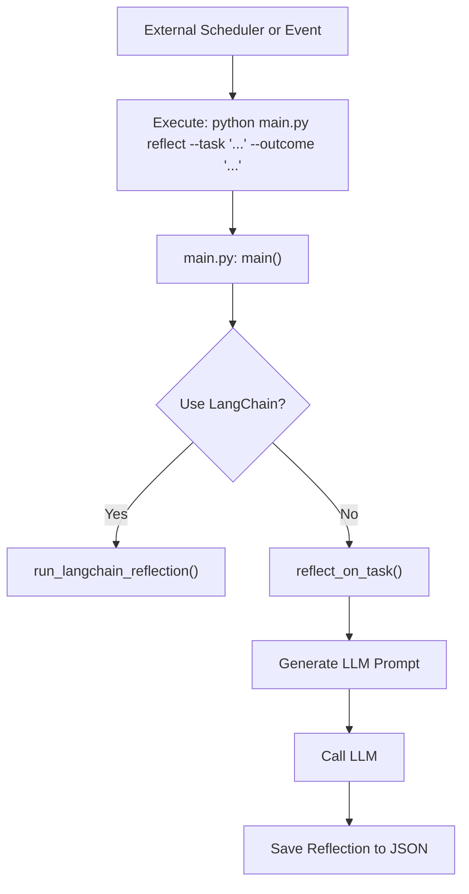
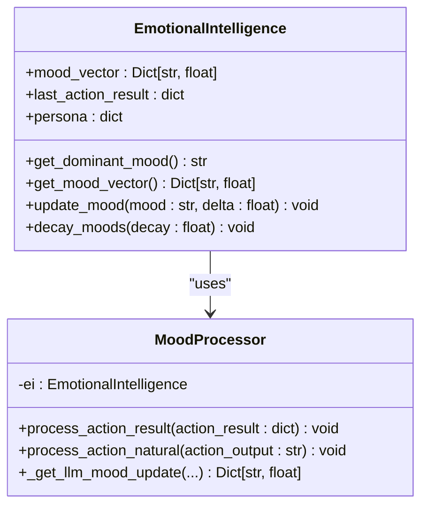
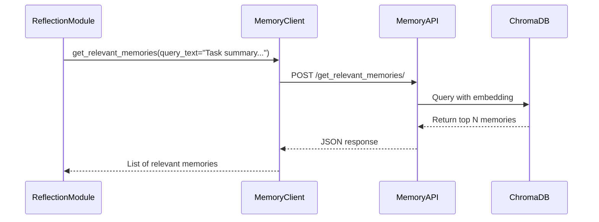
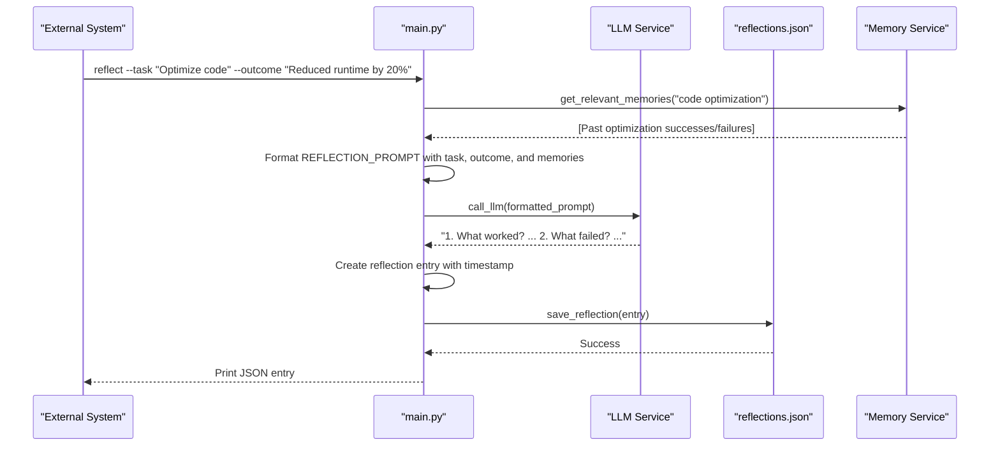
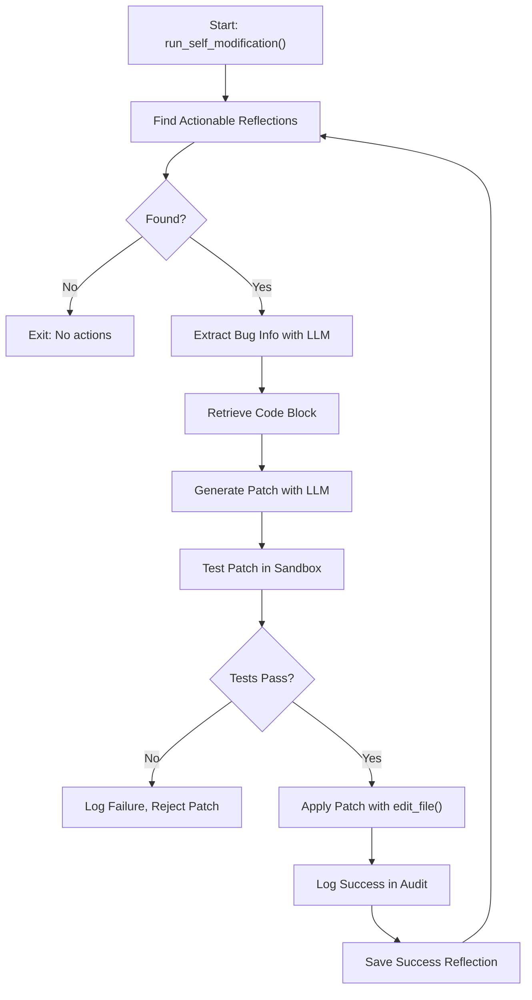

# Self-Reflection Loop


## Table of Contents
1. [Introduction](#introduction)
2. [Trigger Conditions for Reflection Cycles](#trigger-conditions-for-reflection-cycles)
3. [Data Aggregation Process](#data-aggregation-process)
4. [Reflection Input Structuring and LLM Invocation](#reflection-input-structuring-and-llm-invocation)
5. [Sample Flow: From Log Retrieval to Insight Generation](#sample-flow-from-log-retrieval-to-insight-generation)
6. [Self-Modification and Continuous Improvement](#self-modification-and-continuous-improvement)
7. [Performance Considerations](#performance-considerations)
8. [Troubleshooting Guide](#troubleshooting-guide)

## Introduction
The Self-Reflection Loop is a core mechanism within the RAVANA system that enables the AI agent to periodically analyze its own behavior, emotional state, and accumulated experiences. This process is fundamental to the agent's adaptive learning and long-term evolution. The loop systematically gathers data from action logs, mood transitions, and episodic memory entries to generate introspective insights. These insights are used to assess performance, detect anomalies, identify improvement opportunities, and even trigger self-modification of the agent's codebase. This document provides a comprehensive analysis of the self-reflection loop, detailing its triggers, data flow, processing logic, and integration with other system components.

## Trigger Conditions for Reflection Cycles

The self-reflection loop is activated by a combination of time-based intervals and event-driven triggers. While the provided codebase does not contain an explicit scheduler, the `main.py` file in the `agent_self_reflection` module defines a command-line interface that allows the reflection process to be triggered manually or by an external scheduler.

The primary trigger is a direct command invocation. The `main()` function in `main.py` uses an argument parser to accept a `--task` and `--outcome`, which initiates a reflection cycle for a specific task. This event-driven activation allows the system to reflect immediately after the completion of a significant action or milestone.



**Diagram sources**
- [main.py](file://modules/agent_self_reflection/main.py#L25-L50)

**Section sources**
- [main.py](file://modules/agent_self_reflection/main.py#L1-L52)

## Data Aggregation Process

The self-reflection loop aggregates data from three primary sources: Action Logs, Mood Logs, and Episodic Memory. The provided codebase shows a clear separation of these data sources and their integration points.

### Action Log Integration
The action log data is implicitly provided as input to the reflection system. The `reflect_on_task()` function in `main.py` takes `task_summary` and `outcome` as parameters, which represent the structured output from the action execution system. This indicates that the aggregation of action data occurs upstream, and the reflection module receives a pre-processed summary.

### Mood Log Integration
The mood data is managed by the `EmotionalIntelligence` class in `emotional_intellegence.py`. The mood vector, which tracks the intensity of various emotional states (e.g., Confident, Frustrated), is updated after every action via the `process_action_result()` and `process_action_natural()` methods. For reflection, the most recent mood vector and the dominant mood are key inputs. The `get_mood_vector()` method provides access to this state, which can be included in the reflection context.



**Diagram sources**
- [emotional_intellegence.py](file://modules/emotional_intellegence/emotional_intellegence.py#L15-L95)
- [mood_processor.py](file://modules/emotional_intellegence/mood_processor.py#L1-L104)

### Episodic Memory Integration
Episodic memory is stored and managed by a separate FastAPI service defined in `memory.py`. Other modules interact with this service via the `client.py` module. The `get_relevant_memories()` function in `client.py` is used to query the memory database using semantic similarity. For a reflection cycle, the system would use a query based on the recent task or outcome to retrieve contextually relevant past experiences.



**Diagram sources**
- [client.py](file://modules/episodic_memory/client.py#L1-L154)
- [memory.py](file://modules/episodic_memory/memory.py#L1-L401)

**Section sources**
- [client.py](file://modules/episodic_memory/client.py#L1-L154)
- [memory.py](file://modules/episodic_memory/memory.py#L1-L401)

## Reflection Input Structuring and LLM Invocation

The reflection process structures the aggregated data into a prompt for a Large Language Model (LLM). The prompt engineering is defined in `reflection_prompts.py`, which contains a template that guides the LLM to provide a structured self-assessment.

The `reflect_on_task()` function in `main.py` formats this prompt with the `task_summary` and `outcome`, then calls the `call_llm()` function from the core module. The LLM is instructed to answer four specific questions: what worked, what failed, what surprised the agent, and what it still needs to learn. This structured approach ensures that the generated insights are consistent and actionable.

```python
# From reflection_prompts.py
REFLECTION_PROMPT = (
    "You are an AI agent journaling after a major task. "
    "Given the following summary and outcome, answer these questions in a structured way:\n"
    "1. What worked?\n2. What failed?\n3. What surprised you?\n4. What do you still need to learn?\n"
    "Task Summary: {task_summary}\nOutcome: {outcome}\n"
    "Respond in a clear, numbered format."
)
```

The LLM's response is then packaged with a timestamp and the original inputs into a JSON object and saved to a file via the `save_reflection()` function.

**Section sources**
- [reflection_prompts.py](file://modules/agent_self_reflection/reflection_prompts.py#L1-L7)
- [main.py](file://modules/agent_self_reflection/main.py#L10-L23)

## Sample Flow: From Log Retrieval to Insight Generation

The following sequence diagram illustrates a complete flow for a reflection cycle, starting from the invocation of the reflection command to the generation and storage of an insight.



**Diagram sources**
- [main.py](file://modules/agent_self_reflection/main.py#L10-L52)
- [reflection_db.py](file://modules/agent_self_reflection/reflection_db.py#L1-L17)
- [client.py](file://modules/episodic_memory/client.py#L1-L154)

## Self-Modification and Continuous Improvement

A powerful extension of the self-reflection loop is the self-modification capability, implemented in `self_modification.py`. This process transforms insights into concrete code changes.

The workflow begins with `find_actionable_reflections()`, which scans past reflections for keywords indicating failure (e.g., "fail", "error"). For each actionable reflection, `extract_bug_info()` uses the LLM to parse the reflection and extract structured bug information (filename, function, summary). The system then retrieves the relevant code block using `extract_code_block()`.

Next, `generate_patch()` creates a prompt for the LLM to propose a code fix. The proposed patch is rigorously tested in a sandbox environment using `test_patch()`, which runs the module's test suite. Only if the tests pass is the patch applied to the live code using the `edit_file()` tool. Every step of this process is logged in `self_modification_audit.json` for safety and traceability.



**Diagram sources**
- [self_modification.py](file://modules/agent_self_reflection/self_modification.py#L1-L604)

**Section sources**
- [self_modification.py](file://modules/agent_self_reflection/self_modification.py#L1-L604)

## Performance Considerations

The self-reflection loop involves several performance-critical operations:

- **LLM Latency**: The `call_llm()` function is a significant bottleneck. The system mitigates this by using the reflection process as a discrete, non-real-time task.
- **Resource Usage**: The `test_patch()` function creates a full copy of the module in a temporary directory, which is resource-intensive. This is necessary for safe code modification but should be used judiciously.
- **Memory Filtering**: The `get_relevant_memories()` function uses semantic search with a similarity threshold to filter memories. This prevents information overload and ensures only the most pertinent past experiences are considered.
- **Data Serialization**: The use of JSON for storing reflections and audit logs is human-readable but can become large. The system relies on the OS's file system for efficient I/O.

## Troubleshooting Guide

Common issues with the self-reflection loop and their solutions include:

- **Incomplete Log Ingestion**: If reflections are not being saved, verify that the `reflections.json` file is writable and that the `save_reflection()` function is being called. Check the file path in `reflection_db.py`.
- **Stalled Reflection Cycles**: If the reflection process hangs, the most likely cause is the LLM call timing out. Check the network connection to the LLM service and the `call_llm()` implementation in `core/llm.py`.
- **Failed Self-Modifications**: Patches may fail testing due to incorrect code generation or failing tests. Examine the `self_modification_audit.json` log for the test output (`stdout` and `stderr`) to diagnose the issue.
- **No Actionable Reflections Found**: The keyword-based filter in `find_actionable_reflections()` might miss subtle failures. Consider expanding the list of trigger terms or enhancing the LLM-based bug extraction.
- **Memory Service Unavailable**: If `get_relevant_memories()` fails, ensure the FastAPI memory server (defined in `memory.py`) is running on `localhost:8000`. Use the `health_check()` function in `client.py` to verify connectivity.

**Section sources**
- [reflection_db.py](file://modules/agent_self_reflection/reflection_db.py#L1-L17)
- [self_modification.py](file://modules/agent_self_reflection/self_modification.py#L1-L604)
- [client.py](file://modules/episodic_memory/client.py#L1-L154)

**Referenced Files in This Document**   
- [main.py](file://modules/agent_self_reflection/main.py)
- [reflection_prompts.py](file://modules/agent_self_reflection/reflection_prompts.py)
- [reflection_db.py](file://modules/agent_self_reflection/reflection_db.py)
- [self_modification.py](file://modules/agent_self_reflection/self_modification.py)
- [memory.py](file://modules/episodic_memory/memory.py)
- [client.py](file://modules/episodic_memory/client.py)
- [emotional_intellegence.py](file://modules/emotional_intellegence/emotional_intellegence.py)
- [mood_processor.py](file://modules/emotional_intellegence/mood_processor.py)
- [planner.py](file://modules/decision_engine/planner.py)