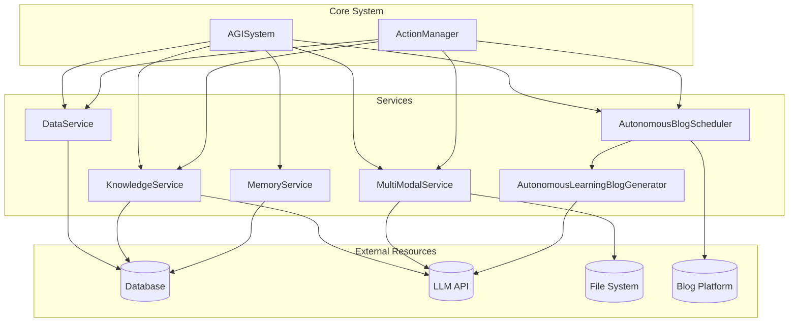

# Services


## Update Summary
**Changes Made**   
- Added new section for AutonomousBlogScheduler service
- Added new section for AutonomousLearningBlogGenerator service
- Updated Service Overview to include new blog-related services
- Added new architectural diagram showing blog service integration
- Updated Service Integration and Coordination section with blog service workflows
- Added configuration details for blog services

## Table of Contents
1. [Introduction](#introduction)
2. [Service Overview](#service-overview)
3. [DataService](#dataservice)
4. [KnowledgeService](#knowledgeservice)
5. [MemoryService](#memoryservice)
6. [MultiModalService](#multimodalservice)
7. [AutonomousBlogScheduler](#autonomousblogscheduler)
8. [AutonomousLearningBlogGenerator](#autonomouslearningbloggenerator)
9. [Service Integration and Coordination](#service-integration-and-coordination)
10. [Error Handling and Logging](#error-handling-and-logging)
11. [Performance and Caching](#performance-and-caching)
12. [Extending Services](#extending-services)

## Introduction

The services layer in the Ravana AGI system provides a critical abstraction between the core system components and external resources such as databases, APIs, and file systems. These services encapsulate business logic and provide a uniform interface for data access, knowledge management, memory operations, multi-modal processing, and autonomous blogging. This document details the purpose, interfaces, and implementation of each service, explaining how they coordinate with the database and LLM components to support the autonomous operation of the AGI.

**Section sources**
- [DEVELOPER_GUIDE.md](file://DEVELOPER_GUIDE.md#L148-L173)

## Service Overview

The Ravana AGI system implements six primary services that handle different aspects of data and resource management:

- **DataService**: Manages database interactions for logging and data ingestion
- **KnowledgeService**: Handles knowledge compression, storage, and retrieval
- **MemoryService**: Provides access to the agent's episodic memory system
- **MultiModalService**: Processes image, audio, and cross-modal content
- **AutonomousBlogScheduler**: Manages autonomous blog posting triggers based on learning events
- **AutonomousLearningBlogGenerator**: Specialized generator for creating thoughtful, introspective blog posts about learning experiences

These services are designed to be loosely coupled, allowing for independent development and replacement. They provide a clean API that abstracts away the complexity of underlying resources, enabling the core system and modules to interact with external systems through a consistent interface.



**Diagram sources**
- [services/data_service.py](file://services/data_service.py)
- [services/knowledge_service.py](file://services/knowledge_service.py)
- [services/memory_service.py](file://services/memory_service.py)
- [services/multi_modal_service.py](file://services/multi_modal_service.py)
- [core/services/autonomous_blog_scheduler.py](file://core/services/autonomous_blog_scheduler.py)
- [core/services/autonomous_learning_blog_generator.py](file://core/services/autonomous_learning_blog_generator.py)

**Section sources**
- [DEVELOPER_GUIDE.md](file://DEVELOPER_GUIDE.md#L148-L173)

## DataService

The DataService is responsible for all interactions with the database for logging and data ingestion. It provides a centralized interface for storing and retrieving operational data, ensuring consistent data handling across the system.

### Purpose and Functionality

The DataService serves as the primary gateway to the database, handling:

- Ingestion of articles from RSS feeds
- Detection and storage of events from processed data
- Logging of system activities including actions, moods, situations, decisions, and experiments

This service abstracts the database operations, allowing other components to log information without direct knowledge of the database schema or connection details.

### Interface and Methods

```python
class DataService:
    def __init__(self, engine, feed_urls: List[str], embedding_model=None, sentiment_classifier=None)
    def fetch_and_save_articles(self) -> int
    def detect_and_save_events(self) -> int
    def save_action_log(self, action_name: str, params: dict, status: str, result: any)
    def save_mood_log(self, mood_vector: dict)
    def save_situation_log(self, situation: dict) -> int
    def save_decision_log(self, situation_id: int, raw_response: str)
    def save_experiment_log(self, hypothesis: str, *args: Any) -> None
```

#### Method Details

- **fetch_and_save_articles**: Fetches articles from configured RSS feeds and saves new articles to the database. Returns the count of new articles saved.
- **detect_and_save_events**: Analyzes recent articles to detect events using embedding and sentiment analysis, then saves identified events to the database.
- **save_action_log**: Records details of executed actions, including parameters and results, for auditing and analysis.
- **save_mood_log**: Stores the current mood vector of the AGI, capturing its emotional state over time.
- **save_situation_log**: Persists generated situations and returns the assigned ID for reference.
- **save_decision_log**: Records decisions made by the AGI in response to specific situations.
- **save_experiment_log**: Stores experiment results with flexible parameter handling for different calling conventions.

### Data Contracts

The DataService interacts with the following database models defined in `database/models.py`:

``mermaid
erDiagram
ARTICLE ||--o{ EVENT : "triggers"
ARTICLE {
int id PK
string title
string link UK
string published
string source
string fetched_at
}
EVENT {
int id PK
string timestamp
string description
string keywords
int cluster_id
}
ACTIONLOG {
int id PK
string timestamp
string action_name
string params
string status
string result
}
MOODLOG {
int id PK
string timestamp
string mood_vector
}
SITUATIONLOG {
int id PK
string timestamp
string situation_type
string prompt
string context
}
DECISIONLOG {
int id PK
string timestamp
int situation_id FK
string raw_response
}
EXPERIMENTLOG {
int id PK
string timestamp
string hypothesis
string results
}
```

**Diagram sources**
- [database/models.py](file://database/models.py#L0-L56)
- [services/data_service.py](file://services/data_service.py#L0-L155)

**Section sources**
- [services/data_service.py](file://services/data_service.py#L0-L155)
- [database/models.py](file://database/models.py#L0-L56)

## KnowledgeService

The KnowledgeService is responsible for managing the AGI's knowledge base, providing capabilities for knowledge compression, storage, retrieval, and semantic search.

### Purpose and Functionality

This service enables long-term learning and reasoning by:

- Compressing and summarizing information for efficient storage
- Preventing duplicate knowledge entries through content hashing
- Providing multiple retrieval methods (by category, recency, and search)
- Implementing semantic search using vector embeddings and FAISS indexing

The KnowledgeService transforms raw information into a compact, organized knowledge base that supports efficient querying and analysis.

### Interface and Methods

```python
class KnowledgeService:
    def __init__(self, engine, embedding_model=None)
    def add_knowledge(self, content: str, source: str = "unknown", category: str = "misc") -> dict
    def get_knowledge_by_category(self, category: str, limit: int = 10) -> List[dict]
    def get_recent_knowledge(self, hours: int = 24, limit: int = 20) -> List[dict]
    def search_knowledge(self, query: str, limit: int = 10) -> List[dict]
```

#### Method Details

- **add_knowledge**: Adds new knowledge by summarizing content and storing it with metadata. Uses content hashing to prevent duplicates and returns a summary dict with metadata.
- **get_knowledge_by_category**: Retrieves knowledge entries filtered by category, enabling organized access to domain-specific information.
- **get_recent_knowledge**: Gets knowledge entries from a specified time window, supporting temporal analysis of learning.
- **search_knowledge**: Performs text-based search within knowledge summaries, with optional relevance scoring.

### Data Contracts

The KnowledgeService primarily interacts with the Summary model:

``mermaid
erDiagram
SUMMARY {
int id PK
string timestamp
string summary_text
string source
string category
string content_hash UK
}
```

The service also manages a FAISS vector index for semantic search, stored in external files:
- `knowledge_index.faiss`: The FAISS index file
- `knowledge_id_map.pkl`: Pickle file mapping index positions to database IDs

**Diagram sources**
- [database/models.py](file://database/models.py#L15-L21)
- [services/knowledge_service.py](file://services/knowledge_service.py#L0-L199)

**Section sources**
- [services/knowledge_service.py](file://services/knowledge_service.py#L0-L199)
- [database/models.py](file://database/models.py#L15-L21)

## MemoryService

The MemoryService provides an asynchronous interface to the agent's episodic memory system, enabling the storage and retrieval of personal experiences and interactions.

### Purpose and Functionality

This service facilitates the AGI's ability to:

- Retrieve relevant memories based on semantic similarity to a query
- Save new memories extracted from interactions
- Extract key information from conversations to form new memories
- Consolidate and refine memories over time to optimize retrieval

The MemoryService acts as a bridge between the main AGI process and the separate memory database service, handling the asynchronous communication required for non-blocking operation.

### Interface and Methods

```python
class MemoryService:
    async def get_relevant_memories(self, query_text: str) -> dict
    async def save_memories(self, memories) -> None
    async def extract_memories(self, user_input: str, ai_output: str) -> dict
    async def consolidate_memories(self) -> dict
```

#### Method Details

- **get_relevant_memories**: Asynchronously queries the memory database for memories relevant to a given text query, using vector similarity.
- **save_memories**: Asynchronously saves a list of memory strings to the memory database.
- **extract_memories**: Extracts key memories from a user-AI interaction by calling an LLM-powered extraction service.
- **consolidate_memories**: Triggers a consolidation process that combines related memories to reduce redundancy and improve organization.

### Data Contracts

The MemoryService interacts with a ChromaDB collection for memory storage, with the following schema:

``mermaid
erDiagram
MEMORY {
string id PK
string text
string created_at
string last_accessed
int access_count
string type
}
```

Each memory record includes metadata such as creation time, access statistics, and type classification.

**Diagram sources**
- [modules/episodic_memory/memory.py](file://modules/episodic_memory/memory.py#L359-L390)
- [services/memory_service.py](file://services/memory_service.py#L0-L20)

**Section sources**
- [services/memory_service.py](file://services/memory_service.py#L0-L20)
- [modules/episodic_memory/memory.py](file://modules/episodic_memory/memory.py#L359-L390)

## MultiModalService

The MultiModalService handles the processing of image, audio, and cross-modal content, enabling the AGI to analyze and understand multi-modal inputs.

### Purpose and Functionality

This service extends the AGI's perception capabilities by:

- Processing image files to generate detailed descriptions
- Analyzing audio files to produce content summaries
- Performing cross-modal analysis on multiple content types
- Generating comprehensive summaries of processed content

The MultiModalService leverages external LLM APIs (specifically Gemini) to interpret visual and auditory content, transforming it into textual representations that can be integrated into the AGI's knowledge and memory systems.

### Interface and Methods

```python
class MultiModalService:
    def __init__(self)
    async def process_image(self, image_path: str, prompt: str = "Analyze this image in detail") -> Dict[str, Any]
    async def process_audio(self, audio_path: str, prompt: str = "Describe and analyze this audio") -> Dict[str, Any]
    async def cross_modal_analysis(self, content_list: List[Dict[str, Any]], analysis_prompt: str = None) -> Dict[str, Any]
    async def generate_content_summary(self, processed_content: List[Dict[str, Any]]) -> str
```

#### Method Details

- **process_image**: Processes an image file using Gemini's image captioning capabilities and returns a detailed analysis.
- **process_audio**: Analyzes an audio file using Gemini's audio description capabilities and returns a content summary.
- **cross_modal_analysis**: Performs comprehensive analysis across multiple content types, identifying themes, relationships, and insights.
- **generate_content_summary**: Creates a human-readable summary of processed multi-modal content, including both successful and failed processing attempts.

### Data Contracts

The MultiModalService returns structured results with consistent fields:

```json
{
  "type": "image|audio|cross_modal_analysis",
  "path": "file_path",
  "format": "file_extension",
  "size_bytes": 12345,
  "description": "LLM-generated description",
  "analysis_prompt": "prompt_used",
  "success": true,
  "error": null
}
```

For cross-modal analysis, the structure includes additional fields:

```json
{
  "type": "cross_modal_analysis",
  "content_types": ["image", "audio"],
  "num_items": 2,
  "analysis": "LLM-generated cross-modal insights",
  "success": true,
  "error": null
}
```

**Diagram sources**
- [services/multi_modal_service.py](file://services/multi_modal_service.py#L0-L350)

**Section sources**
- [services/multi_modal_service.py](file://services/multi_modal_service.py#L0-L350)

## AutonomousBlogScheduler

The AutonomousBlogScheduler manages autonomous blog posting triggers based on learning events, experiments, discoveries, and self-reflection insights. It ensures appropriate posting frequency and captures the 'why and how' of RAVANA's experiences.

### Purpose and Functionality

This service enables the AGI to:

- Automatically detect and register significant learning events
- Prevent spam posting with intelligent frequency management
- Capture reasoning behind decisions and discoveries
- Manage different types of learning experiences
- Ensure high-quality, meaningful blog content
- Consolidate multiple learning events into comprehensive posts

The AutonomousBlogScheduler acts as a gatekeeper for autonomous blogging, ensuring that only significant learning experiences are shared while maintaining appropriate posting frequency.

### Interface and Methods

```python
class AutonomousBlogScheduler:
    async def register_learning_event(
        self,
        trigger_type: BlogTriggerType,
        topic: str,
        context: str,
        learning_content: str,
        reasoning_why: str,
        reasoning_how: str,
        emotional_valence: float = 0.0,
        importance_score: float = 0.5,
        tags: Optional[List[str]] = None,
        metadata: Optional[Dict[str, Any]] = None
    ) -> bool
    
    def get_status(self) -> Dict[str, Any]
    def clear_old_events(self, hours: int = 48)
```

#### Method Details

- **register_learning_event**: Registers a learning event that might trigger a blog post. Evaluates importance and emotional valence to determine if a post should be created. Returns True if the event was registered and might trigger a blog post.
- **get_status**: Returns current scheduler status including pending events, recent posts, and configuration.
- **clear_old_events**: Removes old pending events to prevent memory bloat.

### Data Contracts

The AutonomousBlogScheduler uses the following data structures:

```python
class BlogTriggerType(Enum):
    CURIOSITY_DISCOVERY = "curiosity_discovery"
    LEARNING_MILESTONE = "learning_milestone"
    EXPERIMENT_COMPLETION = "experiment_completion"
    SELF_REFLECTION_INSIGHT = "self_reflection_insight"
    PROBLEM_SOLVING_BREAKTHROUGH = "problem_solving_breakthrough"
    CREATIVE_SYNTHESIS = "creative_synthesis"
    KNOWLEDGE_CONNECTION = "knowledge_connection"
    FAILURE_ANALYSIS = "failure_analysis"

@dataclass
class BlogTriggerEvent:
    trigger_type: BlogTriggerType
    timestamp: datetime
    topic: str
    context: str
    learning_content: str
    reasoning_why: str
    reasoning_how: str
    emotional_valence: float  # -1.0 to 1.0
    importance_score: float  # 0.0 to 1.0
    tags: List[str]
    metadata: Dict[str, Any]
```

The service also maintains internal state for pending events and recent posts.

**Diagram sources**
- [core/services/autonomous_blog_scheduler.py](file://core/services/autonomous_blog_scheduler.py#L0-L417)

**Section sources**
- [core/services/autonomous_blog_scheduler.py](file://core/services/autonomous_blog_scheduler.py#L0-L417)
- [AUTONOMOUS_BLOGGING_GUIDE.md](file://AUTONOMOUS_BLOGGING_GUIDE.md)

## AutonomousLearningBlogGenerator

The AutonomousLearningBlogGenerator is a specialized service for creating thoughtful, introspective blog posts about RAVANA's learning experiences, including experiments, discoveries, self-reflections, and problem-solving breakthroughs.

### Purpose and Functionality

This generator creates authentic, meaningful blog content by:

- Using specialized templates for different types of learning experiences
- Capturing reasoning processes through structured patterns
- Generating engaging titles and content sections
- Creating relevant tags for content discovery
- Ensuring high-quality, well-structured posts
- Adapting writing style based on content type and emotional valence

The generator enhances the base blog content generation with learning-specific prompts and reasoning capture, producing posts that authentically reflect the AI's intellectual journey.

### Interface and Methods

```python
class AutonomousLearningBlogGenerator:
    async def generate_learning_blog_post(
        self,
        trigger_type: str,
        topic: str,
        learning_content: str,
        reasoning_why: str,
        reasoning_how: str,
        context: str,
        metadata: Dict[str, Any],
        style: str = "technical"
    ) -> Tuple[str, str, List[str]]
```

#### Method Details

- **generate_learning_blog_post**: Generates a specialized blog post for learning experiences. Takes learning content, reasoning, and metadata to create a comprehensive post with title, content, and tags. Returns a tuple of (title, content, tags).

### Data Contracts

The generator uses specialized templates and patterns for different learning event types:

```python
learning_templates = {
    'curiosity_discovery': { 'intro_template': "...", 'exploration_template': "...", ... },
    'learning_milestone': { 'intro_template': "...", 'analysis_template': "...", ... },
    'experiment_completion': { 'intro_template': "...", 'methodology_template': "...", ... },
    'self_reflection_insight': { 'intro_template': "...", 'process_template': "...", ... },
    'problem_solving_breakthrough': { 'intro_template': "...", 'challenge_template': "...", ... },
    'creative_synthesis': { 'intro_template': "...", 'connection_template': "...", ... },
    'failure_analysis': { 'intro_template': "...", 'analysis_template': "...", ... }
}

reasoning_patterns = {
    'why_patterns': [ "The significance of this {event_type} lies in...", ... ],
    'how_patterns': [ "This discovery occurred through...", ... ],
    'insight_patterns': [ "The key insight is that...", ... ]
}
```

The generated content follows a structured format with sections for introduction, why this matters, how this unfolded, key insights, implications, and conclusion.

**Diagram sources**
- [core/services/autonomous_learning_blog_generator.py](file://core/services/autonomous_learning_blog_generator.py#L0-L560)

**Section sources**
- [core/services/autonomous_learning_blog_generator.py](file://core/services/autonomous_learning_blog_generator.py#L0-L560)
- [AUTONOMOUS_BLOGGING_GUIDE.md](file://AUTONOMOUS_BLOGGING_GUIDE.md)

## Service Integration and Coordination

The services in the Ravana AGI system are designed to work together seamlessly, coordinating with both the database and LLM components to support the AGI's autonomous operation.

### Database Integration

All services that require persistent storage interact with the database through the SQLModel ORM. The DataService and KnowledgeService directly use the database engine to perform CRUD operations on their respective models, while the MemoryService communicates with a separate ChromaDB instance via HTTP API calls.

The database integration follows a consistent pattern:
1. Services receive the database engine during initialization
2. Methods create database sessions for transactional operations
3. Data is committed and sessions are closed after operations
4. Results are returned in standardized dictionary formats

### LLM Component Coordination

Several services leverage LLM capabilities for advanced processing:

- **KnowledgeService**: Uses LLMs indirectly through the knowledge compression module to summarize content
- **MemoryService**: Calls LLMs via the `call_llm` function to extract memories from conversations and consolidate existing memories
- **MultiModalService**: Directly uses Gemini APIs for image captioning, audio description, and cross-modal analysis
- **AutonomousLearningBlogGenerator**: Uses LLMs to generate engaging titles, expand reasoning, and create comprehensive blog content

The coordination with LLMs follows an asynchronous pattern to prevent blocking the main event loop, using `asyncio.to_thread` or direct async calls where available.

### Module Integration

Services are integrated with core modules through dependency injection:

``mermaid
sequenceDiagram
participant System as AGISystem
participant ActionManager as ActionManager
participant DataService as DataService
participant KnowledgeService as KnowledgeService
participant MultiModalService as MultiModalService
participant BlogScheduler as AutonomousBlogScheduler
participant BlogGenerator as AutonomousLearningBlogGenerator
System->>ActionManager : Initialize with services
ActionManager->>DataService : Execute actions, log results
ActionManager->>KnowledgeService : Add knowledge from action results
ActionManager->>MultiModalService : Process multi-modal content
MultiModalService->>KnowledgeService : Add analysis to knowledge base
System->>MemoryService : Retrieve memories for decision making
System->>MemoryService : Save new memories after actions
System->>BlogScheduler : Register learning events
BlogScheduler->>BlogGenerator : Generate specialized blog content
BlogScheduler->>ActionManager : Trigger blog publishing
```

**Diagram sources**
- [core/action_manager.py](file://core/action_manager.py#L89-L126)
- [core/enhanced_action_manager.py](file://core/enhanced_action_manager.py#L207-L240)
- [core/system.py](file://core/system.py#L603-L624)
- [core/services/autonomous_blog_scheduler.py](file://core/services/autonomous_blog_scheduler.py#L0-L417)

**Section sources**
- [core/action_manager.py](file://core/action_manager.py#L89-L126)
- [core/enhanced_action_manager.py](file://core/enhanced_action_manager.py#L207-L240)
- [core/services/autonomous_blog_scheduler.py](file://core/services/autonomous_blog_scheduler.py#L0-L417)

## Error Handling and Logging

The services implement comprehensive error handling and logging practices to ensure reliability and provide visibility into system operations.

### Error Handling Patterns

Each service employs specific error handling strategies:

- **DataService**: Uses try-except blocks around database operations and validates inputs before processing
- **KnowledgeService**: Implements graceful degradation when FAISS is not available and handles JSON serialization errors
- **MemoryService**: Relies on the underlying memory service's error handling, with minimal error handling at the service layer
- **MultiModalService**: Validates file existence and format before processing, and handles LLM API errors gracefully
- **AutonomousBlogScheduler**: Checks configuration and importance thresholds before processing events, with fallback mechanisms for generator failures

The AutonomousBlogScheduler demonstrates a robust error handling pattern in its `_trigger_autonomous_blog_post` method, which includes fallback to standard generation when the specialized generator fails:

```python
try:
    title, content, tags = await self.learning_generator.generate_learning_blog_post(...)
    result = await blog_action.execute(topic=title, custom_content=content, custom_tags=tags)
except Exception as e:
    logger.warning(f"Specialized learning generator failed, falling back to standard generation: {e}")
    result = await self._standard_blog_generation(blog_action, topic, style, consolidated_context, all_tags)
```

### Logging Practices

All services use Python's logging module with consistent practices:

- **DataService**: Logs the outcome of data ingestion and event detection operations
- **KnowledgeService**: Logs initialization status, duplicate detection, and FAISS index operations
- **MultiModalService**: Logs successful processing and errors for each media type
- **AutonomousBlogScheduler**: Logs event registration, posting decisions, and publication results
- **AutonomousLearningBlogGenerator**: Logs content generation success and failures

The logging follows a standard format with timestamps, log levels, and descriptive messages, enabling effective monitoring and debugging.

**Section sources**
- [services/data_service.py](file://services/data_service.py#L120-L155)
- [services/knowledge_service.py](file://services/knowledge_service.py#L50-L80)
- [services/multi_modal_service.py](file://services/multi_modal_service.py#L50-L100)
- [core/services/autonomous_blog_scheduler.py](file://core/services/autonomous_blog_scheduler.py#L0-L417)

## Performance and Caching

The services implement various performance optimizations and caching strategies to enhance efficiency and scalability.

### Request Batching

The DataService inherently batches database operations within transactions. For example, when saving multiple articles or events, it performs all inserts within a single session and commits them together, reducing database round-trips.

### Caching Strategies

While the services themselves do not implement extensive caching, the system leverages caching at higher levels:

- **KnowledgeService**: Uses a persistent FAISS index for semantic search, which caches vector embeddings on disk
- **EnhancedActionManager**: Implements an in-memory action cache to avoid re-executing identical actions
- **AutonomousLearningBlogGenerator**: Caches content templates for reuse

The EnhancedActionManager's caching mechanism demonstrates a sophisticated approach:

```python
# Cache key based on action name and parameters
cache_key = f"{action_name}_{hash(str(params))}"

# Skip cache for non-cacheable actions
non_cacheable = {'log_message', 'get_current_time', 'generate_random'}

if action_name not in non_cacheable and cache_key in self.action_cache:
    return self.action_cache[cache_key]
```

### Performance Optimizations

Key performance optimizations include:

- **Asynchronous Operations**: The MemoryService uses async/await to prevent blocking on I/O operations
- **Vector Indexing**: The KnowledgeService uses FAISS for efficient similarity search in high-dimensional spaces
- **Content Deduplication**: The KnowledgeService uses SHA-256 hashing to prevent processing duplicate content
- **Batch Processing**: The MultiModalService can process multiple files in a directory and generate consolidated summaries
- **Event Consolidation**: The AutonomousBlogScheduler can consolidate multiple learning events into a single blog post

These optimizations ensure that the services can handle the AGI's continuous operation without becoming performance bottlenecks.

**Section sources**
- [services/knowledge_service.py](file://services/knowledge_service.py#L50-L80)
- [services/memory_service.py](file://services/memory_service.py#L0-L20)
- [core/enhanced_action_manager.py](file://core/enhanced_action_manager.py#L34-L60)
- [core/services/autonomous_blog_scheduler.py](file://core/services/autonomous_blog_scheduler.py#L0-L417)

## Extending Services

The service architecture supports extension with new functionality while maintaining loose coupling between components.

### Extension Guidelines

To extend services while preserving loose coupling:

1. **Define Clear Interfaces**: New methods should have well-defined signatures and return types
2. **Use Dependency Injection**: Services should receive dependencies through initialization rather than creating them internally
3. **Maintain Single Responsibility**: Each service should focus on a specific domain of functionality
4. **Implement Error Isolation**: Errors in one service should not cascade to others

### Examples of Service Usage

The ActionManager demonstrates typical service usage patterns:

```python
# Logging action results
await asyncio.to_thread(
    self.data_service.save_action_log,
    action_name,
    action_params,
    'success',
    str(result)
)

# Adding knowledge from action results
await asyncio.to_thread(
    self.system.knowledge_service.add_knowledge,
    content=result['description'],
    source="image_analysis",
    category="visual_content"
)
```

### Adding New Services

To add a new service:

1. Create a new Python file in the `services/` directory
2. Define a class with clear methods and documentation
3. Initialize with required dependencies
4. Register the service in the AGISystem initialization
5. Update the developer guide documentation

The recent addition of the AutonomousBlogScheduler and AutonomousLearningBlogGenerator services demonstrates this extensible architecture. These services were added to support autonomous blogging about learning experiences while maintaining clean separation of concerns.

**Section sources**
- [core/action_manager.py](file://core/action_manager.py#L89-L126)
- [core/enhanced_action_manager.py](file://core/enhanced_action_manager.py#L207-L240)
- [DEVELOPER_GUIDE.md](file://DEVELOPER_GUIDE.md#L148-L173)
- [core/services/autonomous_blog_scheduler.py](file://core/services/autonomous_blog_scheduler.py#L0-L417)

**Referenced Files in This Document**   
- [data_service.py](file://services/data_service.py)
- [knowledge_service.py](file://services/knowledge_service.py)
- [memory_service.py](file://services/memory_service.py)
- [multi_modal_service.py](file://services/multi_modal_service.py)
- [database/models.py](file://database/models.py)
- [DEVELOPER_GUIDE.md](file://DEVELOPER_GUIDE.md)
- [core/action_manager.py](file://core/action_manager.py)
- [core/enhanced_action_manager.py](file://core/enhanced_action_manager.py)
- [modules/episodic_memory/memory.py](file://modules/episodic_memory/memory.py)
- [core/llm.py](file://core/llm.py)
- [core/services/autonomous_blog_scheduler.py](file://core/services/autonomous_blog_scheduler.py) - *Added in recent commit*
- [core/services/autonomous_learning_blog_generator.py](file://core/services/autonomous_learning_blog_generator.py) - *Added in recent commit*
- [AUTONOMOUS_BLOGGING_GUIDE.md](file://AUTONOMOUS_BLOGGING_GUIDE.md) - *New documentation for blog services*
