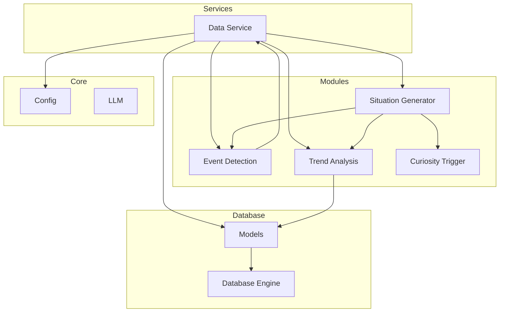
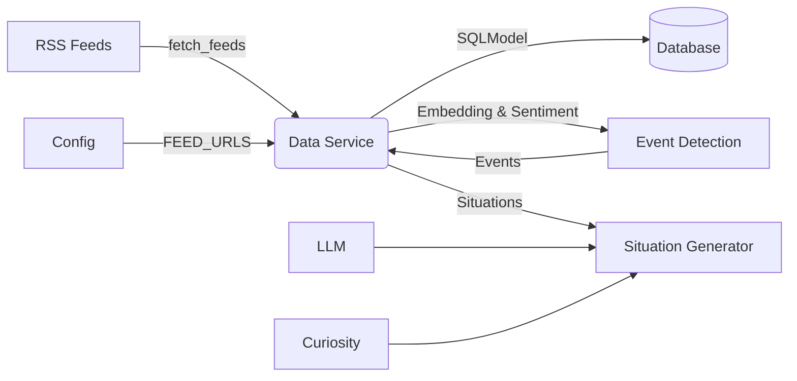
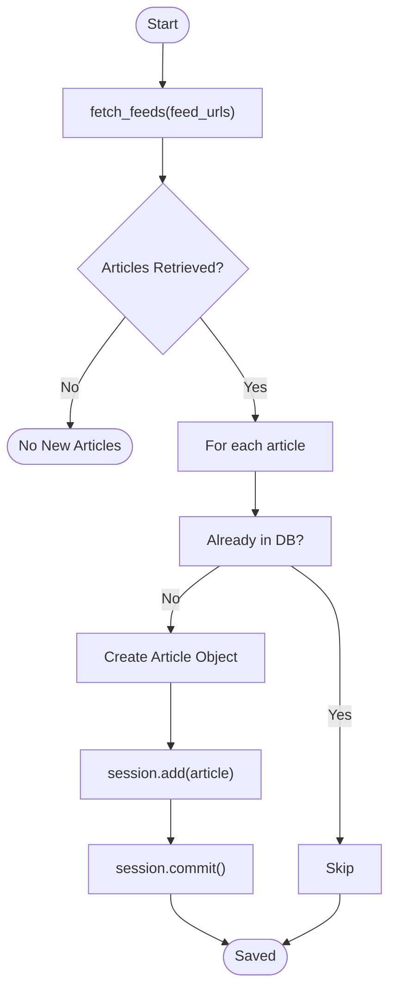
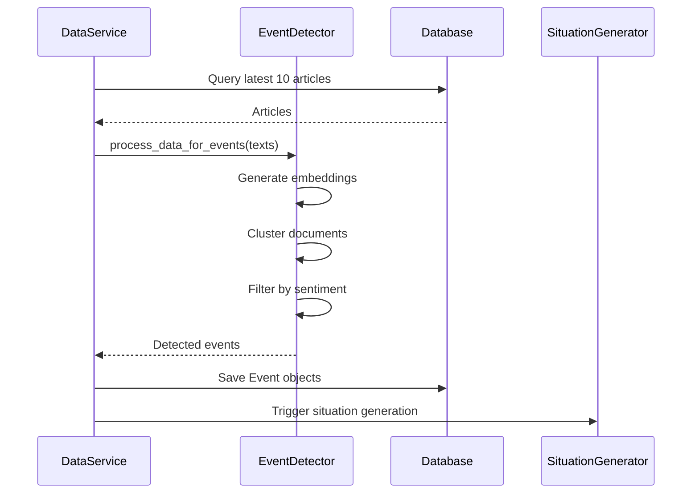
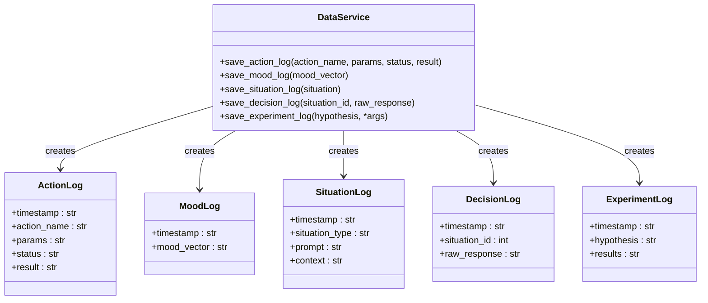
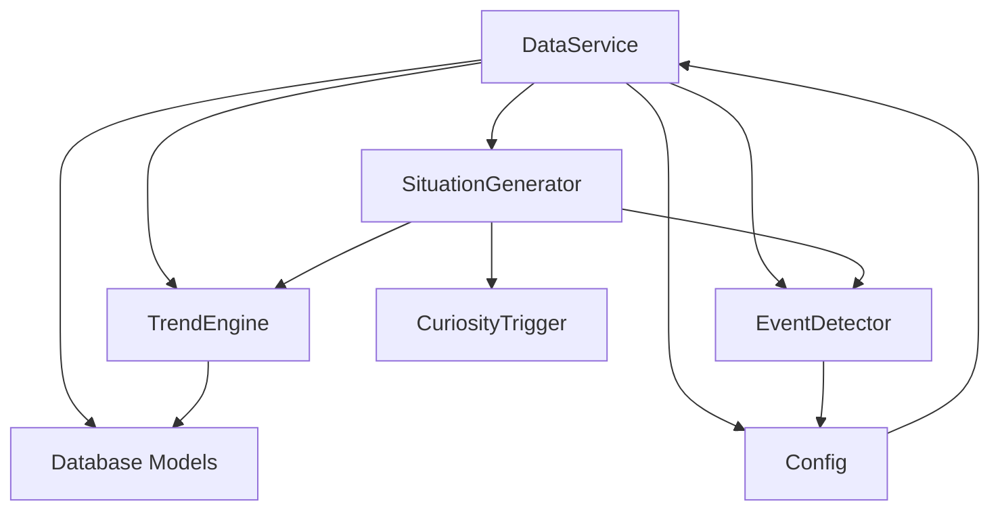

# Data Service

## Table of Contents
1. [Introduction](#introduction)
2. [Project Structure](#project-structure)
3. [Core Components](#core-components)
4. [Architecture Overview](#architecture-overview)
5. [Detailed Component Analysis](#detailed-component-analysis)
6. [Dependency Analysis](#dependency-analysis)
7. [Performance Considerations](#performance-considerations)
8. [Troubleshooting Guide](#troubleshooting-guide)
9. [Conclusion](#conclusion)

## Introduction
The Data Service is a central component of the RAVANA system, responsible for ingesting, processing, and routing external data from various sources such as RSS feeds, web content, and file inputs. It acts as a bridge between raw external data and downstream modules like Event Detection and Situation Generator. The service retrieves data asynchronously, normalizes it into a consistent format, stores it in a SQL database via SQLModel, and forwards relevant events for further processing. It integrates with machine learning models for embedding generation and sentiment analysis, enabling intelligent clustering and filtering of content. This document provides a comprehensive overview of the Data Service’s functionality, architecture, integration points, configuration, and operational considerations.

## Project Structure
The RAVANA project follows a modular structure with distinct directories for core logic, database operations, specialized modules, and services. The Data Service resides in the `services` directory and interacts with components across the system, including database models, information processing modules, and situation generation logic.

**Diagram sources**
- [data_service.py](file://services/data_service.py)
- [models.py](file://database/models.py)
- [trend_engine.py](file://modules/information_processing/trend_analysis/trend_engine.py)
- [event_detector.py](file://modules/event_detection/event_detector.py)
- [situation_generator.py](file://modules/situation_generator/situation_generator.py)
- [config.py](file://core/config.py)

## Core Components
The Data Service orchestrates data ingestion and processing through several key methods:
- `fetch_and_save_articles`: Retrieves articles from configured RSS feeds and stores them in the database.
- `detect_and_save_events`: Processes recent articles to detect significant events using clustering and sentiment analysis.
- Logging methods (`save_action_log`, `save_mood_log`, etc.) for recording system activities.
These components work together to transform unstructured external data into structured, actionable insights.

**Section sources**
- [data_service.py](file://services/data_service.py#L15-L155)
- [models.py](file://database/models.py#L1-L56)

## Architecture Overview
The Data Service operates within a layered architecture that separates concerns across ingestion, processing, storage, and event forwarding. It uses a pull-based model to periodically fetch data from external sources, processes it using NLP models, and persists results in a relational database. Detected events are then used by downstream modules to generate situations for the AGI system.

**Diagram sources**
- [data_service.py](file://services/data_service.py)
- [trend_engine.py](file://modules/information_processing/trend_analysis/trend_engine.py)
- [event_detector.py](file://modules/event_detection/event_detector.py)
- [situation_generator.py](file://modules/situation_generator/situation_generator.py)
- [config.py](file://core/config.py)

## Detailed Component Analysis

### Data Ingestion and Storage
The Data Service ingests data primarily from RSS feeds using the `fetch_feeds` function from the Trend Analysis module. Articles are normalized and stored in the `Article` table.

**Diagram sources**
- [data_service.py](file://services/data_service.py#L25-L45)
- [trend_engine.py](file://modules/information_processing/trend_analysis/trend_engine.py#L60-L70)
- [models.py](file://database/models.py#L3-L9)

**Section sources**
- [data_service.py](file://services/data_service.py#L25-L45)
- [trend_engine.py](file://modules/information_processing/trend_analysis/trend_engine.py#L60-L70)

### Event Detection and Forwarding
The service detects events by analyzing recent articles using embeddings and clustering. Detected events are saved and can trigger situation generation.

**Diagram sources**
- [data_service.py](file://services/data_service.py#L47-L75)
- [event_detector.py](file://modules/event_detection/event_detector.py#L100-L180)
- [situation_generator.py](file://modules/situation_generator/situation_generator.py)

**Section sources**
- [data_service.py](file://services/data_service.py#L47-L75)
- [event_detector.py](file://modules/event_detection/event_detector.py#L100-L180)

### Logging and State Persistence
The Data Service provides multiple logging methods to record system state and actions, using JSON serialization for complex data.

**Diagram sources**
- [data_service.py](file://services/data_service.py#L77-L155)
- [models.py](file://database/models.py#L19-L56)

**Section sources**
- [data_service.py](file://services/data_service.py#L77-L155)

## Dependency Analysis
The Data Service has direct dependencies on several key components, forming a critical integration point in the system.

**Diagram sources**
- [data_service.py](file://services/data_service.py)
- [trend_engine.py](file://modules/information_processing/trend_analysis/trend_engine.py)
- [event_detector.py](file://modules/event_detection/event_detector.py)
- [situation_generator.py](file://modules/situation_generator/situation_generator.py)
- [config.py](file://core/config.py)

**Section sources**
- [data_service.py](file://services/data_service.py)
- [config.py](file://core/config.py)

## Performance Considerations
The Data Service handles asynchronous data streams and implements several performance optimizations:
- **Batch Processing**: Articles are fetched and processed in batches from RSS feeds.
- **Rate Limiting**: Configuration via `DATA_COLLECTION_INTERVAL` (default 3600 seconds) prevents excessive external requests.
- **Memory Usage**: Articles are processed one at a time during ingestion to minimize memory footprint.
- **Database Efficiency**: Uses SQLModel sessions efficiently with batch commits.
- **Model Reuse**: Embedding and sentiment models are reused across calls to avoid reloading.

For high-volume ingestion, the service could be enhanced with:
- Parallel feed fetching
- In-memory caching of recent articles
- Connection pooling for database operations
- Asynchronous database operations using async SQL drivers

## Troubleshooting Guide
Common issues and their resolutions:

**Failed Fetches**
- **Symptom**: No new articles appear in the database.
- **Cause**: Invalid RSS URLs or network connectivity issues.
- **Fix**: Verify `FEED_URLS` in `config.py` and check network access.

**Schema Mismatches**
- **Symptom**: Database errors during save operations.
- **Cause**: Mismatch between `Article` model and actual feed data.
- **Fix**: Ensure all required fields (`title`, `link`, `source`) are present in feed entries.

**Pipeline Backpressure**
- **Symptom**: Delayed event detection or situation generation.
- **Cause**: Long-running event detection blocking the main loop.
- **Fix**: Run `detect_and_save_events` in a separate thread or process.

**Sentiment/Embedding Model Failures**
- **Symptom**: Event detection fails with model loading errors.
- **Fix**: Pre-load models and pass them to `DataService` to avoid lazy loading in production.

**JSON Serialization Errors**
- **Symptom**: `save_experiment_log` fails with TypeError.
- **Fix**: The method includes fallback serialization using `str()` for non-serializable objects.

**Section sources**
- [data_service.py](file://services/data_service.py)
- [event_detector.py](file://modules/event_detection/event_detector.py)
- [config.py](file://core/config.py)

## Conclusion
The Data Service is a robust and essential component that enables the RAVANA system to stay informed about external events through automated data ingestion and intelligent processing. By integrating RSS feed parsing, NLP-based event detection, and structured logging, it provides a solid foundation for higher-level cognitive functions like situation generation and decision making. Its modular design allows for easy extension with new data sources and processing pipelines. Proper configuration of polling intervals and error handling ensures reliable operation in production environments.

**Referenced Files in This Document**   
- [data_service.py](file://services/data_service.py)
- [models.py](file://database/models.py)
- [trend_engine.py](file://modules/information_processing/trend_analysis/trend_engine.py)
- [event_detector.py](file://modules/event_detection/event_detector.py)
- [situation_generator.py](file://modules/situation_generator/situation_generator.py)
- [config.py](file://core/config.py)