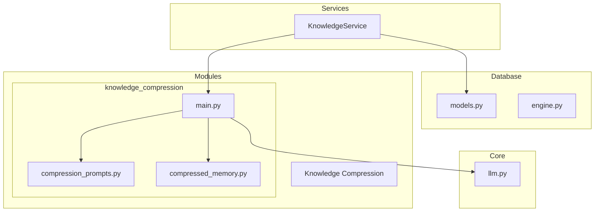
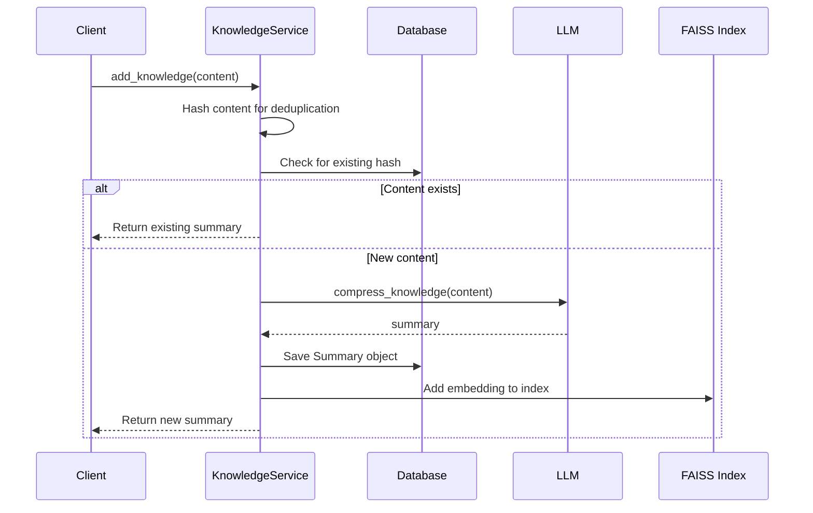
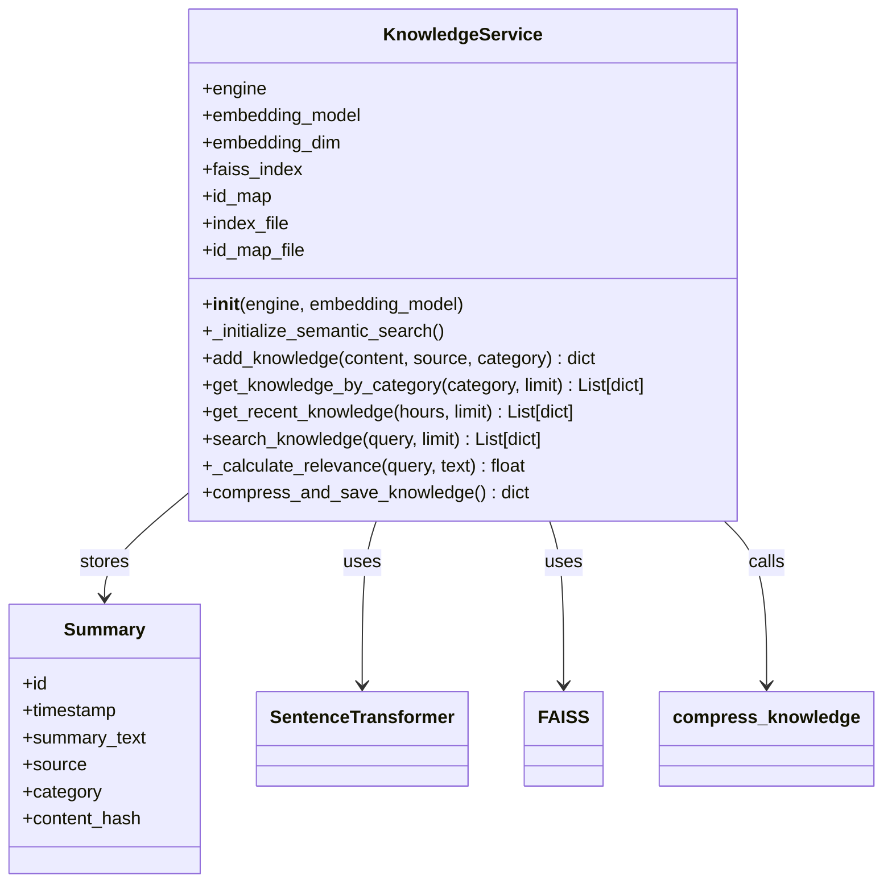
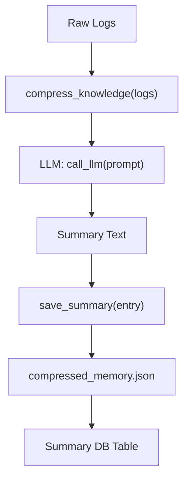
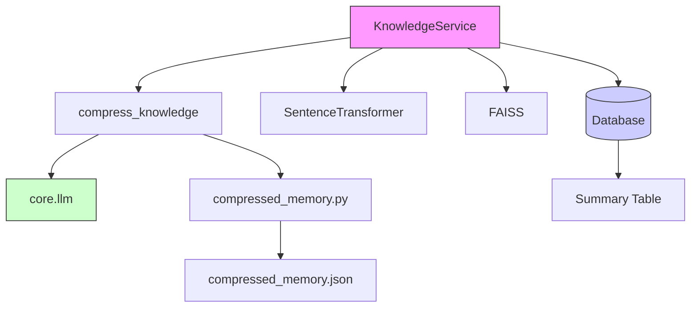

# Knowledge Service


## Table of Contents
1. [Introduction](#introduction)
2. [Project Structure](#project-structure)
3. [Core Components](#core-components)
4. [Architecture Overview](#architecture-overview)
5. [Detailed Component Analysis](#detailed-component-analysis)
6. [Dependency Analysis](#dependency-analysis)
7. [Performance Considerations](#performance-considerations)
8. [Troubleshooting Guide](#troubleshooting-guide)
9. [Conclusion](#conclusion)

## Introduction
The **Knowledge Service** is a central component in the RAVANA system responsible for managing semantic knowledge through retrieval, indexing, and contextual enrichment. It leverages Large Language Models (LLMs) and vector embeddings to enable intelligent knowledge storage and search. The service interacts with database models such as **Summary**, supports knowledge compression via integration with the **Knowledge Compression Module**, and enables trend analysis and curiosity-driven learning by providing contextual data to other modules. This document provides a comprehensive analysis of its functionality, architecture, configuration, and failure handling mechanisms.

## Project Structure
The project follows a modular architecture with clear separation of concerns. The **Knowledge Service** resides in the `services/` directory and depends on components in `database/`, `modules/knowledge_compression`, and core utilities.



**Diagram sources**
- [services/knowledge_service.py](file://services/knowledge_service.py)
- [database/models.py](file://database/models.py)
- [modules/knowledge_compression/main.py](file://modules/knowledge_compression/main.py)

**Section sources**
- [services/knowledge_service.py](file://services/knowledge_service.py)
- [database/models.py](file://database/models.py)

## Core Components
The **Knowledge Service** is implemented as a class that manages knowledge through semantic indexing, retrieval, and deduplication. It uses FAISS for vector similarity search and integrates with the LLM via the `core.llm` module for knowledge compression. Key entities include:
- **Summary**: Stores compressed knowledge entries
- **Article**: Raw content source (not directly used by Knowledge Service)
- **CompressedMemory**: Persistent JSON store for compressed summaries

The service supports multiple retrieval methods: semantic search (via embeddings), keyword-based search, category filtering, and time-based queries.

**Section sources**
- [services/knowledge_service.py](file://services/knowledge_service.py#L1-L255)
- [database/models.py](file://database/models.py#L18-L24)

## Architecture Overview
The **Knowledge Service** operates as a middleware layer between raw data ingestion and higher-level cognitive modules. It receives unstructured content, processes it into semantic summaries, stores them in a database, and indexes them for fast retrieval.



**Diagram sources**
- [services/knowledge_service.py](file://services/knowledge_service.py#L50-L100)
- [modules/knowledge_compression/main.py](file://modules/knowledge_compression/main.py#L10-L20)

## Detailed Component Analysis

### Knowledge Service Class Analysis
The `KnowledgeService` class encapsulates all knowledge management functionality.

#### Class Structure


**Diagram sources**
- [services/knowledge_service.py](file://services/knowledge_service.py#L15-L255)
- [database/models.py](file://database/models.py#L18-L24)

#### Key Methods

**add_knowledge(content, source, category)**
Adds new knowledge by summarizing content and storing it with metadata. Implements deduplication via SHA-256 hashing.

```python
def add_knowledge(self, content: str, source: str = "unknown", category: str = "misc") -> dict:
    content_hash = hashlib.sha256(content.encode('utf-8')).hexdigest()
    # Check for duplicates
    # Compress via LLM
    # Save to DB and FAISS
```

**search_knowledge(query, limit)**
Performs text-based search on summary content with relevance scoring.

**_initialize_semantic_search()**
Initializes FAISS vector index from disk or creates a new one, loading all existing summaries on first run.

**Section sources**
- [services/knowledge_service.py](file://services/knowledge_service.py#L15-L255)

### Knowledge Compression Module
The **Knowledge Compression Module** transforms raw logs and interactions into concise summaries using LLMs.

#### Data Flow


**Diagram sources**
- [modules/knowledge_compression/main.py](file://modules/knowledge_compression/main.py#L10-L40)
- [modules/knowledge_compression/compressed_memory.py](file://modules/knowledge_compression/compressed_memory.py)

#### Configuration Parameters
- **Embedding Model**: Default is `all-MiniLM-L6-v2`, configurable via constructor
- **Similarity Threshold**: Implicit in FAISS L2 distance; lower = more similar
- **Update Frequency**: Real-time indexing on knowledge addition
- **Compression Schedule**: Weekly/monthly via `scheduled_compression`

**Section sources**
- [modules/knowledge_compression/main.py](file://modules/knowledge_compression/main.py)
- [modules/knowledge_compression/compression_prompts.py](file://modules/knowledge_compression/compression_prompts.py)

## Dependency Analysis
The **Knowledge Service** has well-defined dependencies across the system.



**Diagram sources**
- [services/knowledge_service.py](file://services/knowledge_service.py)
- [modules/knowledge_compression/main.py](file://modules/knowledge_compression/main.py)
- [database/models.py](file://database/models.py)

**Section sources**
- [services/knowledge_service.py](file://services/knowledge_service.py)
- [modules/knowledge_compression/main.py](file://modules/knowledge_compression/main.py)

## Performance Considerations
The **Knowledge Service** employs several optimization strategies:

- **Caching Strategy**: FAISS index is persisted to disk (`knowledge_index.faiss`) and reloaded on startup
- **Latency Optimization**: Vector search enables sub-second semantic retrieval even with large datasets
- **Batch Initialization**: On first run, all summaries are indexed to ensure completeness
- **Deduplication**: SHA-256 hashing prevents redundant processing and storage
- **Asynchronous Testing**: Tests use `asyncio.to_thread` to simulate concurrent access

Failure modes and mitigations:
- **Stale Indexes**: Mitigated by writing index to disk after each update
- **Retrieval Inaccuracies**: Basic relevance scoring based on keyword overlap; could be enhanced with BM25 or neural ranking
- **LLM Timeout Handling**: Not explicitly handled; relies on `core.llm.call_llm` implementation
- **FAISS Unavailability**: Graceful fallback to text search if FAISS is not installed

**Section sources**
- [services/knowledge_service.py](file://services/knowledge_service.py#L30-L50)
- [tests/test_enhanced_knowledge_service.py](file://tests/test_enhanced_knowledge_service.py)

## Troubleshooting Guide
Common issues and solutions:

**Issue: Semantic search disabled**
- **Cause**: FAISS library not installed
- **Solution**: `pip install faiss-cpu` or `faiss-gpu`

**Issue: Duplicate knowledge entries**
- **Cause**: Content hash collision or database query failure
- **Check**: Verify `content_hash` field in `Summary` table

**Issue: Slow search performance**
- **Cause**: Large dataset without vector index
- **Fix**: Ensure FAISS index is properly initialized and persisted

**Issue: Empty compression results**
- **Cause**: LLM not returning valid response
- **Debug**: Check `core.llm.call_llm` logs and prompt formatting

**Issue: Index out of sync with database**
- **Fix**: Delete `knowledge_index.faiss` and `knowledge_id_map.pkl` to force rebuild

**Section sources**
- [services/knowledge_service.py](file://services/knowledge_service.py#L30-L50)
- [modules/knowledge_compression/main.py](file://modules/knowledge_compression/main.py)

## Conclusion
The **Knowledge Service** is a robust component that enables semantic knowledge management through vector embeddings and LLM-powered compression. It provides efficient retrieval mechanisms, supports trend analysis and curiosity-driven learning, and integrates seamlessly with the broader cognitive architecture. With proper configuration and monitoring, it serves as a reliable foundation for long-term knowledge retention and contextual reasoning in the RAVANA system.

**Referenced Files in This Document**   
- [services/knowledge_service.py](file://services/knowledge_service.py)
- [database/models.py](file://database/models.py)
- [modules/knowledge_compression/main.py](file://modules/knowledge_compression/main.py)
- [modules/knowledge_compression/compression_prompts.py](file://modules/knowledge_compression/compression_prompts.py)
- [modules/knowledge_compression/compressed_memory.py](file://modules/knowledge_compression/compressed_memory.py)
- [tests/test_enhanced_knowledge_service.py](file://tests/test_enhanced_knowledge_service.py)
