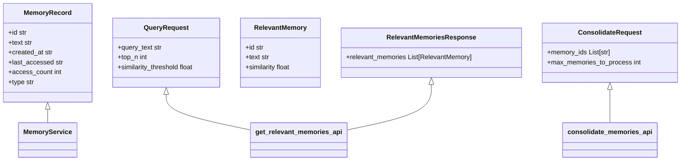

# Memory Service

## Table of Contents
1. [Introduction](#introduction)
2. [Project Structure](#project-structure)
3. [Core Components](#core-components)
4. [Architecture Overview](#architecture-overview)
5. [Detailed Component Analysis](#detailed-component-analysis)
6. [Dependency Analysis](#dependency-analysis)
7. [Performance Considerations](#performance-considerations)
8. [Troubleshooting Guide](#troubleshooting-guide)
9. [Conclusion](#conclusion)

## Introduction
The Memory Service is a central component of the RAVANA AGI system, responsible for managing both episodic and semantic memory. It serves as the primary interface between the AGISystem and persistent memory storage, enabling the AI to retain, recall, and consolidate experiences over time. The service supports multi-modal memory storage (text, audio, image), advanced retrieval via embedding-based similarity search, and long-term knowledge compression. It integrates with the Episodic Memory module for raw experience storage and the Knowledge Compression module for creating structured semantic summaries. This documentation provides a comprehensive analysis of its architecture, functionality, and integration points.

## Project Structure
The Memory Service is organized within a modular repository structure, with distinct directories for core system logic, database operations, and specialized modules. The service itself resides in the `services` directory, while its primary dependencies are located in the `modules` directory under `episodic_memory` and `knowledge_compression`. This separation allows for independent development and testing of memory-related functionalities.

**Diagram sources**
- [services\memory_service.py](file://services\memory_service.py)
- [modules\episodic_memory\memory.py](file://modules\episodic_memory\memory.py)
- [modules\knowledge_compression\main.py](file://modules\knowledge_compression\main.py)

**Section sources**
- [services\memory_service.py](file://services\memory_service.py)
- [modules\episodic_memory\memory.py](file://modules\episodic_memory\memory.py)

## Core Components
The Memory Service is built upon several core components that work together to provide a robust memory management system. The primary component is the `MemoryService` class, which acts as a facade for all memory operations. It delegates tasks to the Episodic Memory module for immediate storage and retrieval, and to the Knowledge Compression module for long-term consolidation. The service uses SentenceTransformers to generate embeddings for semantic search and ChromaDB for vector-based similarity queries. It also supports multi-modal memory through integration with Whisper for audio transcription and PostgreSQL for structured storage of diverse memory types.

**Section sources**
- [services\memory_service.py](file://services\memory_service.py#L1-L86)
- [modules\episodic_memory\memory.py](file://modules\episodic_memory\memory.py#L1-L722)

## Architecture Overview
The Memory Service architecture is designed as a layered system with clear separation of concerns. At the top is the `MemoryService` class, which provides a simple API for the AGISystem. Below it, the Episodic Memory module handles the storage and retrieval of raw experiences using a FastAPI server. This module uses ChromaDB for in-memory vector search and PostgreSQL for persistent storage. The Knowledge Compression module operates on a schedule to summarize episodic memories into semantic knowledge. The entire system is orchestrated through asynchronous Python, allowing for non-blocking I/O operations and efficient resource utilization.

**Diagram sources**
- [services\memory_service.py](file://services\memory_service.py)
- [modules\episodic_memory\memory.py](file://modules\episodic_memory\memory.py)
- [modules\knowledge_compression\main.py](file://modules\knowledge_compression\main.py)

## Detailed Component Analysis

### Memory Service Analysis
The `MemoryService` class provides a high-level interface for memory operations, abstracting away the complexity of the underlying systems. It manages a separate process for the memory server and provides methods for saving, retrieving, and consolidating memories.

**Diagram sources**
- [services\memory_service.py](file://services\memory_service.py#L1-L86)

**Section sources**
- [services\memory_service.py](file://services\memory_service.py#L1-L86)

### Episodic Memory Analysis
The Episodic Memory module is a FastAPI application that provides a RESTful interface for memory operations. It uses ChromaDB for vector-based similarity search and PostgreSQL for persistent storage of multi-modal memories. The module supports text, audio, and image memories, with embeddings generated by SentenceTransformers.

**Diagram sources**
- [modules\episodic_memory\memory.py](file://modules\episodic_memory\memory.py#L1-L722)

**Section sources**
- [modules\episodic_memory\memory.py](file://modules\episodic_memory\memory.py#L1-L722)

### Knowledge Compression Analysis
The Knowledge Compression module is responsible for transforming episodic memories into structured semantic knowledge. It uses an LLM to summarize accumulated logs and reflections, creating concise reports of new facts, key outcomes, and future goals. The summaries are stored in a JSON file for persistent access.

**Diagram sources**
- [modules\knowledge_compression\main.py](file://modules\knowledge_compression\main.py#L1-L43)

**Section sources**
- [modules\knowledge_compression\main.py](file://modules\knowledge_compression\main.py#L1-L43)

## Dependency Analysis
The Memory Service has a complex dependency graph, integrating multiple modules and external libraries. The primary dependencies are the Episodic Memory module for immediate memory storage and the Knowledge Compression module for long-term knowledge management. The service also depends on core system components like the LLM for memory extraction and consolidation, and configuration utilities for runtime settings.

**Diagram sources**
- [services\memory_service.py](file://services\memory_service.py)
- [modules\episodic_memory\memory.py](file://modules\episodic_memory\memory.py)
- [modules\knowledge_compression\main.py](file://modules\knowledge_compression\main.py)

**Section sources**
- [services\memory_service.py](file://services\memory_service.py)
- [modules\episodic_memory\memory.py](file://modules\episodic_memory\memory.py)
- [modules\knowledge_compression\main.py](file://modules\knowledge_compression\main.py)

## Performance Considerations
The Memory Service faces several performance challenges, particularly with large-scale memory searches and embedding generation. The use of ChromaDB for in-memory vector search provides fast retrieval but requires significant RAM for large memory sets. The PostgreSQL backend ensures persistence but introduces latency for write operations. Embedding generation with SentenceTransformers is computationally expensive, especially for batch operations. To mitigate these issues, the system employs caching in the EmbeddingService, asynchronous processing for I/O-bound tasks, and batch operations for memory consolidation. The AdvancedSearchEngine implements hybrid search strategies to balance speed and accuracy, combining vector similarity with full-text search.

**Section sources**
- [modules\episodic_memory\embedding_service.py](file://modules\episodic_memory\embedding_service.py)
- [modules\episodic_memory\search_engine.py](file://modules\episodic_memory\search_engine.py)

## Troubleshooting Guide
Common issues with the Memory Service include failure to start the memory server process, embedding generation errors, and database connection problems. If the memory server fails to start, check the port availability and ensure the required dependencies are installed. For embedding errors, verify that the SentenceTransformer model is correctly loaded and that the GPU (if used) has sufficient memory. Database connection issues can be resolved by checking the PostgreSQL URL and credentials in the environment variables. Memory leaks can occur if the ChromaDB collection grows too large; periodic cleanup of old memories is recommended. The service provides a health check endpoint that can be used to diagnose issues.

**Section sources**
- [services\memory_service.py](file://services\memory_service.py#L60-L86)
- [modules\episodic_memory\memory.py](file://modules\episodic_memory\memory.py#L680-L722)

## Conclusion
The Memory Service is a sophisticated component that enables the RAVANA AGI system to maintain a persistent and evolving memory. By integrating episodic and semantic memory systems, it provides a comprehensive solution for experience retention and knowledge management. The service's modular design allows for flexible extension and optimization, while its use of modern AI techniques like embedding-based search and LLM-powered summarization ensures high-quality memory recall and consolidation. Future improvements could include more advanced compression algorithms, real-time memory indexing, and enhanced multi-modal integration.

**Referenced Files in This Document**   
- [services\memory_service.py](file://services\memory_service.py)
- [modules\episodic_memory\memory.py](file://modules\episodic_memory\memory.py)
- [modules\episodic_memory\models.py](file://modules\episodic_memory\models.py)
- [modules\episodic_memory\search_engine.py](file://modules\episodic_memory\search_engine.py)
- [modules\episodic_memory\embedding_service.py](file://modules\episodic_memory\embedding_service.py)
- [modules\episodic_memory\postgresql_store.py](file://modules\episodic_memory\postgresql_store.py)
- [modules\episodic_memory\multi_modal_service.py](file://modules\episodic_memory\multi_modal_service.py)
- [modules\knowledge_compression\compressed_memory.py](file://modules\knowledge_compression\compressed_memory.py)
- [modules\knowledge_compression\main.py](file://modules\knowledge_compression\main.py)
- [modules\knowledge_compression\compression_prompts.py](file://modules\knowledge_compression\compression_prompts.py)