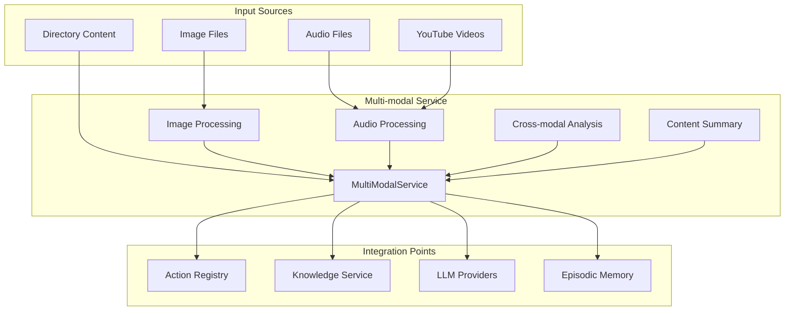
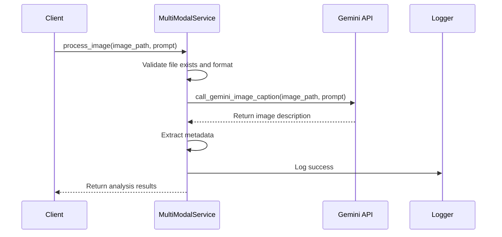
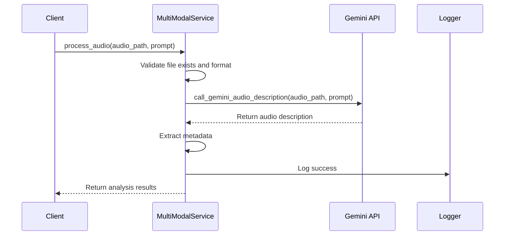
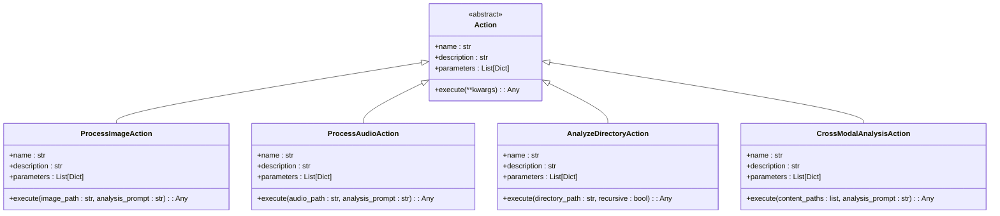
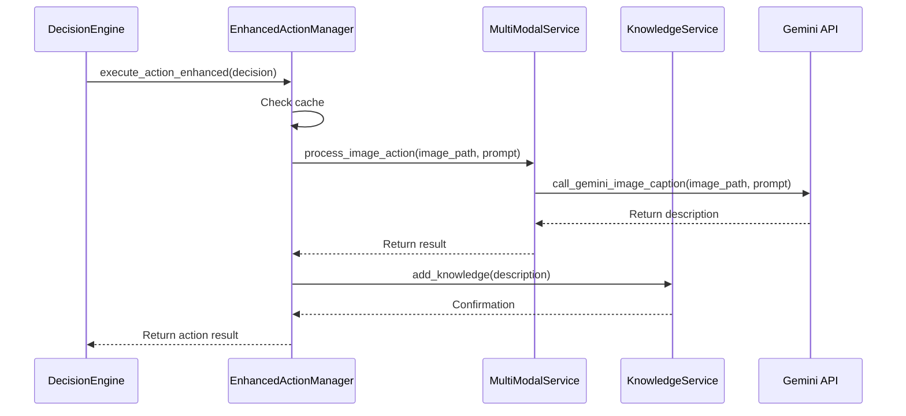
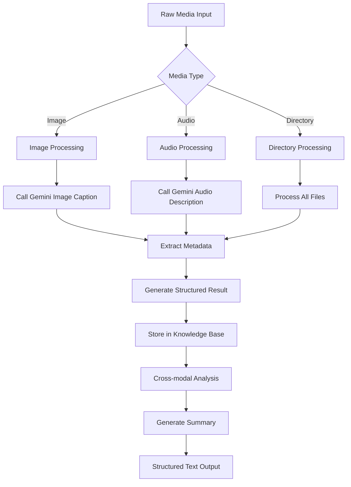
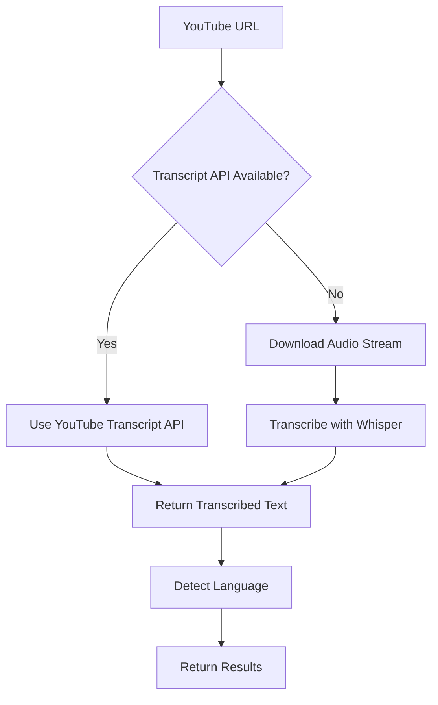

# Multi-modal Service


## Table of Contents
1. [Introduction](#introduction)
2. [Core Architecture](#core-architecture)
3. [Multi-modal Service Implementation](#multi-modal-service-implementation)
4. [Action Registry Integration](#action-registry-integration)
5. [Data Transformation Pipeline](#data-transformation-pipeline)
6. [YouTube Transcription Integration](#youtube-transcription-integration)
7. [LLM Integration for Cross-modal Understanding](#llm-integration-for-cross-modal-understanding)
8. [Configuration Parameters](#configuration-parameters)
9. [Error Handling and Fallback Strategies](#error-handling-and-fallback-strategies)
10. [Performance Considerations](#performance-considerations)

## Introduction
The Multi-modal Service is a core component of the RAVANA system designed to process and coordinate non-textual data such as images, audio, and video. This service enables the system to understand and analyze multi-modal inputs, transforming them into structured text representations that can be used for knowledge integration, decision making, and response generation. The service integrates with the Action Registry to enable multi-modal actions and works with LLM providers for cross-modal understanding.

## Core Architecture
The Multi-modal Service operates as a centralized processing unit that handles various media types and coordinates with other system components. It follows a modular design with clear separation between media processing, action execution, and knowledge integration.



**Diagram sources**
- [services/multi_modal_service.py](file://services/multi_modal_service.py#L0-L350)
- [core/enhanced_action_manager.py](file://core/enhanced_action_manager.py#L0-L269)

**Section sources**
- [services/multi_modal_service.py](file://services/multi_modal_service.py#L0-L350)
- [core/enhanced_action_manager.py](file://core/enhanced_action_manager.py#L0-L269)

## Multi-modal Service Implementation
The MultiModalService class provides comprehensive functionality for processing various media types and performing cross-modal analysis.

### Service Initialization
The service initializes with configuration for supported formats and creates a temporary directory for processing artifacts.

```python
def __init__(self):
    self.supported_image_formats = {'.jpg', '.jpeg', '.png', '.gif', '.bmp', '.webp'}
    self.supported_audio_formats = {'.mp3', '.wav', '.m4a', '.ogg', '.flac'}
    self.temp_dir = Path(tempfile.gettempdir()) / "agi_multimodal"
    self.temp_dir.mkdir(exist_ok=True)
```

### Image Processing
The service processes images using the Gemini API for image captioning and analysis.



**Diagram sources**
- [services/multi_modal_service.py](file://services/multi_modal_service.py#L50-L100)

**Section sources**
- [services/multi_modal_service.py](file://services/multi_modal_service.py#L50-L150)

### Audio Processing
Audio files are processed using the Gemini API for audio description and analysis.



**Diagram sources**
- [services/multi_modal_service.py](file://services/multi_modal_service.py#L100-L150)

**Section sources**
- [services/multi_modal_service.py](file://services/multi_modal_service.py#L100-L200)

### Cross-modal Analysis
The service can analyze multiple content types together to identify patterns and relationships.

```python
async def cross_modal_analysis(self, content_list: List[Dict[str, Any]], analysis_prompt: str = None) -> Dict[str, Any]:
    # Prepare content descriptions
    descriptions = []
    content_types = []
    
    for content in content_list:
        if content.get('success', False):
            descriptions.append(content.get('description', ''))
            content_types.append(content.get('type', 'unknown'))
    
    # Create analysis prompt
    if not analysis_prompt:
        analysis_prompt = f"""
        Perform a comprehensive cross-modal analysis of the following content:
        
        Content types: {', '.join(set(content_types))}
        
        Content descriptions:
        {chr(10).join([f"{i+1}. {desc}" for i, desc in enumerate(descriptions)])}
        
        Please provide:
        1. Common themes and patterns across all content
        2. Relationships and connections between different modalities
        3. Insights that emerge from combining these different types of information
        4. Potential applications or implications
        5. Any contradictions or interesting contrasts
        """
    
    # Use LLM for cross-modal analysis
    loop = asyncio.get_event_loop()
    from core.llm import safe_call_llm
    analysis = await loop.run_in_executor(
        None,
        safe_call_llm,
        analysis_prompt
    )
```

**Section sources**
- [services/multi_modal_service.py](file://services/multi_modal_service.py#L150-L200)

### Content Summary Generation
The service generates comprehensive summaries of processed multi-modal content.

```python
async def generate_content_summary(self, processed_content: List[Dict[str, Any]]) -> str:
    # Create summary header
    summary_parts.append(f"Multi-Modal Content Summary ({len(processed_content)} items processed)")
    summary_parts.append("=" * 50)
    
    # Add successful content
    if successful_content:
        summary_parts.append(f"\nSuccessfully Processed ({len(successful_content)} items):")
        for i, content in enumerate(successful_content, 1):
            content_type = content.get('type', 'unknown').title()
            description = content.get('description', 'No description')[:200]
            summary_parts.append(f"\n{i}. {content_type}: {description}...")
    
    # Add failed content
    if failed_content:
        summary_parts.append(f"\n\nFailed to Process ({len(failed_content)} items):")
        for i, content in enumerate(failed_content, 1):
            content_type = content.get('type', 'unknown').title()
            error = content.get('error', 'Unknown error')
            summary_parts.append(f"\n{i}. {content_type}: {error}")
    
    # Add cross-modal insights if multiple successful items
    if len(successful_content) > 1:
        cross_modal = await self.cross_modal_analysis(successful_content)
        if cross_modal.get('success', False):
            summary_parts.append(f"\n\nCross-Modal Analysis:")
            summary_parts.append(cross_modal.get('analysis', 'No analysis available'))
```

**Section sources**
- [services/multi_modal_service.py](file://services/multi_modal_service.py#L200-L250)

## Action Registry Integration
The Multi-modal Service integrates with the Action Registry through the EnhancedActionManager, which registers multi-modal actions and provides execution methods.

### Action Registration
The EnhancedActionManager registers multi-modal actions during initialization.

```python
def register_enhanced_actions(self):
    """Register new multi-modal actions as Action instances."""
    self.action_registry.register_action(ProcessImageAction(self.system, self.data_service))
    self.action_registry.register_action(ProcessAudioAction(self.system, self.data_service))
    self.action_registry.register_action(AnalyzeDirectoryAction(self.system, self.data_service))
    self.action_registry.register_action(CrossModalAnalysisAction(self.system, self.data_service))
```

### Action Implementation
Each multi-modal action is implemented as a class that inherits from the Action base class.



**Diagram sources**
- [core/actions/multi_modal.py](file://core/actions/multi_modal.py#L0-L79)
- [core/enhanced_action_manager.py](file://core/enhanced_action_manager.py#L0-L269)

**Section sources**
- [core/actions/multi_modal.py](file://core/actions/multi_modal.py#L0-L79)
- [core/enhanced_action_manager.py](file://core/enhanced_action_manager.py#L20-L50)

### Action Execution Flow
Multi-modal actions are executed through a coordinated process that involves the service and knowledge integration.



**Diagram sources**
- [core/enhanced_action_manager.py](file://core/enhanced_action_manager.py#L200-L269)
- [services/multi_modal_service.py](file://services/multi_modal_service.py#L50-L100)

**Section sources**
- [core/enhanced_action_manager.py](file://core/enhanced_action_manager.py#L150-L270)

## Data Transformation Pipeline
The service implements a comprehensive pipeline that transforms raw media into structured text representations.

### Pipeline Architecture


**Diagram sources**
- [services/multi_modal_service.py](file://services/multi_modal_service.py#L0-L350)
- [core/enhanced_action_manager.py](file://core/enhanced_action_manager.py#L0-L269)

**Section sources**
- [services/multi_modal_service.py](file://services/multi_modal_service.py#L0-L350)

### Directory Processing
The service can process all supported media files in a directory.

```python
async def process_directory(self, directory_path: str, recursive: bool = False) -> List[Dict[str, Any]]:
    # Get all files
    if recursive:
        files = list(directory.rglob("*"))
    else:
        files = list(directory.iterdir())
    
    # Filter for supported files
    supported_files = []
    for file_path in files:
        if file_path.is_file():
            ext = file_path.suffix.lower()
            if ext in self.supported_image_formats or ext in self.supported_audio_formats:
                supported_files.append(file_path)
    
    # Process each file
    for file_path in supported_files:
        if ext in self.supported_image_formats:
            result = await self.process_image(str(file_path))
        elif ext in self.supported_audio_formats:
            result = await self.process_audio(str(file_path))
```

**Section sources**
- [services/multi_modal_service.py](file://services/multi_modal_service.py#L250-L300)

## YouTube Transcription Integration
The system includes a dedicated module for YouTube video transcription that uses multiple methods for reliability.

### Transcription Process


**Diagram sources**
- [modules/information_processing/youtube_transcription/youtube_transcription.py](file://modules/information_processing/youtube_transcription/youtube_transcription.py#L0-L60)

**Section sources**
- [modules/information_processing/youtube_transcription/youtube_transcription.py](file://modules/information_processing/youtube_transcription/youtube_transcription.py#L0-L60)

### Implementation Details
The YouTube transcription module uses a fallback strategy to ensure transcription success.

```python
def transcribe_youtube_video(url):
    # Fallback to audio-to-text method
    yt = YouTube(url)
    
    # Get the audio stream
    audio_stream = yt.streams.filter(only_audio=True).first()
    
    # Download the audio stream
    output_path = "YoutubeAudios"
    filename = "audio.mp3"
    audio_stream.download(output_path=output_path, filename=filename)
    
    # Load the base model and transcribe the audio
    model = whisper.load_model("large")
    result = model.transcribe("YoutubeAudios/audio.mp3")
    transcribed_text = result["text"]
    
    # Detect the language
    language = detect(transcribed_text)
```

**Section sources**
- [modules/information_processing/youtube_transcription/youtube_transcription.py](file://modules/information_processing/youtube_transcription/youtube_transcription.py#L0-L60)

## LLM Integration for Cross-modal Understanding
The Multi-modal Service integrates with LLM providers to enable cross-modal understanding and response generation.

### LLM Function Calls
The service uses specific LLM functions for different media types.

```python
from core.llm import call_gemini_image_caption, call_gemini_audio_description, call_gemini_with_function_calling

# Image processing uses image captioning
description = await loop.run_in_executor(
    None, 
    call_gemini_image_caption, 
    image_path, 
    prompt
)

# Audio processing uses audio description
description = await loop.run_in_executor(
    None,
    call_gemini_audio_description,
    audio_path,
    prompt
)

# Cross-modal analysis uses general LLM calling
from core.llm import safe_call_llm
analysis = await loop.run_in_executor(
    None,
    safe_call_llm,
    analysis_prompt
)
```

**Section sources**
- [services/multi_modal_service.py](file://services/multi_modal_service.py#L0-L350)

### Cross-modal Analysis Prompt
The service generates comprehensive prompts for cross-modal analysis.

```python
analysis_prompt = f"""
Perform a comprehensive cross-modal analysis of the following content:

Content types: {', '.join(set(content_types))}

Content descriptions:
{chr(10).join([f"{i+1}. {desc}" for i, desc in enumerate(descriptions)])}

Please provide:
1. Common themes and patterns across all content
2. Relationships and connections between different modalities
3. Insights that emerge from combining these different types of information
4. Potential applications or implications
5. Any contradictions or interesting contrasts
"""
```

**Section sources**
- [services/multi_modal_service.py](file://services/multi_modal_service.py#L150-L200)

## Configuration Parameters
The system includes various configuration parameters for media processing and LLM integration.

### Media Codecs and Formats
The service defines supported media formats for validation.

```python
self.supported_image_formats = {'.jpg', '.jpeg', '.png', '.gif', '.bmp', '.webp'}
self.supported_audio_formats = {'.mp3', '.wav', '.m4a', '.ogg', '.flac'}
```

### LLM Routing
The system uses different LLM functions based on the media type and processing requirements.

```python
# Different LLM functions for different tasks
call_gemini_image_caption - For image analysis
call_gemini_audio_description - For audio analysis
safe_call_llm - For general text processing and cross-modal analysis
```

### Multi-modal Service Configuration
The episodic memory module includes configuration for the multi-modal service.

```python
class MultiModalMemoryService:
    def __init__(self, 
                 database_url: str,
                 text_model_name: str = "all-MiniLM-L6-v2",
                 whisper_model_size: str = "base",
                 device: Optional[str] = None):
```

**Section sources**
- [services/multi_modal_service.py](file://services/multi_modal_service.py#L0-L350)
- [modules/episodic_memory/multi_modal_service.py](file://modules/episodic_memory/multi_modal_service.py#L28-L68)

## Error Handling and Fallback Strategies
The system implements comprehensive error handling and fallback strategies for multi-modal capabilities.

### Error Handling in Media Processing
Each processing method includes try-except blocks to handle failures gracefully.

```python
try:
    if not os.path.exists(image_path):
        raise FileNotFoundError(f"Image file not found: {image_path}")
    
    file_ext = Path(image_path).suffix.lower()
    if file_ext not in self.supported_image_formats:
        raise ValueError(f"Unsupported image format: {file_ext}")
    
    # Processing logic
    ...
    
except Exception as e:
    logger.error(f"Failed to process image {image_path}: {e}")
    return {
        "type": "image",
        "path": image_path,
        "success": False,
        "error": str(e),
        "description": f"Failed to process image: {e}"
    }
```

### Fallback Strategies
The system implements multiple fallback strategies:

1. **YouTube Transcription**: Uses YouTube Transcript API as primary method, falls back to audio download and Whisper transcription
2. **Action Caching**: Caches successful action results to avoid reprocessing
3. **Parallel Execution Limiting**: Limits concurrent actions to prevent resource exhaustion

```python
# Action caching
cache_key = f"{action_name}_{hash(str(params))}"
if action_name not in non_cacheable and cache_key in self.action_cache:
    logger.info(f"Using cached result for action: {action_name}")
    return self.action_cache[cache_key]

# Parallel execution limiting
semaphore = asyncio.Semaphore(self.parallel_limit)
```

**Section sources**
- [services/multi_modal_service.py](file://services/multi_modal_service.py#L0-L350)
- [core/enhanced_action_manager.py](file://core/enhanced_action_manager.py#L0-L269)

## Performance Considerations
The system addresses several performance considerations for multi-modal processing.

### Processing Latency
The system manages processing latency through:

- **Asynchronous Processing**: Uses asyncio for non-blocking operations
- **Executor Pool**: Runs CPU-intensive LLM calls in executor pool
- **Parallel Execution**: Supports parallel action execution with configurable limits

```python
# Asynchronous processing with executor
loop = asyncio.get_event_loop()
description = await loop.run_in_executor(
    None, 
    call_gemini_image_caption, 
    image_path, 
    prompt
)
```

### Quality Degradation
The system addresses quality degradation through:

- **Format Validation**: Validates input formats before processing
- **Error Reporting**: Provides detailed error information
- **Fallback Methods**: Implements alternative processing methods

### Resource Management
The system manages resources through:

- **Temporary File Cleanup**: Regularly cleans up temporary files
- **Cache Management**: Limits cache size and clears old entries
- **Memory Management**: Uses efficient data structures

```python
def cleanup_temp_files(self, max_age_hours: int = 24):
    """Clean up temporary files older than specified age."""
    import time
    current_time = time.time()
    max_age_seconds = max_age_hours * 3600
    
    cleaned_count = 0
    for file_path in self.temp_dir.iterdir():
        if file_path.is_file():
            file_age = current_time - file_path.stat().st_mtime
            if file_age > max_age_seconds:
                file_path.unlink()
                cleaned_count += 1
```

**Section sources**
- [services/multi_modal_service.py](file://services/multi_modal_service.py#L300-L350)
- [core/enhanced_action_manager.py](file://core/enhanced_action_manager.py#L250-L270)

**Referenced Files in This Document**   
- [services/multi_modal_service.py](file://services/multi_modal_service.py#L0-L350)
- [core/enhanced_action_manager.py](file://core/enhanced_action_manager.py#L0-L269)
- [core/actions/multi_modal.py](file://core/actions/multi_modal.py#L0-L79)
- [modules/information_processing/youtube_transcription/youtube_transcription.py](file://modules/information_processing/youtube_transcription/youtube_transcription.py#L0-L60)
- [modules/episodic_memory/memory.py](file://modules/episodic_memory/memory.py#L0-L720)
- [modules/episodic_memory/multi_modal_service.py](file://modules/episodic_memory/multi_modal_service.py#L0-L200)