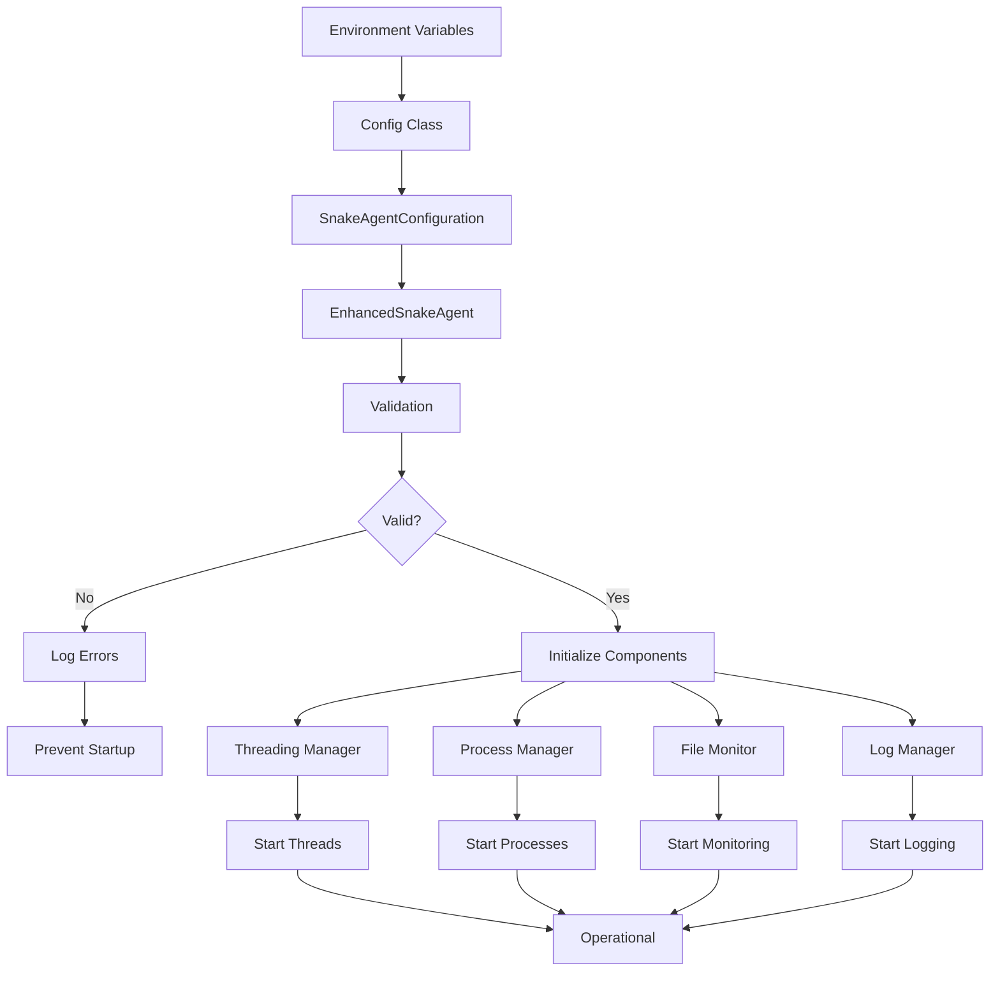

# Snake Agent Configuration


## Table of Contents
1. [Configuration Overview](#configuration-overview)
2. [Core Configuration Options](#core-configuration-options)
3. [Enhanced Mode Configuration](#enhanced-mode-configuration)
4. [LLM and Model Configuration](#llm-and-model-configuration)
5. [Safety and Security Settings](#safety-and-security-settings)
6. [Performance and Resource Management](#performance-and-resource-management)
7. [Validation Rules](#validation-rules)
8. [Usage Examples](#usage-examples)
9. [Configuration Flow](#configuration-flow)

## Configuration Overview

The Snake Agent is a sophisticated autonomous component within the RAVANA system that continuously monitors, analyzes, and improves the codebase through safe experimentation. Configuration is managed through environment variables and structured data classes, allowing for fine-grained control over the agent's behavior, performance characteristics, and safety parameters.

The configuration system supports both basic and enhanced modes, with the enhanced mode providing advanced capabilities through threading, multiprocessing, and comprehensive performance monitoring. All configuration options have sensible defaults but can be customized to match specific hardware capabilities and operational requirements.

**Section sources**
- [core/config.py](file://core/config.py#L60-L141)
- [SNAKE_AGENT_SETUP.md](file://SNAKE_AGENT_SETUP.md#L73-L118)

## Core Configuration Options

The Snake Agent's fundamental behavior is controlled by a set of core configuration options that determine when and how it operates within the RAVANA system.

### Basic Operation Settings

These settings control the fundamental operation of the Snake Agent:

**SNAKE_AGENT_ENABLED**
- **Purpose**: Enables or disables the Snake Agent entirely
- **Default Value**: `True`
- **Type**: Boolean
- **Environment Variable**: `SNAKE_AGENT_ENABLED`
- **Usage**: Set to `False` to completely disable the Snake Agent's operation

**SNAKE_AGENT_INTERVAL**
- **Purpose**: Determines how frequently the agent performs analysis cycles
- **Default Value**: `300` (5 minutes)
- **Type**: Integer (seconds)
- **Environment Variable**: `SNAKE_AGENT_INTERVAL`
- **Usage**: Controls the frequency of code analysis and improvement cycles

### Ollama Integration Settings

These settings configure the connection to the Ollama service for LLM operations:

**SNAKE_OLLAMA_BASE_URL**
- **Purpose**: Specifies the base URL for the Ollama service
- **Default Value**: `http://localhost:11434`
- **Type**: String (URL)
- **Environment Variable**: `SNAKE_OLLAMA_BASE_URL`
- **Usage**: Set to the appropriate address if Ollama is running on a different host or port

**SNAKE_OLLAMA_TIMEOUT**
- **Purpose**: Sets the timeout for Ollama API requests
- **Default Value**: `120` seconds
- **Type**: Integer (seconds)
- **Environment Variable**: `SNAKE_OLLAMA_TIMEOUT`
- **Usage**: Adjust based on network conditions and model response times

**SNAKE_OLLAMA_KEEP_ALIVE**
- **Purpose**: Configures the keep-alive duration for Ollama connections
- **Default Value**: `5m`
- **Type**: String (duration)
- **Environment Variable**: `SNAKE_OLLAMA_KEEP_ALIVE`
- **Usage**: Controls how long models remain loaded in memory

**Section sources**
- [core/config.py](file://core/config.py#L60-L66)
- [SNAKE_AGENT_SETUP.md](file://SNAKE_AGENT_SETUP.md#L91-L93)

## Enhanced Mode Configuration

The enhanced mode provides advanced capabilities through concurrent processing and comprehensive monitoring. These settings control the threading, multiprocessing, and performance characteristics of the enhanced Snake Agent.

### Threading Configuration

These settings control the threading behavior of the Snake Agent:

**SNAKE_MAX_THREADS**
- **Purpose**: Maximum number of threads the agent can create
- **Default Value**: `8`
- **Type**: Integer
- **Environment Variable**: `SNAKE_MAX_THREADS`
- **Usage**: Controls the upper limit of concurrent thread operations

**SNAKE_ANALYSIS_THREADS**
- **Purpose**: Number of dedicated threads for code analysis
- **Default Value**: `3`
- **Type**: Integer
- **Environment Variable**: `SNAKE_ANALYSIS_THREADS`
- **Usage**: Sets the number of concurrent analysis workers

**SNAKE_MONITOR_INTERVAL**
- **Purpose**: Interval between file monitoring checks
- **Default Value**: `2.0` seconds
- **Type**: Float
- **Environment Variable**: `SNAKE_MONITOR_INTERVAL`
- **Usage**: Controls the frequency of file system monitoring

### Multiprocessing Configuration

These settings control the multiprocessing behavior:

**SNAKE_MAX_PROCESSES**
- **Purpose**: Maximum number of processes the agent can create
- **Default Value**: `4`
- **Type**: Integer
- **Environment Variable**: `SNAKE_MAX_PROCESSES`
- **Usage**: Limits the number of concurrent CPU-intensive operations

**SNAKE_TASK_TIMEOUT**
- **Purpose**: Maximum time allowed for task execution
- **Default Value**: `300.0` seconds (5 minutes)
- **Type**: Float
- **Environment Variable**: `SNAKE_TASK_TIMEOUT`
- **Usage**: Prevents tasks from running indefinitely

**SNAKE_HEARTBEAT_INTERVAL**
- **Purpose**: Interval for process health checks
- **Default Value**: `10.0` seconds
- **Type**: Float
- **Environment Variable**: `SNAKE_HEARTBEAT_INTERVAL`
- **Usage**: Controls how frequently processes report their status

### Performance Monitoring

These settings control performance monitoring features:

**SNAKE_PERF_MONITORING**
- **Purpose**: Enables or disables performance monitoring
- **Default Value**: `True`
- **Type**: Boolean
- **Environment Variable**: `SNAKE_PERF_MONITORING`
- **Usage**: Set to `False` to disable performance metrics collection

**SNAKE_AUTO_RECOVERY**
- **Purpose**: Enables automatic recovery from failures
- **Default Value**: `True`
- **Type**: Boolean
- **Environment Variable**: `SNAKE_AUTO_RECOVERY`
- **Usage**: Controls whether the agent attempts to recover from errors

**SNAKE_LOG_RETENTION_DAYS**
- **Purpose**: Number of days to retain log files
- **Default Value**: `30`
- **Type**: Integer
- **Environment Variable**: `SNAKE_LOG_RETENTION_DAYS`
- **Usage**: Controls log rotation and cleanup

**Section sources**
- [core/config.py](file://core/config.py#L120-L132)
- [ENHANCED_SNAKE_IMPLEMENTATION.md](file://ENHANCED_SNAKE_IMPLEMENTATION.md#L147-L211)

## LLM and Model Configuration

The Snake Agent uses specialized LLM models for different tasks, with separate models for coding and reasoning operations.

### Model Selection

**SNAKE_CODING_MODEL**
- **Purpose**: Specifies the model used for code analysis and generation
- **Default Value**: `gpt-oss:20b`
- **Type**: String (model name)
- **Environment Variable**: `SNAKE_CODING_MODEL`
- **Usage**: Choose from available coding models based on hardware capabilities

**SNAKE_REASONING_MODEL**
- **Purpose**: Specifies the model used for decision making and safety evaluation
- **Default Value**: `deepseek-r1:7b`
- **Type**: String (model name)
- **Environment Variable**: `SNAKE_REASONING_MODEL`
- **Usage**: Select a reasoning model appropriate for your system

### Model Parameters

**SNAKE_CODING_TEMPERATURE**
- **Purpose**: Controls the creativity of code generation
- **Default Value**: `0.1`
- **Type**: Float
- **Environment Variable**: `SNAKE_CODING_TEMPERATURE`
- **Usage**: Lower values produce more conservative, predictable code

**SNAKE_REASONING_TEMPERATURE**
- **Purpose**: Controls the creativity of reasoning processes
- **Default Value**: `0.3`
- **Type**: Float
- **Environment Variable**: `SNAKE_REASONING_TEMPERATURE`
- **Usage**: Higher values allow for more creative problem solving

**SNAKE_CODING_MAX_TOKENS**
- **Purpose**: Maximum tokens for coding model responses
- **Default Value**: `4096`
- **Type**: Integer or "unlimited"
- **Environment Variable**: `SNAKE_CODING_MAX_TOKENS`
- **Usage**: Limits response length for coding tasks

**SNAKE_REASONING_MAX_TOKENS**
- **Purpose**: Maximum tokens for reasoning model responses
- **Type**: Integer or "unlimited"
- **Default Value**: `2048`
- **Environment Variable**: `SNAKE_REASONING_MAX_TOKENS`
- **Usage**: Controls response length for reasoning tasks

**SNAKE_CHUNK_SIZE**
- **Purpose**: Size of text chunks for processing
- **Default Value**: `4096` (coding), `2048` (reasoning)
- **Type**: Integer
- **Environment Variable**: `SNAKE_CHUNK_SIZE`
- **Usage**: Optimizes processing of large code files

**Section sources**
- [core/config.py](file://core/config.py#L69-L90)
- [SNAKE_AGENT_SETUP.md](file://SNAKE_AGENT_SETUP.md#L96-L103)

## Safety and Security Settings

The Snake Agent includes comprehensive safety features to prevent system damage and ensure reliable operation.

### File System Safety

**SNAKE_MAX_FILE_SIZE**
- **Purpose**: Maximum size of files to analyze
- **Default Value**: `1048576` (1MB)
- **Type**: Integer (bytes)
- **Environment Variable**: `SNAKE_MAX_FILE_SIZE`
- **Usage**: Prevents analysis of excessively large files

**SNAKE_BLACKLIST_PATHS**
- **Purpose**: Comma-separated list of paths to exclude from monitoring
- **Default Value**: Empty list
- **Type**: List of strings
- **Environment Variable**: `SNAKE_BLACKLIST_PATHS`
- **Usage**: Protect critical directories from modification

**SNAKE_SANDBOX_TIMEOUT**
- **Purpose**: Maximum time for sandboxed operations
- **Default Value**: `60` seconds
- **Type**: Integer
- **Environment Variable**: `SNAKE_SANDBOX_TIMEOUT`
- **Usage**: Prevents sandboxed code from running too long

### Communication Settings

**SNAKE_COMM_CHANNEL**
- **Purpose**: Communication channel for RAVANA integration
- **Default Value**: `memory_service`
- **Type**: String
- **Environment Variable**: `SNAKE_COMM_CHANNEL`
- **Usage**: Specifies the messaging system to use

**SNAKE_COMM_PRIORITY_THRESHOLD**
- **Purpose**: Minimum priority for communications
- **Default Value**: `0.8`
- **Type**: Float
- **Environment Variable**: `SNAKE_COMM_PRIORITY_THRESHOLD`
- **Usage**: Filters low-priority messages

### Approval and Control

**SNAKE_APPROVAL_REQUIRED**
- **Purpose**: Whether changes require approval before implementation
- **Default Value**: `True`
- **Type**: Boolean
- **Environment Variable**: `SNAKE_APPROVAL_REQUIRED`
- **Usage**: Controls autonomy level of the agent

**SNAKE_STATE_PERSISTENCE**
- **Purpose**: Whether to persist state across restarts
- **Default Value**: `True`
- **Type**: Boolean
- **Environment Variable**: `SNAKE_STATE_PERSISTENCE`
- **Usage**: Maintains continuity of learning and metrics

**SNAKE_SHUTDOWN_TIMEOUT**
- **Purpose**: Time to wait for graceful shutdown
- **Default Value**: `30` seconds
- **Type**: Integer
- **Environment Variable**: `SNAKE_SHUTDOWN_TIMEOUT`
- **Usage**: Controls shutdown behavior

**Section sources**
- [core/config.py](file://core/config.py#L114-L120)
- [SNAKE_AGENT_SETUP.md](file://SNAKE_AGENT_SETUP.md#L106-L118)

## Performance and Resource Management

These settings control resource usage and performance characteristics of the Snake Agent.

### Queue and Buffer Management

**SNAKE_MAX_QUEUE_SIZE**
- **Purpose**: Maximum size of internal task queues
- **Default Value**: `1000`
- **Type**: Integer
- **Environment Variable**: `SNAKE_MAX_QUEUE_SIZE`
- **Usage**: Prevents memory exhaustion from queued tasks

**SNAKE_CLEANUP_INTERVAL**
- **Purpose**: Interval for resource cleanup operations
- **Default Value**: `3600.0` seconds (1 hour)
- **Type**: Float
- **Environment Variable**: `SNAKE_CLEANUP_INTERVAL`
- **Usage**: Controls frequency of memory and resource cleanup

### Threading and Process Limits

The `SnakeAgentConfiguration` dataclass defines additional performance parameters:

**max_threads**
- **Purpose**: Maximum number of threads (reinforces SNAKE_MAX_THREADS)
- **Default Value**: `8`
- **Type**: Integer
- **Source**: `SnakeAgentConfiguration` class

**max_processes**
- **Purpose**: Maximum number of processes (reinforces SNAKE_MAX_PROCESSES)
- **Default Value**: `4`
- **Type**: Integer
- **Source**: `SnakeAgentConfiguration` class

**analysis_threads**
- **Purpose**: Number of analysis threads (reinforces SNAKE_ANALYSIS_THREADS)
- **Default Value**: `3`
- **Type**: Integer
- **Source**: `SnakeAgentConfiguration` class

**file_monitor_interval**
- **Purpose**: Interval between file monitoring checks (reinforces SNAKE_MONITOR_INTERVAL)
- **Default Value**: `2.0` seconds
- **Type**: Float
- **Source**: `SnakeAgentConfiguration` class

**process_heartbeat_interval**
- **Purpose**: Interval for process health checks (reinforces SNAKE_HEARTBEAT_INTERVAL)
- **Default Value**: `10.0` seconds
- **Type**: Float
- **Source**: `SnakeAgentConfiguration` class

**task_timeout**
- **Purpose**: Maximum time for task execution (reinforces SNAKE_TASK_TIMEOUT)
- **Default Value**: `300.0` seconds
- **Type**: Float
- **Source**: `SnakeAgentConfiguration` class

**cleanup_interval**
- **Purpose**: Interval for cleanup operations (reinforces SNAKE_CLEANUP_INTERVAL)
- **Default Value**: `3600.0` seconds
- **Type**: Float
- **Source**: `SnakeAgentConfiguration` class

**log_level**
- **Purpose**: Logging verbosity level
- **Default Value**: `INFO`
- **Type**: String
- **Source**: `SnakeAgentConfiguration` class
- **Options**: `DEBUG`, `INFO`, `WARNING`, `ERROR`, `CRITICAL`

**enable_performance_monitoring**
- **Purpose**: Enables performance metrics collection
- **Default Value**: `True`
- **Type**: Boolean
- **Source**: `SnakeAgentConfiguration` class

**auto_recovery**
- **Purpose**: Enables automatic recovery from failures
- **Default Value**: `True`
- **Type**: Boolean
- **Source**: `SnakeAgentConfiguration` class

**Section sources**
- [core/snake_data_models.py](file://core/snake_data_models.py#L374-L412)
- [core/config.py](file://core/config.py#L132-L141)

## Validation Rules

The Snake Agent configuration includes built-in validation rules to ensure system stability and prevent invalid configurations.

### Configuration Validation

The `SnakeAgentConfiguration.validate()` method enforces the following rules:

- **max_threads**: Must be at least 1
- **max_processes**: Must be at least 1
- **analysis_threads**: Cannot exceed max_threads
- **file_monitor_interval**: Must be at least 0.1 seconds
- **task_timeout**: Must be at least 10.0 seconds

```python
def validate(self) -> List[str]:
    """Validate configuration and return any issues"""
    issues = []
    
    if self.max_threads < 1:
        issues.append("max_threads must be at least 1")
    
    if self.max_processes < 1:
        issues.append("max_processes must be at least 1")
    
    if self.analysis_threads > self.max_threads:
        issues.append("analysis_threads cannot exceed max_threads")
    
    if self.file_monitor_interval < 0.1:
        issues.append("file_monitor_interval too low (minimum 0.1 seconds)")
    
    if self.task_timeout < 10.0:
        issues.append("task_timeout too low (minimum 10 seconds)")
    
    return issues
```

### Environment Variable Validation

Additional validation occurs at the system level:

- **Ollama Connection**: Validates that the Ollama service is reachable
- **Model Availability**: Checks that specified models are available
- **Required Configuration**: Ensures all essential configuration options are present
- **Data Type Validation**: Confirms that configuration values have correct types

The validation system prevents the Snake Agent from starting with invalid configurations, ensuring system stability and reliability.

**Section sources**
- [core/snake_data_models.py](file://core/snake_data_models.py#L374-L412)
- [simple_snake_test.py](file://simple_snake_test.py#L0-L34)

## Usage Examples

### Basic Configuration (Linux/macOS)

```bash
#!/bin/bash
# Basic Snake Agent configuration
export SNAKE_AGENT_ENABLED=True
export SNAKE_AGENT_INTERVAL=300
export SNAKE_OLLAMA_BASE_URL=http://localhost:11434
export SNAKE_OLLAMA_TIMEOUT=120
export SNAKE_OLLAMA_KEEP_ALIVE=5m

# Model selection
export SNAKE_CODING_MODEL=deepseek-coder:6.7b
export SNAKE_REASONING_MODEL=llama3.1:8b

# Model parameters
export SNAKE_CODING_TEMPERATURE=0.1
export SNAKE_REASONING_TEMPERATURE=0.3
export SNAKE_CODING_MAX_TOKENS=4096
export SNAKE_REASONING_MAX_TOKENS=2048

# Safety settings
export SNAKE_SANDBOX_TIMEOUT=60
export SNAKE_MAX_FILE_SIZE=1048576
export SNAKE_APPROVAL_REQUIRED=True

# Communication
export SNAKE_COMM_CHANNEL=memory_service
export SNAKE_COMM_PRIORITY_THRESHOLD=0.8

# Start RAVANA with Snake Agent
python main.py
```

### Enhanced Mode Configuration

```bash
#!/bin/bash
# Enhanced Snake Agent with performance tuning
export SNAKE_ENHANCED_MODE=true
export SNAKE_MAX_THREADS=8
export SNAKE_MAX_PROCESSES=4
export SNAKE_ANALYSIS_THREADS=3
export SNAKE_MONITOR_INTERVAL=2.0

# Performance monitoring
export SNAKE_PERF_MONITORING=true
export SNAKE_AUTO_RECOVERY=true

# Resource limits
export SNAKE_MAX_QUEUE_SIZE=1000
export SNAKE_LOG_RETENTION_DAYS=30

# Extended timeouts for complex tasks
export SNAKE_TASK_TIMEOUT=600.0
export SNAKE_HEARTBEAT_INTERVAL=15.0

python main.py
```

### Windows Configuration

```batch
@echo off
set SNAKE_AGENT_ENABLED=True
set SNAKE_AGENT_INTERVAL=300
set SNAKE_OLLAMA_BASE_URL=http://localhost:11434
set SNAKE_OLLAMA_TIMEOUT=120
set SNAKE_OLLAMA_KEEP_ALIVE=5m
set SNAKE_CODING_MODEL=deepseek-coder:6.7b
set SNAKE_REASONING_MODEL=llama3.1:8b
set SNAKE_CODING_TEMPERATURE=0.1
set SNAKE_REASONING_TEMPERATURE=0.3
set SNAKE_CODING_MAX_TOKENS=4096
set SNAKE_REASONING_MAX_TOKENS=2048
set SNAKE_SANDBOX_TIMEOUT=60
set SNAKE_MAX_FILE_SIZE=1048576
set SNAKE_APPROVAL_REQUIRED=True
set SNAKE_COMM_CHANNEL=memory_service
set SNAKE_COMM_PRIORITY_THRESHOLD=0.8
set SNAKE_ENHANCED_MODE=true
set SNAKE_MAX_THREADS=8
set SNAKE_MAX_PROCESSES=4

python main.py
```

### Minimal Configuration for Testing

```bash
# Minimal setup for testing
export SNAKE_AGENT_ENABLED=True
export SNAKE_AGENT_INTERVAL=60
export SNAKE_OLLAMA_BASE_URL=http://localhost:11434
export SNAKE_CODING_MODEL=deepseek-coder:1.3b
export SNAKE_REASONING_MODEL=mistral:7b
export SNAKE_APPROVAL_REQUIRED=False
export SNAKE_ENHANCED_MODE=false

python main.py
```

**Section sources**
- [SNAKE_AGENT_SETUP.md](file://SNAKE_AGENT_SETUP.md#L73-L118)
- [ENHANCED_SNAKE_IMPLEMENTATION.md](file://ENHANCED_SNAKE_IMPLEMENTATION.md#L307-L309)

## Configuration Flow

The following diagram illustrates the configuration flow and component initialization process for the Snake Agent:



**Diagram sources**
- [core/config.py](file://core/config.py#L60-L141)
- [core/snake_data_models.py](file://core/snake_data_models.py#L374-L412)
- [core/snake_agent_enhanced.py](file://core/snake_agent_enhanced.py#L31-L64)

**Section sources**
- [core/snake_agent_enhanced.py](file://core/snake_agent_enhanced.py#L31-L64)
- [core/snake_data_models.py](file://core/snake_data_models.py#L374-L412)

**Referenced Files in This Document**   
- [core/config.py](file://core/config.py)
- [core/snake_data_models.py](file://core/snake_data_models.py)
- [core/snake_agent_enhanced.py](file://core/snake_agent_enhanced.py)
- [SNAKE_AGENT_SETUP.md](file://SNAKE_AGENT_SETUP.md)
- [ENHANCED_SNAKE_IMPLEMENTATION.md](file://ENHANCED_SNAKE_IMPLEMENTATION.md)
- [simple_snake_test.py](file://simple_snake_test.py)
