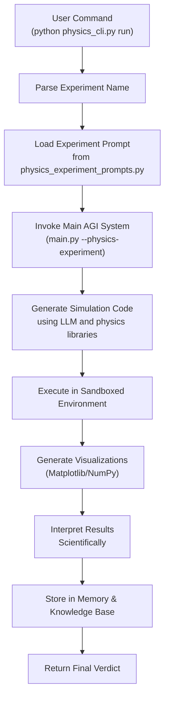
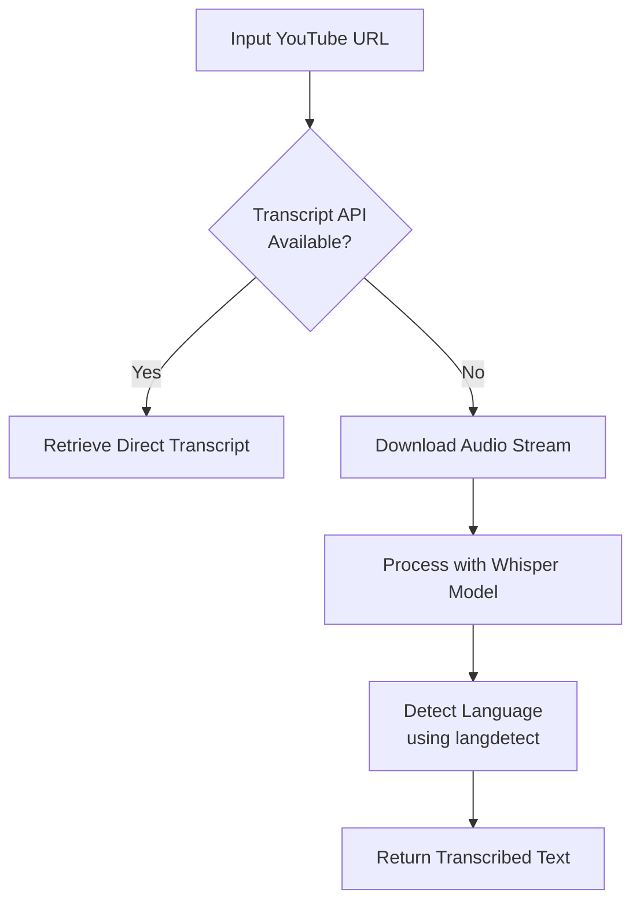
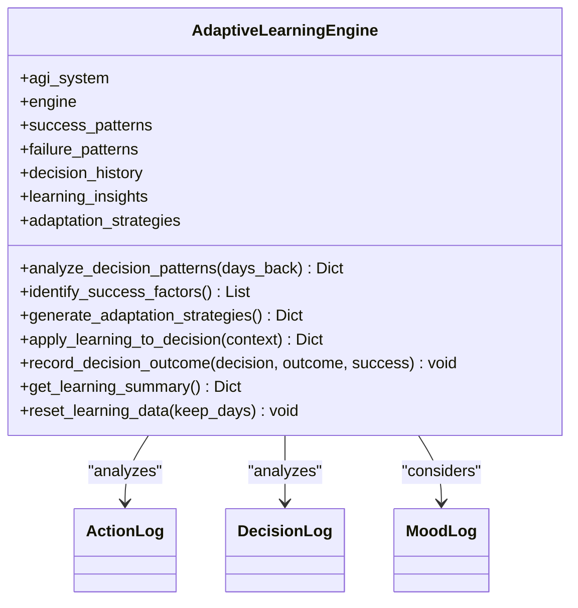
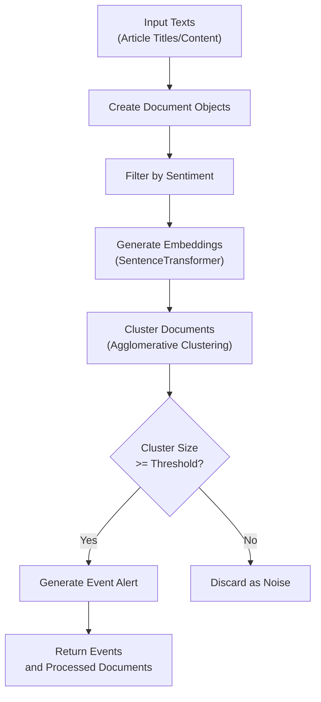

# Specialized Modules


## Table of Contents
1. [Physics Experimentation](#physics-experimentation)
2. [YouTube Transcription Capabilities](#youtube-transcription-capabilities)
3. [Adaptive Learning Mechanisms](#adaptive-learning-mechanisms)
4. [Event Detection System](#event-detection-system)

## Physics Experimentation

The physics experimentation system enables the AGI to autonomously conduct sophisticated scientific research through a structured pipeline that includes hypothesis formulation, simulation, analysis, and knowledge integration.

### Experiment Pipeline and Workflow

The system follows a seven-step "Experiment and Learn" pipeline:
1. **Scientific Analysis**: Deep understanding of the physics problem
2. **Code Generation**: Creation of Python simulations using proper physics formulas
3. **Safe Execution**: Running experiments in a sandboxed environment
4. **Visualization**: Generation of plots and graphs of results
5. **Interpretation**: Scientific analysis of findings
6. **Knowledge Integration**: Storage of results in memory and knowledge base
7. **Online Validation**: Cross-referencing with real-world physics knowledge



**Diagram sources**
- [physics_cli.py](file://physics_cli.py#L100-L140)
- [PHYSICS_EXPERIMENTS.md](file://PHYSICS_EXPERIMENTS.md#L10-L33)

**Section sources**
- [physics_cli.py](file://physics_cli.py#L1-L140)
- [PHYSICS_EXPERIMENTS.md](file://PHYSICS_EXPERIMENTS.md#L1-L170)

### Hypothesis Testing and Experiment Design

The system uses predefined experiment prompts stored in `physics_experiment_prompts.py` to structure its investigations. Each experiment includes:
- **Name**: Descriptive title of the experiment
- **Prompt**: Detailed instructions for the investigation
- **Expected Concepts**: Key physics concepts to be applied
- **Difficulty Level**: Categorized as intermediate, advanced, or expert

Example experiment structure:
```python
{
    "name": "Quantum Tunneling Barrier Analysis",
    "prompt": "Design an experiment to simulate quantum tunneling through a potential barrier...",
    "expected_concepts": ["wave function", "Schrödinger equation", "transmission coefficient"],
    "difficulty": "advanced"
}
```

The system supports three modes of operation:
- **Specific Experiment Mode**: Run a named experiment
- **Discovery Mode**: Explore novel physics concepts using random prompts
- **Test Suite Mode**: Execute comprehensive validation tests

### Results Logging and Storage

All experiment results are systematically stored through multiple channels:
- **File System**: Detailed logs saved in `experiment_results/` directory
- **Visual Outputs**: Generated plots saved as PNG files
- **Episodic Memory**: Results stored in the AGI's memory system
- **Knowledge Base**: Scientific findings integrated into the knowledge compression system

The system uses the following physics libraries:
- **NumPy**: Numerical calculations
- **Matplotlib**: Visualization and plotting
- **SciPy**: Advanced scientific computing
- **SymPy**: Symbolic mathematics (when needed)

Safety features include sandboxed execution, timeout protection, and error recovery mechanisms to ensure reliable operation.

**Section sources**
- [PHYSICS_EXPERIMENTS.md](file://PHYSICS_EXPERIMENTS.md#L60-L169)
- [physics_experiment_prompts.py](file://physics_experiment_prompts.py#L1-L108)

## YouTube Transcription Capabilities

The YouTube transcription module processes video content by extracting audio and converting it to text using state-of-the-art speech recognition technology.

### Processing Workflow

The transcription process follows a fallback strategy with two methods:
1. **Primary Method**: Use `youtube-transcript-api` to retrieve existing transcripts
2. **Fallback Method**: Download audio and transcribe using Whisper AI model



**Diagram sources**
- [modules/information_processing/youtube_transcription/youtube_transcription.py](file://modules/information_processing/youtube_transcription/youtube_transcription.py#L1-L60)

**Section sources**
- [modules/information_processing/youtube_transcription/youtube_transcription.py](file://modules/information_processing/youtube_transcription/youtube_transcription.py#L1-L60)

### Implementation Details

The module uses the following components:
- **pytube**: YouTube video downloading
- **Whisper**: OpenAI's speech recognition model
- **langdetect**: Language detection for transcribed text

Key function: `transcribe_youtube_video(url)`
- **Inputs**: YouTube video URL as string
- **Outputs**: Transcribed text as string
- **Process**:
  1. Download audio stream as MP3
  2. Load Whisper "large" model
  3. Transcribe audio to text
  4. Detect language of transcribed content
  5. Return text result

The system currently uses the "large" Whisper model for highest accuracy, though this can be configured. Transcriptions are returned as plain text without saving to files (current implementation has file saving commented out).

### Integration and Usage

The module can be used programmatically:
```python
from modules.information_processing.youtube_transcription.youtube_transcription import transcribe_youtube_video

text = transcribe_youtube_video("https://youtube.com/watch?v=example")
```

Or via command line execution, which prompts the user for a URL input.

**Section sources**
- [modules/information_processing/youtube_transcription/youtube_transcription.py](file://modules/information_processing/youtube_transcription/youtube_transcription.py#L1-L60)
- [modules/information_processing/youtube_transcription/pyproject.toml](file://modules/information_processing/youtube_transcription/pyproject.toml#L1-L14)

## Adaptive Learning Mechanisms

The adaptive learning engine analyzes past decisions and outcomes to improve future performance through pattern recognition and strategy adjustment.

### Learning Architecture

The `AdaptiveLearningEngine` class implements a comprehensive learning system that:
- Tracks decision history (last 1000 decisions)
- Maintains success and failure patterns by action type
- Generates adaptation strategies based on performance analysis
- Applies learned insights to future decisions



**Diagram sources**
- [modules/adaptive_learning/learning_engine.py](file://modules/adaptive_learning/learning_engine.py#L1-L356)

**Section sources**
- [modules/adaptive_learning/learning_engine.py](file://modules/adaptive_learning/learning_engine.py#L1-L356)

### Performance Analysis and Strategy Generation

The engine performs weekly analysis (configurable) of action and decision logs to identify patterns:

**Key Metrics Tracked:**
- Overall success rate
- Action-specific success rates
- Top performing actions
- Underperforming actions
- Action diversity

The system generates four types of adaptation strategies:

1. **Action Prioritization**: 
   - Prefer actions with >80% success rate (minimum 3 attempts)
   - Avoid actions with <30% success rate (minimum 3 attempts)

2. **Confidence Adjustment**:
   - Increase confidence modifier to 1.1 if overall success rate >80%
   - Decrease to 0.8 if below 40%

3. **Exploration vs Exploitation**:
   - Encourage exploration (bonus 0.2) if using fewer than 5 action types
   - Focus on exploitation (bonus 0.1) if using more than 15 action types

4. **Context Awareness**: Adjust decisions based on mood and memory context

### Integration and Application

The learning engine is integrated into the main AGI system and applies adaptations through:
- **Decision Influence**: Modifying action preferences and confidence levels
- **Mood Sensitivity**: Adjusting behavior based on emotional context
- **Memory Weighting**: Considering past experiences in current decisions

The system records outcomes via `record_decision_outcome()` which stores:
- Timestamp
- Action name and parameters
- Confidence level
- Outcome description
- Success/failure status
- Mood and memory context

This creates a feedback loop where the AGI continuously improves its decision-making capabilities based on empirical performance data.

**Section sources**
- [modules/adaptive_learning/learning_engine.py](file://modules/adaptive_learning/learning_engine.py#L1-L356)
- [core/system.py](file://core/system.py#L28-L63)

## Event Detection System

The event detection system identifies emerging events from RSS feeds and web sources by clustering similar content and generating alerts for significant topics.

### Detection Architecture

The system processes text data through a four-stage pipeline:
1. **Content Filtering**: Remove irrelevant or negative content
2. **Embedding Generation**: Convert text to vector representations
3. **Clustering**: Group similar documents using agglomerative clustering
4. **Alert Generation**: Create event alerts for significant clusters



**Diagram sources**
- [modules/event_detection/event_detector.py](file://modules/event_detection/event_detector.py#L1-L189)

**Section sources**
- [modules/event_detection/event_detector.py](file://modules/event_detection/event_detector.py#L1-L189)

### Core Components and Algorithms

**Key Classes:**
- **Document**: Represents a text document with metadata, embedding, cluster ID, and sentiment
- **Event**: Represents a detected event with ID, keywords, summary, and document count

**Machine Learning Models:**
- **Embedding Model**: `all-MiniLM-L6-v2` from Sentence Transformers
- **Sentiment Classifier**: Hugging Face transformers pipeline

**Clustering Parameters:**
- Algorithm: Agglomerative Clustering
- Metric: Cosine distance
- Linkage: Average
- Distance threshold: 0.5
- Minimum cluster size: 5 documents

The system uses lazy loading for models, with global instances to avoid reloading. It can accept pre-loaded models for production use or load them on demand.

### Integration and Data Flow

The event detection system is integrated at multiple levels:

**From Data Service:**
```python
def detect_and_save_events(self):
    # Fetch recent articles from database
    # Extract titles and links as texts
    # Process through event detection
    # Save detected events to database
```

**From Situation Generator:**
Uses detected events to create trending topic situations for the AGI to analyze.

**From Main System:**
Provides recent events that can influence the AGI's decision-making process.

The system is exposed as an API server on port 8001, accepting POST requests with text arrays and returning detected events and processed documents.

**Section sources**
- [modules/event_detection/event_detector.py](file://modules/event_detection/event_detector.py#L1-L189)
- [services/data_service.py](file://services/data_service.py#L1-L57)
- [core/system.py](file://core/system.py#L28-L63)
- [modules/event_detection/README.md](file://modules/event_detection/README.md#L1-L37)

**Referenced Files in This Document**   
- [physics_cli.py](file://physics_cli.py)
- [physics_experiment_prompts.py](file://physics_experiment_prompts.py)
- [PHYSICS_EXPERIMENTS.md](file://PHYSICS_EXPERIMENTS.md)
- [modules/information_processing/youtube_transcription/youtube_transcription.py](file://modules/information_processing/youtube_transcription/youtube_transcription.py)
- [modules/adaptive_learning/learning_engine.py](file://modules/adaptive_learning/learning_engine.py)
- [modules/event_detection/event_detector.py](file://modules/event_detection/event_detector.py)
- [services/data_service.py](file://services/data_service.py)
- [core/system.py](file://core/system.py)