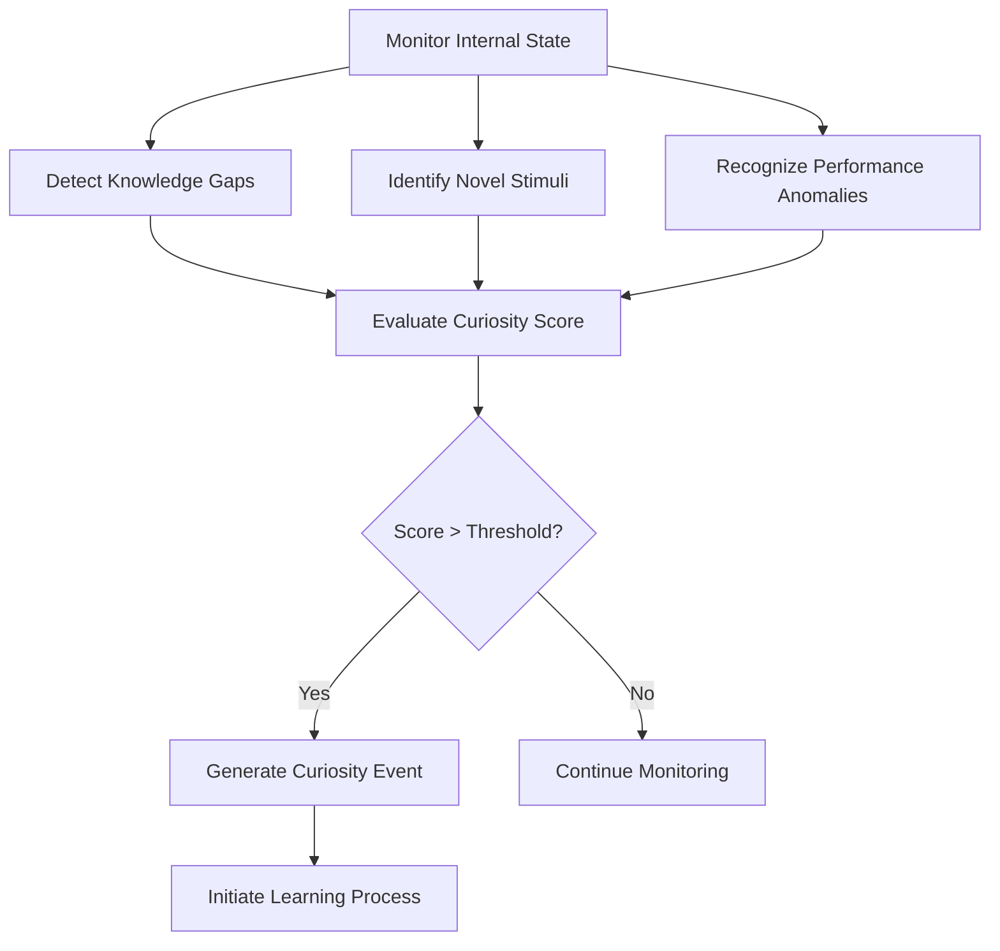
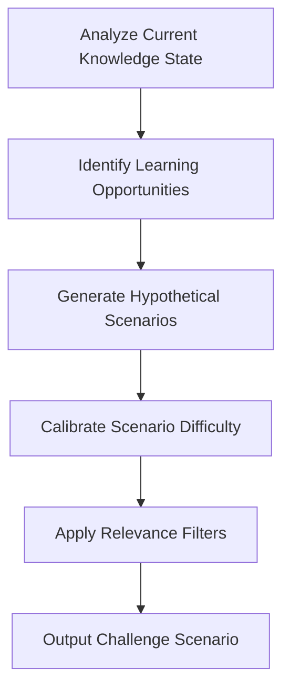
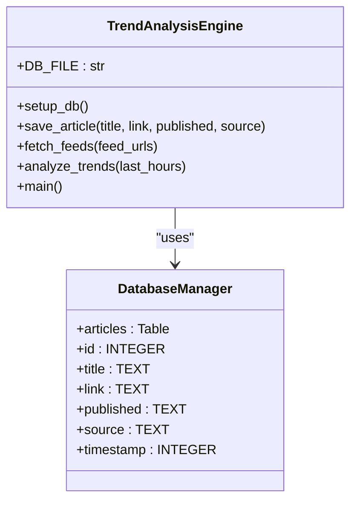
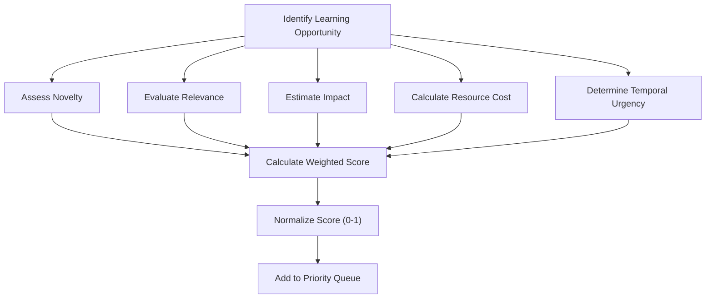
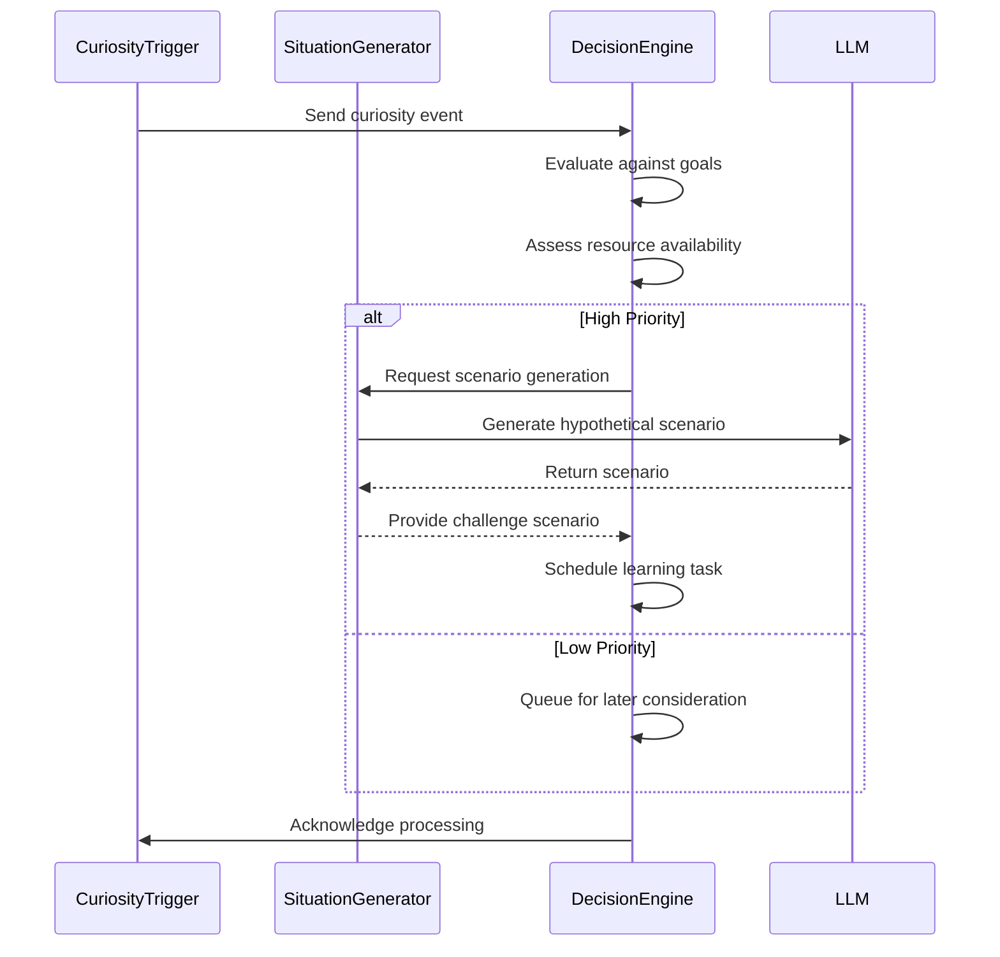

# Specialized Modules


## Update Summary
**Changes Made**   
- Added integration between Adaptive Learning Engine and Autonomous Blog Scheduler for milestone blogging
- Updated Introduction and Examples sections to reflect new learning milestone triggers
- Enhanced Configuration and Tuning section with blog-related parameters
- Added new examples of learning milestone blog triggers
- Updated section sources to reflect new file dependencies

## Table of Contents
1. [Introduction](#introduction)
2. [Curiosity Trigger Mechanism](#curiosity-trigger-mechanism)
3. [Situation Generator](#situation-generator)
4. [Trend Analysis Engine](#trend-analysis-engine)
5. [Curiosity Scoring and Prioritization](#curiosity-scoring-and-prioritization)
6. [Integration with Decision-Making System](#integration-with-decision-making-system)
7. [Resource Management and Filtering](#resource-management-and-filtering)
8. [Configuration and Tuning](#configuration-and-tuning)
9. [Examples and Use Cases](#examples-and-use-cases)
10. [Conclusion](#conclusion)

## Introduction
The Learning & Curiosity system is a core component of the RAVANA AGI framework, designed to autonomously identify knowledge gaps, detect novel stimuli, and initiate learning processes. This system enables the AGI to proactively explore its environment, generate challenging scenarios, and adapt to emerging patterns in external data. The architecture integrates multiple specialized modules that work in concert to balance exploration with resource constraints, ensuring efficient and relevant knowledge acquisition.

A recent enhancement integrates the Adaptive Learning Engine with the Autonomous Blog Scheduler, enabling automatic documentation of learning milestones. This integration allows the system to recognize significant learning achievements and generate blog posts to document these milestones, enhancing knowledge retention and external communication.

**Section sources**
- [curiosity_trigger.py](file://modules/curiosity_trigger/curiosity_trigger.py#L1-L100)
- [trend_engine.py](file://modules/information_processing/trend_analysis/trend_engine.py#L1-L90)
- [learning_engine.py](file://modules/adaptive_learning/learning_engine.py#L23-L699) - *Updated in recent commit*

## Curiosity Trigger Mechanism

The CuriosityTrigger module detects knowledge gaps and novel stimuli to initiate learning processes. It operates by monitoring internal state changes, identifying information asymmetries, and recognizing patterns that deviate from established knowledge.

The trigger mechanism evaluates multiple signals:
- **Knowledge gaps**: Areas where confidence in responses is low or information is missing
- **Novel stimuli**: New patterns or concepts detected in external data streams
- **Performance anomalies**: Situations where expected outcomes differ from actual results
- **Temporal patterns**: Recurring topics or emerging trends that warrant investigation

When a trigger condition is met, the system generates a curiosity event that initiates a learning cycle. The trigger uses probabilistic assessment to avoid over-curiosity, incorporating randomness to prevent predictable behavior patterns.



**Diagram sources**
- [curiosity_trigger.py](file://modules/curiosity_trigger/curiosity_trigger.py#L1-L50)

**Section sources**
- [curiosity_trigger.py](file://modules/curiosity_trigger/curiosity_trigger.py#L1-L100)

## Situation Generator

The SituationGenerator creates challenging scenarios for the AGI to solve, fostering learning through problem-solving and experimentation. It generates hypothetical situations based on current knowledge gaps, trending topics, and areas of potential improvement.

The generator operates through a multi-step process:
1. **Context analysis**: Evaluates current knowledge state and recent experiences
2. **Scenario formulation**: Creates "what if" questions and hypothetical challenges
3. **Complexity calibration**: Adjusts difficulty based on AGI's current capabilities
4. **Relevance filtering**: Ensures scenarios align with overarching goals

The system can generate various types of situations:
- **Knowledge-based challenges**: Questions that test understanding of specific domains
- **Problem-solving scenarios**: Complex problems requiring multi-step reasoning
- **Ethical dilemmas**: Situations that test value alignment and decision-making
- **Creative tasks**: Open-ended challenges that encourage innovative thinking



**Diagram sources**
- [situation_generator.py](file://modules/situation_generator/situation_generator.py#L1-L50)

**Section sources**
- [situation_generator.py](file://modules/situation_generator/situation_generator.py#L1-L100)
- [llm.py](file://core/llm.py#L500-L550)

## Trend Analysis Engine

The trend_analysis engine processes external data to identify emerging patterns and topics. It monitors RSS feeds and other information sources to detect shifts in discourse and technological developments.

The engine architecture consists of:
- **Data ingestion**: Fetches articles from configured RSS feeds
- **Storage layer**: Persists articles in a local SQLite database
- **Text analysis**: Processes article titles to identify trending words
- **Pattern recognition**: Detects frequently occurring terms and concepts

Key implementation details:
- Articles are stored with metadata including title, link, publication date, and source
- Trend analysis focuses on article titles, performing basic text cleaning and stopword removal
- The system tracks word frequency over configurable time windows (default: 24 hours)
- Results are presented as ranked lists of the most mentioned terms



**Diagram sources**
- [trend_engine.py](file://modules/information_processing/trend_analysis/trend_engine.py#L1-L90)

**Section sources**
- [trend_engine.py](file://modules/information_processing/trend_analysis/trend_engine.py#L1-L90)

## Curiosity Scoring and Prioritization

Curiosity scores are calculated using a weighted combination of factors that assess the potential value of pursuing a particular learning opportunity. The scoring system balances novelty, relevance, and potential impact.

The scoring algorithm considers:
- **Novelty weight**: How new or unfamiliar the topic is to the AGI
- **Relevance weight**: Alignment with current goals and interests
- **Impact potential**: Expected improvement in capabilities if learned
- **Resource cost**: Estimated time and computational resources required
- **Temporal urgency**: How quickly the knowledge might become obsolete

Scores are normalized to a 0-1 scale, with higher values indicating greater priority. The system uses these scores to rank learning opportunities and determine which should be pursued immediately versus stored for later consideration.



**Section sources**
- [curiosity_trigger.py](file://modules/curiosity_trigger/curiosity_trigger.py#L1-L100)
- [decision_maker.py](file://modules/decision_engine/decision_maker.py#L1-L181)

## Integration with Decision-Making System

The learning and curiosity system integrates with the decision-making framework to schedule learning tasks and allocate resources appropriately. This integration ensures that curiosity-driven activities align with overarching goals and do not interfere with critical operations.

The decision engine processes curiosity events through the following workflow:
1. **Event reception**: Receives curiosity triggers from the CuriosityTrigger module
2. **Goal alignment**: Checks if the learning opportunity supports existing goals
3. **Resource assessment**: Evaluates available computational resources
4. **Task scheduling**: Adds learning tasks to the execution queue when appropriate
5. **Progress tracking**: Monitors completion and incorporates new knowledge

The system uses a probabilistic approach to avoid over-committing to curiosity-driven tasks, with a 10% chance of initiating experiments when no active experiment is running. This prevents the AGI from becoming distracted by endless exploration.



**Diagram sources**
- [decision_maker.py](file://modules/decision_engine/decision_maker.py#L1-L181)
- [curiosity_trigger.py](file://modules/curiosity_trigger/curiosity_trigger.py#L1-L50)

**Section sources**
- [decision_maker.py](file://modules/decision_engine/decision_maker.py#L1-L181)
- [planner.py](file://modules/decision_engine/planner.py#L1-L220)

## Resource Management and Filtering

The system addresses over-curiosity issues through comprehensive resource allocation strategies and relevance filtering mechanisms. These safeguards ensure that learning activities remain productive and do not consume excessive computational resources.

Key resource management features:
- **Time budgeting**: Limits the duration of learning sessions
- **Frequency capping**: Prevents excessive triggering of curiosity events
- **Priority queuing**: Orders learning tasks by importance
- **Progressive disclosure**: Gradually increases complexity based on mastery

Relevance filtering employs multiple criteria:
- **Goal alignment**: Filters opportunities that don't support current objectives
- **Domain focus**: Prioritizes topics within areas of specialization
- **Redundancy detection**: Avoids relearning already mastered concepts
- **Practical applicability**: Favors knowledge with real-world utility

The system also implements backpressure mechanisms that temporarily suppress curiosity triggers when system load exceeds thresholds, ensuring stable operation during high-demand periods.

**Section sources**
- [decision_maker.py](file://modules/decision_engine/decision_maker.py#L1-L181)
- [curiosity_trigger.py](file://modules/curiosity_trigger/curiosity_trigger.py#L1-L50)

## Configuration and Tuning

The learning and curiosity system provides several configuration parameters for tuning sensitivity thresholds and domain focus. These settings allow operators to customize the AGI's exploratory behavior based on specific requirements.

Configurable parameters include:
- **Curiosity threshold**: Minimum score required to initiate learning (default: 0.7)
- **Exploration rate**: Probability of pursuing novel opportunities (default: 0.1)
- **Trend analysis window**: Time period for identifying emerging patterns (default: 24 hours)
- **Maximum concurrent experiments**: Limit on active learning processes (default: 1)
- **Domain weights**: Relative importance of different knowledge areas
- **Blog integration**: Enables automatic blog generation for learning milestones (default: True)
- **Blog importance threshold**: Minimum importance score for blog-worthy events (default: 0.5)

Tuning recommendations:
- For focused applications: Increase the curiosity threshold and reduce exploration rate
- For research-oriented systems: Lower thresholds and increase concurrent experiment limits
- For production environments: Implement stricter relevance filtering and resource limits
- For creative applications: Emphasize novelty weighting and reduce practicality filters
- When integrating with blogging: Adjust the blog importance threshold based on desired posting frequency

Configuration is managed through the system's central configuration file, with parameters exposed for both automated adjustment and manual override.

**Section sources**
- [decision_maker.py](file://modules/decision_engine/decision_maker.py#L1-L181)
- [trend_engine.py](file://modules/information_processing/trend_analysis/trend_engine.py#L1-L90)
- [planner.py](file://modules/decision_engine/planner.py#L1-L220)
- [learning_engine.py](file://modules/adaptive_learning/learning_engine.py#L23-L699) - *Updated in recent commit*

## Examples and Use Cases

### Generated Situations
- "What if quantum entanglement could be used for instantaneous communication across interstellar distances?"
- "Design a self-replicating spacecraft that could explore the galaxy within 1 million years"
- "How would society change if humans could directly interface with AI systems at neural speeds?"

### Curiosity-Driven Queries
- "Recent articles show increased mentions of 'neural lace technology' - investigate potential applications"
- "Performance on quantum computing questions has declined 15% - initiate learning protocol"
- "No recent exploration of bio-inspired robotics - generate challenge scenarios"

### Trend Detection Outputs
```
🔥 Top Trending Words (Last 24 hours):
quantum: 42 mentions
neural: 38 mentions
fusion: 35 mentions
autonomous: 33 mentions
biomimetic: 29 mentions
```

### Learning Milestone Blog Triggers
The Adaptive Learning Engine now automatically detects and documents significant learning achievements:

- **Performance Breakthrough**: "Learning Milestone: Performance Breakthrough" triggered when success rate improves by 15% or more
- **Behavioral Diversity Growth**: "Behavioral Diversity Growth: {count} Action Types" when the AGI expands its action repertoire by 5+ new types
- **Sustained Excellence**: "Sustained Excellence: Consistent High Performance" when maintaining >80% success rate over 5 consecutive periods
- **Strategic Evolution**: "Strategic Evolution: {count} New Adaptations" when multiple new decision-making strategies are generated
- **Failure Analysis**: "Learning from Setbacks: {action} Analysis" after 3, 7, or 15 failures with the same action type

These milestones are automatically registered with the Autonomous Blog Scheduler, which determines whether to generate a blog post based on importance scoring and system priorities.

**Section sources**
- [trend_engine.py](file://modules/information_processing/trend_analysis/trend_engine.py#L1-L90)
- [curiosity_trigger.py](file://modules/curiosity_trigger/curiosity_trigger.py#L1-L50)
- [decision_maker.py](file://modules/decision_engine/decision_maker.py#L1-L181)
- [learning_engine.py](file://modules/adaptive_learning/learning_engine.py#L23-L699) - *Updated in recent commit*
- [autonomous_blog_scheduler.py](file://core/services/autonomous_blog_scheduler.py#L29-L38) - *Blog trigger types*

## Conclusion
The Learning & Curiosity system provides a sophisticated framework for autonomous knowledge acquisition in the RAVANA AGI. By integrating curiosity triggers, situation generation, trend analysis, and decision-making, the system enables proactive learning while maintaining appropriate resource constraints. The modular design allows for independent optimization of each component, while the unified architecture ensures coherent behavior across different learning modalities. 

Recent enhancements integrating the Adaptive Learning Engine with the Autonomous Blog Scheduler enable automatic documentation of learning milestones, enhancing knowledge retention and external communication. This system represents a significant step toward truly autonomous artificial general intelligence capable of self-directed improvement and adaptation.

**Referenced Files in This Document**   
- [curiosity_trigger.py](file://modules/curiosity_trigger/curiosity_trigger.py)
- [trend_engine.py](file://modules/information_processing/trend_analysis/trend_engine.py)
- [decision_maker.py](file://modules/decision_engine/decision_maker.py)
- [planner.py](file://modules/decision_engine/planner.py)
- [llm.py](file://core/llm.py)
- [situation_generator.py](file://modules/situation_generator/situation_generator.py)
- [learning_engine.py](file://modules/adaptive_learning/learning_engine.py) - *Updated in recent commit*
- [autonomous_blog_scheduler.py](file://core/services/autonomous_blog_scheduler.py) - *Referenced for blog integration*
