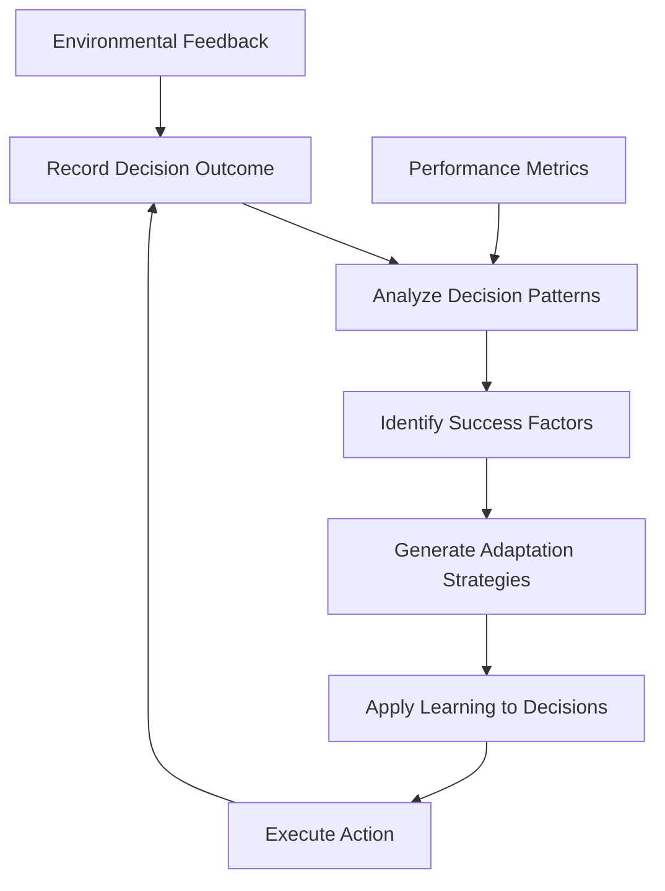
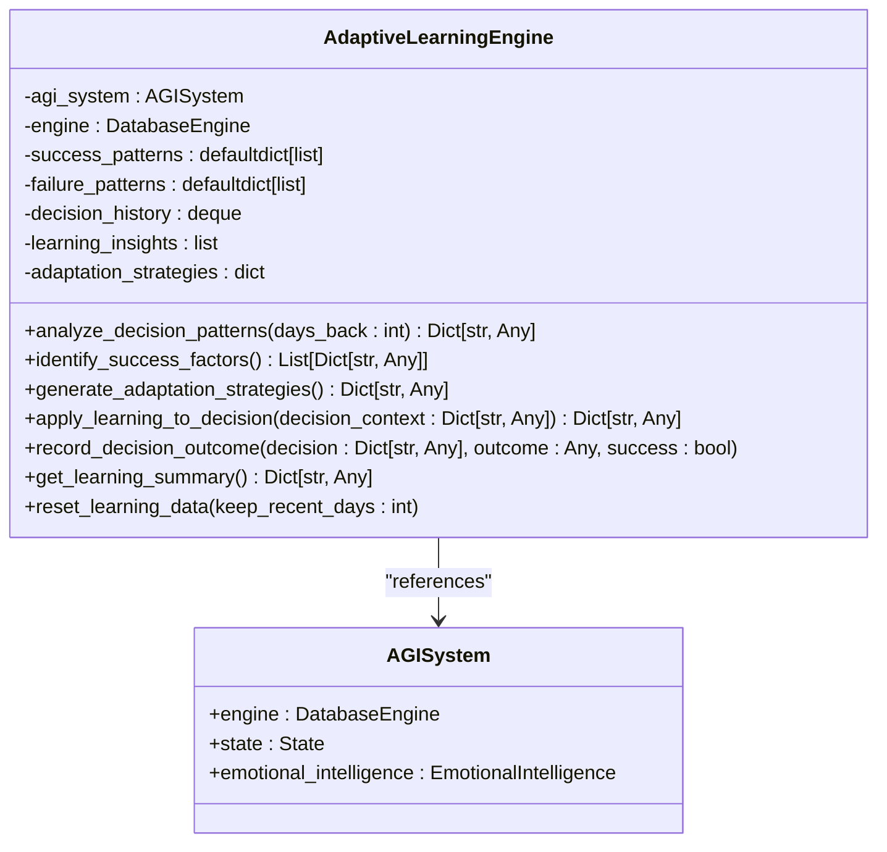
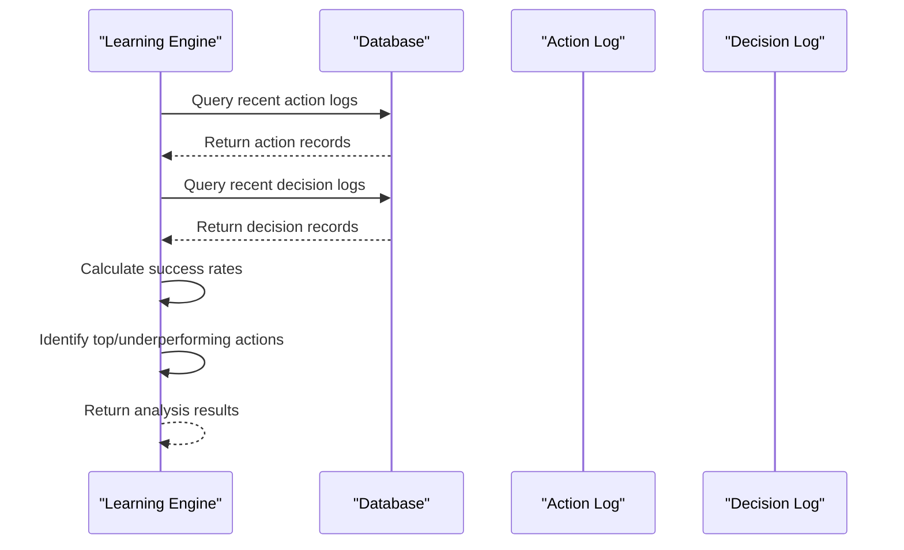
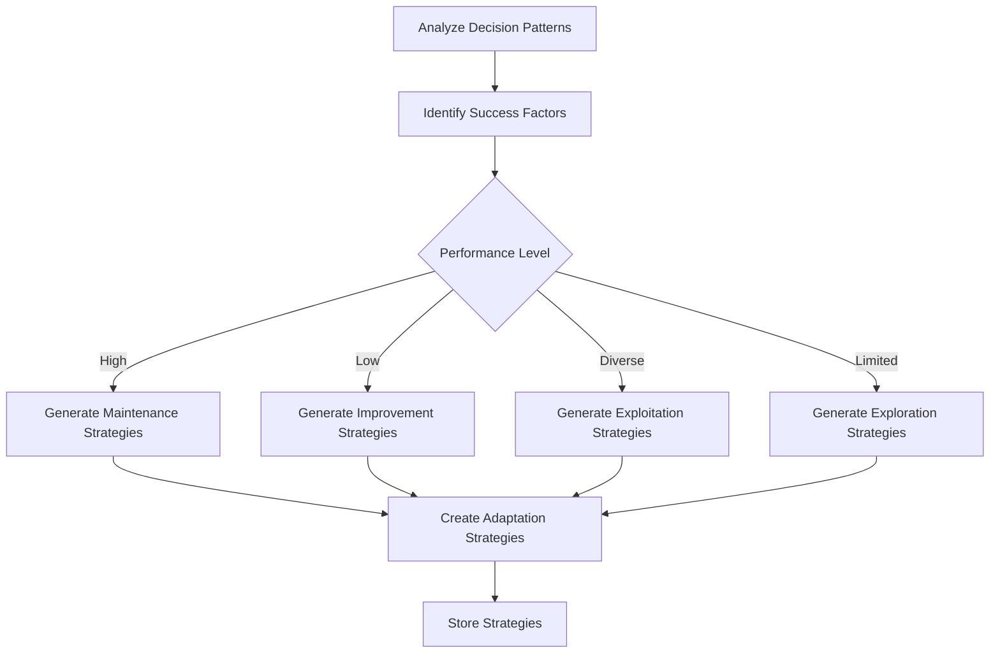
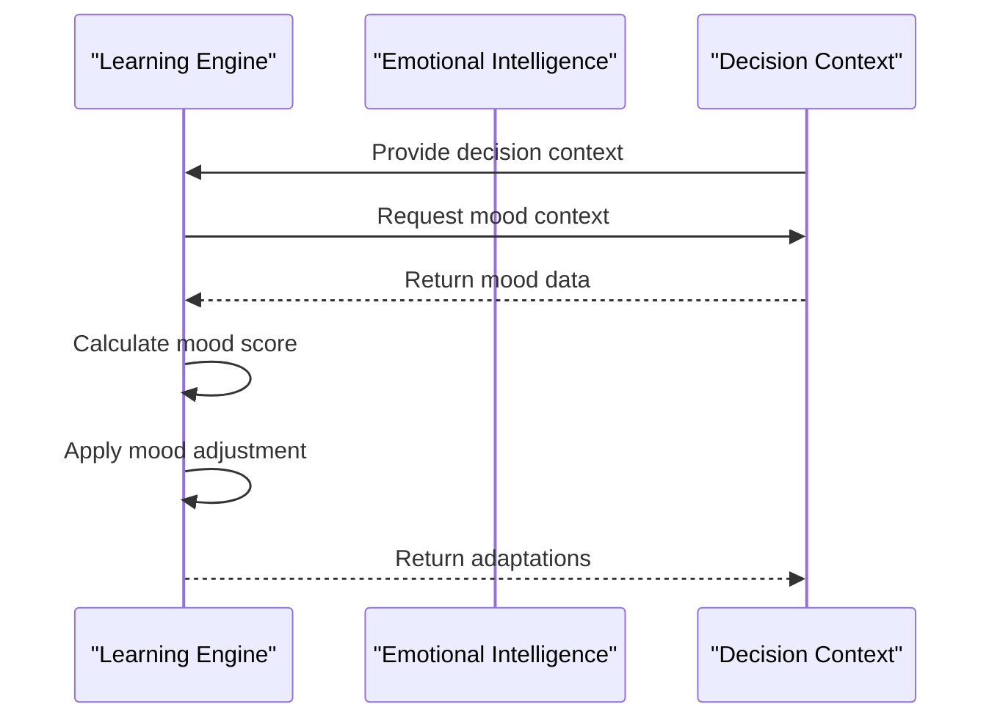

# Adaptive Learning


## Table of Contents
1. [Introduction](#introduction)
2. [Core Learning Mechanisms](#core-learning-mechanisms)
3. [Learning Engine Architecture](#learning-engine-architecture)
4. [Performance Analysis and Pattern Recognition](#performance-analysis-and-pattern-recognition)
5. [Adaptation Strategy Generation](#adaptation-strategy-generation)
6. [Integration with Cognitive Modules](#integration-with-cognitive-modules)
7. [Configuration Parameters and Tuning](#configuration-parameters-and-tuning)
8. [Learning State Management](#learning-state-management)
9. [Potential Challenges and Best Practices](#potential-challenges-and-best-practices)

## Introduction
The Adaptive Learning module is a core component of the RAVANA AGI system, responsible for continuous self-improvement through performance feedback and environmental interactions. This document provides a comprehensive analysis of the learning engine's architecture, mechanisms, and integration points. The system analyzes past decisions and outcomes to identify success patterns, generate adaptation strategies, and modify future behavior accordingly. It integrates with emotional intelligence, episodic memory, and self-reflection modules to create a holistic learning framework that enables the AGI to evolve its knowledge retention, decision-making strategies, and behavioral patterns over time.

## Core Learning Mechanisms

The Adaptive Learning Engine operates through a continuous cycle of performance analysis, strategy generation, and behavioral adaptation. The system records decision outcomes, analyzes patterns in successful and failed actions, and generates adaptation strategies that influence future decisions. This closed-loop learning process enables the AGI to refine its approach based on empirical performance data.



**Diagram sources**
- [learning_engine.py](file://modules/adaptive_learning/learning_engine.py#L16-L354)

**Section sources**
- [learning_engine.py](file://modules/adaptive_learning/learning_engine.py#L16-L354)

## Learning Engine Architecture

The AdaptiveLearningEngine class serves as the central component of the learning system, maintaining state and coordinating learning activities. The engine tracks decision history, success and failure patterns, learning insights, and active adaptation strategies. It interfaces with the AGI system's database to retrieve action and decision logs for analysis.



**Diagram sources**
- [learning_engine.py](file://modules/adaptive_learning/learning_engine.py#L16-L354)

**Section sources**
- [learning_engine.py](file://modules/adaptive_learning/learning_engine.py#L16-L354)

## Performance Analysis and Pattern Recognition

### Decision Pattern Analysis
The learning engine analyzes recent decisions and outcomes to identify performance patterns. It queries the database for action and decision logs from a specified time period (default: 7 days) and calculates success rates for different action types. The analysis includes overall success rate, action-specific success rates, and identifies top-performing and underperforming actions.



**Diagram sources**
- [learning_engine.py](file://modules/adaptive_learning/learning_engine.py#L28-L94)

**Section sources**
- [learning_engine.py](file://modules/adaptive_learning/learning_engine.py#L28-L94)

### Success Factor Identification
Based on the performance analysis, the engine identifies factors that contribute to successful outcomes. These factors include high-performing actions, overall performance trends, and action diversity. The system categorizes performance levels and provides recommendations for maintaining or adjusting strategies accordingly.

**Key Success Factors:**
- **High-performing actions**: Actions with success rates above 80%
- **Overall performance**: Success rate above 70% indicates effective strategy
- **Action diversity**: Using more than 10 different action types promotes exploration

**Section sources**
- [learning_engine.py](file://modules/adaptive_learning/learning_engine.py#L96-L143)

## Adaptation Strategy Generation

### Strategy Creation Process
The learning engine generates adaptation strategies based on identified success factors and performance analysis. These strategies are designed to improve future performance by modifying decision-making parameters and behavioral tendencies.



**Diagram sources**
- [learning_engine.py](file://modules/adaptive_learning/learning_engine.py#L145-L210)

**Section sources**
- [learning_engine.py](file://modules/adaptive_learning/learning_engine.py#L145-L210)

### Strategy Types
The system generates four primary types of adaptation strategies:

1. **Action Prioritization**: Identifies actions to prefer or avoid based on historical success rates
2. **Confidence Adjustment**: Modifies decision confidence based on overall performance
3. **Exploration vs Exploitation**: Balances between trying new actions and using proven ones
4. **Context-aware Adaptations**: Adjusts decisions based on mood and memory context

**Section sources**
- [learning_engine.py](file://modules/adaptive_learning/learning_engine.py#L145-L210)

## Integration with Cognitive Modules

### Emotional Intelligence Integration
The learning engine integrates with the emotional intelligence module to incorporate mood context into decision-making. When applying learning adaptations, the system considers the current mood state, calculating a mood score based on positive and negative mood indicators. This score is weighted by the mood_sensitivity parameter to influence decisions.



**Diagram sources**
- [learning_engine.py](file://modules/adaptive_learning/learning_engine.py#L244-L245)
- [emotional_intellegence.py](file://modules/emotional_intellegence/emotional_intellegence.py#L9-L104)

**Section sources**
- [learning_engine.py](file://modules/adaptive_learning/learning_engine.py#L244-L245)
- [emotional_intellegence.py](file://modules/emotional_intellegence/emotional_intellegence.py#L9-L104)

### Episodic Memory Integration
The learning engine connects with the episodic memory system to incorporate past experiences into decision-making. Decision records include memory context, allowing the system to reference relevant past experiences when evaluating outcomes. The memory system's retrieval capabilities enable the AGI to access similar past situations when making new decisions.

**Section sources**
- [learning_engine.py](file://modules/adaptive_learning/learning_engine.py#L252-L253)
- [memory.py](file://modules/episodic_memory/memory.py#L1-L721)

### Self-Reflection Integration
The adaptive learning system complements the self-reflection module by providing quantitative performance data that can inform deeper cognitive reflection. While the learning engine focuses on pattern recognition and strategy generation, the self-reflection module uses LLM-powered analysis to generate qualitative insights about task outcomes and potential improvements.

**Section sources**
- [learning_engine.py](file://modules/adaptive_learning/learning_engine.py#L16-L354)
- [main.py](file://modules/agent_self_reflection/main.py#L1-L51)

## Configuration Parameters and Tuning

### Learning Parameters
The system includes several configurable parameters that control the learning behavior:

**Context-awareness Parameters:**
- **mood_sensitivity**: Weight applied to mood score when adjusting decisions (default: 0.1)
- **memory_weight**: Influence of memory context on decision-making (default: 0.15)

**Strategy Thresholds:**
- **High success rate**: Actions with success rate > 80% are prioritized
- **Low success rate**: Actions with success rate < 30% are avoided
- **High overall performance**: Overall success rate > 70% triggers confidence increase
- **Low overall performance**: Overall success rate < 50% triggers strategy adjustment

**Section sources**
- [learning_engine.py](file://modules/adaptive_learning/learning_engine.py#L195-L226)

### Adaptation Triggers
The learning engine automatically generates adaptation strategies when they are needed. The `apply_learning_to_decision` method checks if strategies exist and generates them if necessary, ensuring that decisions are always informed by the latest performance analysis.

**Section sources**
- [learning_engine.py](file://modules/adaptive_learning/learning_engine.py#L212-L214)

## Learning State Management

### Decision Outcome Recording
The system records detailed information about each decision outcome, including timestamp, action type, parameters, confidence level, outcome description, success status, and contextual information. This comprehensive logging enables thorough analysis and pattern recognition.

```python
decision_record = {
    'timestamp': datetime.utcnow().isoformat(),
    'action': decision.get('action', 'unknown'),
    'params': decision.get('params', {}),
    'confidence': decision.get('confidence', 0.5),
    'outcome': str(outcome)[:500],
    'success': success,
    'mood_context': decision.get('mood_context', {}),
    'memory_context': decision.get('memory_context', [])
}
```

**Section sources**
- [learning_engine.py](file://modules/adaptive_learning/learning_engine.py#L252-L262)

### Data Retention and History Management
The learning engine maintains several data structures with defined retention policies:
- **decision_history**: Deque with maximum length of 1000 records
- **success_patterns** and **failure_patterns**: Limited to 50 records per action
- **Learning data reset**: Option to reset all learning data or keep recent data (default: 30 days)

**Section sources**
- [learning_engine.py](file://modules/adaptive_learning/learning_engine.py#L274-L278)
- [learning_engine.py](file://modules/adaptive_learning/learning_engine.py#L308-L354)

## Potential Challenges and Best Practices

### Potential Issues
1. **Overfitting to recent experiences**: The system may overemphasize recent patterns while neglecting longer-term trends
2. **Slow adaptation in dynamic environments**: Fixed analysis periods (7 days) may not respond quickly to rapidly changing conditions
3. **Conflicting learning signals**: Multiple adaptation strategies may provide contradictory guidance
4. **Mood sensitivity imbalance**: Excessive mood influence could lead to unstable decision-making

### Best Practices for Tuning
1. **Monitor learning summary regularly**: Use `get_learning_summary()` to track learning progress and active strategies
2. **Adjust analysis period based on environment**: Modify the `days_back` parameter in `analyze_decision_patterns()` for faster or slower adaptation
3. **Balance exploration and exploitation**: Monitor action diversity and adjust exploration bonuses as needed
4. **Validate adaptation strategies**: Periodically review generated strategies to ensure they align with overall objectives
5. **Reset learning data when necessary**: Use `reset_learning_data()` to clear outdated patterns when the AGI's role or environment changes significantly

**Section sources**
- [learning_engine.py](file://modules/adaptive_learning/learning_engine.py#L286-L306)
- [learning_engine.py](file://modules/adaptive_learning/learning_engine.py#L308-L354)

**Referenced Files in This Document**   
- [learning_engine.py](file://modules/adaptive_learning/learning_engine.py#L16-L354)
- [emotional_intellegence.py](file://modules/emotional_intellegence/emotional_intellegence.py#L9-L104)
- [memory.py](file://modules/episodic_memory/memory.py#L1-L721)
- [main.py](file://modules/agent_self_reflection/main.py#L1-L51)