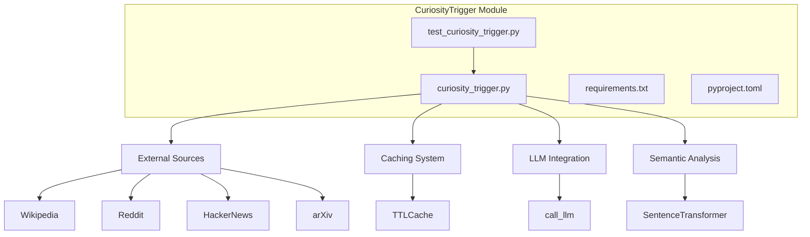
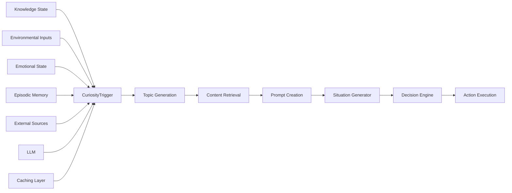
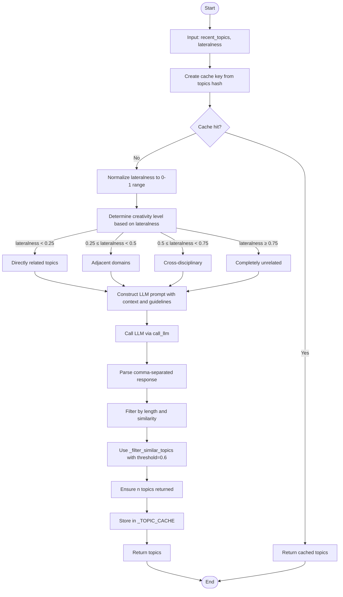
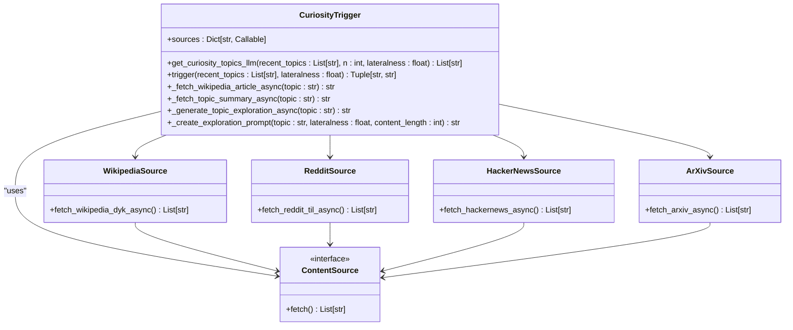
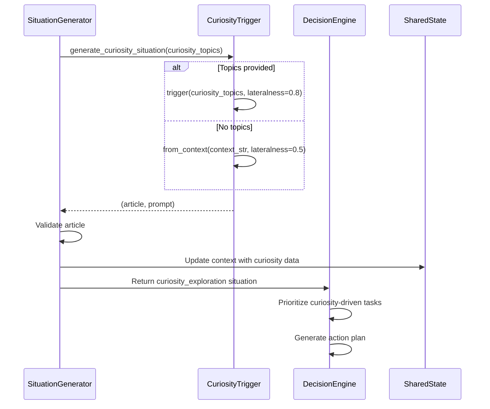
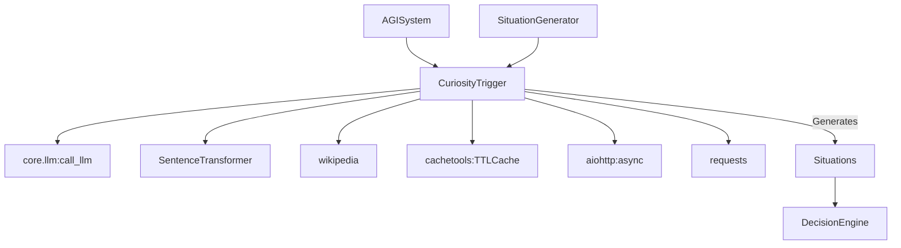

# Curiosity Trigger

## Table of Contents
1. [Introduction](#introduction)
2. [Project Structure](#project-structure)
3. [Core Components](#core-components)
4. [Architecture Overview](#architecture-overview)
5. [Detailed Component Analysis](#detailed-component-analysis)
6. [Dependency Analysis](#dependency-analysis)
7. [Performance Considerations](#performance-considerations)
8. [Troubleshooting Guide](#troubleshooting-guide)
9. [Conclusion](#conclusion)

## Introduction
The CuriosityTrigger module is a core component of the RAVANA AGI system designed to autonomously detect novelty, uncertainty, and information gaps in the agent's knowledge state and environmental inputs. It functions as a cognitive driver that initiates learning behavior by generating curiosity-driven exploration tasks. The module evaluates recent topics, emotional context, and memory fragments to calculate curiosity scores and identify high-potential learning opportunities. These triggers are then integrated into the decision-making pipeline to prioritize exploratory actions. The system leverages multiple external data sources, semantic similarity analysis, and LLM-based topic generation to ensure diverse and meaningful curiosity events.

## Project Structure
The CuriosityTrigger module is organized as a self-contained Python package within the `modules/curiosity_trigger` directory. It follows a modular design with clear separation between data ingestion, processing logic, and output generation.

**Diagram sources**
- [curiosity_trigger.py](file://modules/curiosity_trigger/curiosity_trigger.py#L1-L551)
- [test_curiosity_trigger.py](file://modules/curiosity_trigger/test_curiosity_trigger.py#L1-L23)

**Section sources**
- [curiosity_trigger.py](file://modules/curiosity_trigger/curiosity_trigger.py#L1-L551)

## Core Components
The CuriosityTrigger module consists of several key components that work together to detect and generate curiosity events. The primary class is `CuriosityTrigger`, which orchestrates the entire process of topic generation, content retrieval, and prompt creation. It integrates with external knowledge sources such as Wikipedia, Reddit's r/todayilearned, Hacker News, and arXiv to gather novel information. The module uses semantic embeddings via SentenceTransformer to filter out topics that are too similar to recently explored subjects, ensuring novelty. It also implements caching mechanisms using TTLCache to improve performance and reduce redundant API calls. The integration with the LLM through `call_llm` enables sophisticated topic generation based on context and creativity parameters.

**Section sources**
- [curiosity_trigger.py](file://modules/curiosity_trigger/curiosity_trigger.py#L1-L551)

## Architecture Overview
The CuriosityTrigger operates within the broader RAVANA architecture as a stimulus generator that feeds into the decision-making and situation generation systems. It receives contextual input from the AGI's knowledge state and produces curiosity-driven prompts that are consumed by higher-level planning components.

**Diagram sources**
- [curiosity_trigger.py](file://modules/curiosity_trigger/curiosity_trigger.py#L1-L551)
- [situation_generator.py](file://modules/situation_generator/situation_generator.py#L1-L873)
- [system.py](file://core/system.py#L1-L266)

## Detailed Component Analysis

### Curiosity Scoring Algorithm
The CuriosityTrigger module calculates curiosity scores through a multi-faceted approach that combines novelty detection, semantic distance, and contextual relevance. The primary mechanism is the `get_curiosity_topics_llm` method, which generates topics based on their "lateralness" parameter—a measure of conceptual distance from known topics.

**Diagram sources**
- [curiosity_trigger.py](file://modules/curiosity_trigger/curiosity_trigger.py#L213-L310)

**Section sources**
- [curiosity_trigger.py](file://modules/curiosity_trigger/curiosity_trigger.py#L213-L310)

### Content Retrieval and Trigger Mechanism
The `trigger` method implements the core functionality for generating curiosity events by combining topic generation with content retrieval from multiple sources.

**Diagram sources**
- [curiosity_trigger.py](file://modules/curiosity_trigger/curiosity_trigger.py#L1-L551)

**Section sources**
- [curiosity_trigger.py](file://modules/curiosity_trigger/curiosity_trigger.py#L368-L407)

### Integration with Decision Engine
The CuriosityTrigger module integrates with the broader AGI system through the SituationGenerator, which consumes curiosity topics and transforms them into actionable situations for the Decision Engine.

**Diagram sources**
- [situation_generator.py](file://modules/situation_generator/situation_generator.py#L165-L189)
- [curiosity_trigger.py](file://modules/curiosity_trigger/curiosity_trigger.py#L368-L407)

**Section sources**
- [situation_generator.py](file://modules/situation_generator/situation_generator.py#L165-L189)
- [system.py](file://core/system.py#L238-L266)

## Dependency Analysis
The CuriosityTrigger module depends on several internal and external components to function effectively. It relies on the LLM integration through `core.llm.call_llm` for generating novel topics based on context. The module uses `SentenceTransformer` from the sentence-transformers library to compute semantic similarity between topics and filter out redundant concepts. It also depends on the `wikipedia` library for retrieving detailed article content. The caching system uses `cachetools.TTLCache` to store frequently accessed data and improve response times. The module is integrated into the larger system through the `SituationGenerator` and `AGISystem` classes, which consume its outputs to create learning opportunities for the AGI.

**Diagram sources**
- [curiosity_trigger.py](file://modules/curiosity_trigger/curiosity_trigger.py#L1-L551)
- [system.py](file://core/system.py#L28-L63)
- [situation_generator.py](file://modules/situation_generator/situation_generator.py#L1-L873)

**Section sources**
- [curiosity_trigger.py](file://modules/curiosity_trigger/curiosity_trigger.py#L1-L551)
- [system.py](file://core/system.py#L28-L63)

## Performance Considerations
The CuriosityTrigger module implements several performance optimizations to ensure efficient operation within the AGI system. It uses a two-tier caching system with different TTL values for facts (2 hours) and topics (1 hour) to minimize redundant external requests. The module processes content sources asynchronously using aiohttp, allowing for non-blocking I/O operations when fetching data from external APIs. Semantic filtering is optimized by encoding all candidate and recent topics in bulk rather than individually, reducing computational overhead. The LLM calls are executed in executor threads to prevent blocking the async event loop. Error handling is implemented at multiple levels to ensure graceful degradation when external services are unavailable, with fallback mechanisms that maintain functionality even when primary sources fail.

**Section sources**
- [curiosity_trigger.py](file://modules/curiosity_trigger/curiosity_trigger.py#L1-L551)

## Troubleshooting Guide
Common issues with the CuriosityTrigger module typically relate to external service availability, configuration parameters, and integration points. When the module fails to generate topics, check the LLM connectivity and ensure that the `call_llm` function is properly configured. If Wikipedia content retrieval fails, verify that the `wikipedia` library is correctly installed and that network access to Wikipedia is not blocked. The semantic filtering may fail if the SentenceTransformer model cannot be loaded; in this case, check internet connectivity and disk space. For debugging, enable verbose logging to monitor which content sources are being accessed and which fallback mechanisms are triggered. When integrating with the SituationGenerator, ensure that the shared state is properly updated and that curiosity topics are being passed correctly between components.

**Section sources**
- [curiosity_trigger.py](file://modules/curiosity_trigger/curiosity_trigger.py#L1-L551)
- [test_curiosity_trigger.py](file://modules/curiosity_trigger/test_curiosity_trigger.py#L1-L23)
- [situation_generator.py](file://modules/situation_generator/situation_generator.py#L165-L189)

## Conclusion
The CuriosityTrigger module serves as a sophisticated mechanism for driving autonomous learning within the RAVANA AGI system. By combining semantic analysis, external knowledge sourcing, and LLM-powered topic generation, it effectively identifies novel learning opportunities that balance relevance with creative exploration. The module's integration with the SituationGenerator and DecisionEngine ensures that curiosity-driven tasks are properly prioritized and executed within the broader cognitive architecture. Its configurable parameters, particularly the lateralness setting, allow fine-tuning of the exploration-exploitation trade-off. The robust error handling and fallback mechanisms ensure reliable operation even when external services are unavailable, making it a resilient component of the AGI's self-directed learning capabilities.

**Referenced Files in This Document**   
- [curiosity_trigger.py](file://modules/curiosity_trigger/curiosity_trigger.py#L1-L551)
- [test_curiosity_trigger.py](file://modules/curiosity_trigger/test_curiosity_trigger.py#L1-L23)
- [situation_generator.py](file://modules/situation_generator/situation_generator.py#L1-L873)
- [system.py](file://core/system.py#L1-L266)