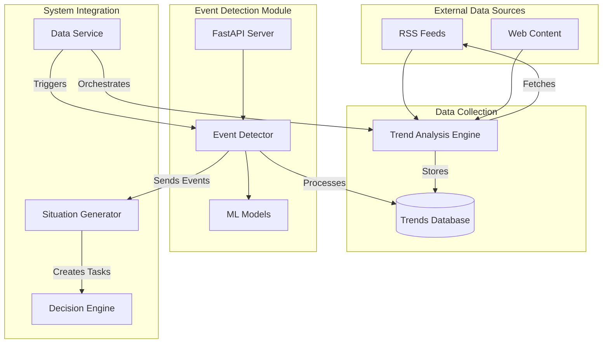
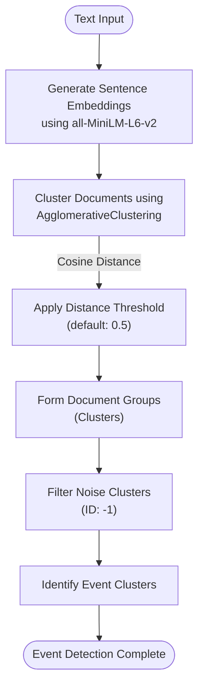
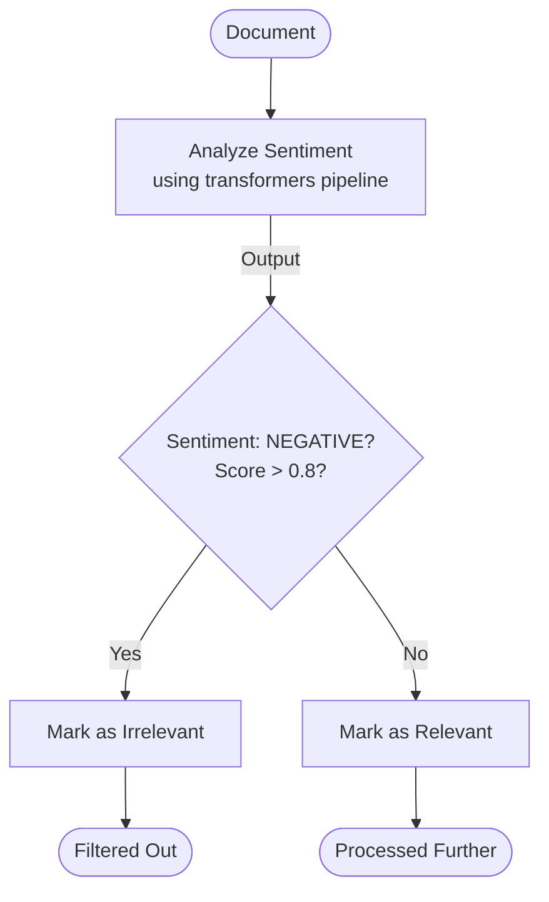
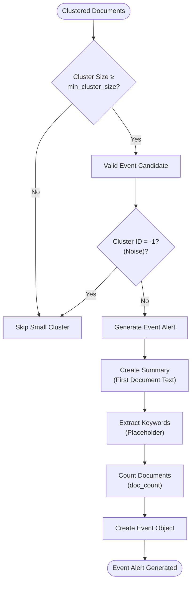
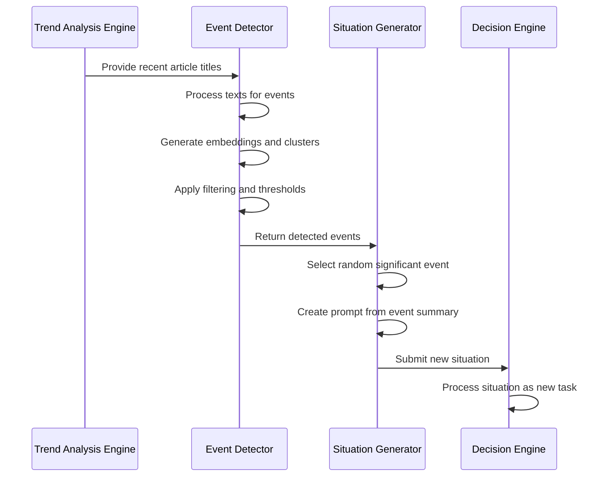

# Event Detection


## Table of Contents
1. [Introduction](#introduction)
2. [System Architecture and Integration](#system-architecture-and-integration)
3. [Event Detection Algorithms](#event-detection-algorithms)
4. [Data Processing Pipeline](#data-processing-pipeline)
5. [Configuration and Tuning](#configuration-and-tuning)
6. [Usage Examples](#usage-examples)
7. [Accuracy Limitations](#accuracy-limitations)
8. [Troubleshooting Guide](#troubleshooting-guide)

## Introduction
The Event Detection module is a core component of the RAVANA AGI system, responsible for identifying significant events, trends, and anomalies from streams of external text data. It processes information from various sources, including RSS feeds and web content, to detect emerging topics and trigger appropriate system responses. The module employs machine learning techniques for topic clustering, sentiment analysis, and event alerting, serving as a critical input mechanism for the situation generator to create new tasks based on detected events.

The system operates by continuously monitoring external data sources, analyzing the content for relevance and significance, and generating structured event alerts when threshold conditions are met. These alerts are then used by other system components to initiate appropriate actions, such as research tasks, reflections, or creative challenges, enabling the AGI to respond proactively to changing information landscapes.

## System Architecture and Integration



**Diagram sources**
- [trend_engine.py](file://modules/information_processing/trend_analysis/trend_engine.py#L1-L90)
- [event_detector.py](file://modules/event_detection/event_detector.py#L1-L188)
- [situation_generator.py](file://modules/situation_generator/situation_generator.py#L1-L873)
- [data_service.py](file://services/data_service.py#L1-L57)

**Section sources**
- [trend_engine.py](file://modules/information_processing/trend_analysis/trend_engine.py#L1-L90)
- [event_detector.py](file://modules/event_detection/event_detector.py#L1-L188)
- [situation_generator.py](file://modules/situation_generator/situation_generator.py#L1-L873)

## Event Detection Algorithms

### Topic Detection with Sentence Embeddings and Clustering
The core of the event detection system relies on sentence embeddings and clustering algorithms to identify related documents and group them into coherent events. The process begins with generating embeddings for input texts using the SentenceTransformer model 'all-MiniLM-L6-v2', which converts text into high-dimensional vector representations that capture semantic meaning.



**Diagram sources**
- [event_detector.py](file://modules/event_detection/event_detector.py#L57-L60)

The clustering algorithm uses Agglomerative Clustering with cosine distance as the metric and average linkage. This hierarchical clustering approach is particularly effective for event detection as it doesn't require specifying the number of clusters in advance and can identify natural groupings in the data. The distance threshold parameter (default: 0.5) controls the sensitivity of the clustering—lower values create more, tighter clusters, while higher values produce fewer, broader clusters.

### Content Filtering with Sentiment Analysis
Before clustering, the system applies content filtering based on sentiment analysis to remove irrelevant or low-quality data. This filtering step uses a pre-trained sentiment analysis pipeline from the transformers library to classify the sentiment of each document.



**Diagram sources**
- [event_detector.py](file://modules/event_detection/event_detector.py#L70-L77)

The filtering logic currently discards content classified as "NEGATIVE" with a confidence score above 0.8, though this threshold and criteria can be customized. This helps prevent the system from focusing on potentially toxic or unproductive content streams. Documents that pass the sentiment filter proceed to the embedding and clustering stages, while filtered documents are excluded from event detection but retained in the output for transparency.

### Event Alert Generation
The final stage of event detection involves generating alerts for significant clusters that meet predefined threshold conditions. The system evaluates each cluster based on its size and assigns alerts only to clusters that exceed the minimum size threshold.



**Diagram sources**
- [event_detector.py](file://modules/event_detection/event_detector.py#L78-L92)

The `generate_event_alerts` function processes clustered documents and creates Event objects for clusters that meet the criteria. By default, the minimum cluster size is set to 5 documents, meaning that only groups of 5 or more related documents will trigger an event alert. This threshold helps filter out minor topics and focus on more significant, widely discussed events. Each event includes a summary (currently the text of the first document in the cluster), keywords (currently an empty list, indicating a placeholder for future implementation), and a document count.

## Data Processing Pipeline

### Input Data Formats and Parsing Strategies
The event detection system accepts input as a list of text strings, typically representing headlines, article summaries, or social media posts. The primary input format is JSON through the API endpoint `/process/`, which expects a structure containing a "texts" array.

```json
{
  "texts": [
    "Massive solar flare expected to hit Earth tomorrow.",
    "New study shows coffee can improve memory.",
    "Scientists are amazed by the recent solar activity."
  ]
}
```

The system parses these texts by first creating Document objects that encapsulate the text content along with metadata, embeddings, cluster assignments, and sentiment analysis results. This object-oriented approach allows for rich data enrichment throughout the processing pipeline.

### Integration with Situation Generator
The detected events are integrated with the situation generator to create new tasks and challenges for the AGI system. When significant events are identified, the situation generator uses them as prompts for deeper analysis and response generation.



**Diagram sources**
- [trend_engine.py](file://modules/information_processing/trend_analysis/trend_engine.py#L1-L90)
- [situation_generator.py](file://modules/situation_generator/situation_generator.py#L109-L139)

The integration occurs through direct function calls between modules. The situation generator imports the `process_data_for_events` function from the event detector and uses it to analyze recent article titles from the trends database. When events are detected, the generator creates a new situation with a prompt based on the event summary, such as "Based on recent news, there's a trending topic about: {event['summary']}. Analyze this trend, its implications, and provide insights."

## Configuration and Tuning

### Source Whitelisting and Data Collection
The system's data sources are configured through the `FEED_URLS` parameter in the core configuration file. This whitelist defines which RSS feeds are monitored for new content.

:FEED_URLS
- "http://rss.cnn.com/rss/cnn_latest.rss"
- "https://feeds.bbci.co.uk/news/rss.xml"
- "https://www.reddit.com/r/worldnews/.rss"
- "https://techcrunch.com/feed/"
- "https://www.npr.org/rss/rss.php?id=1001"

These sources represent a diverse range of news outlets covering general news, technology, and world events. The trend analysis engine periodically fetches content from these whitelisted sources and stores article metadata in a local SQLite database.

### Event Categorization
Currently, the system does not implement explicit event categorization beyond the clustering process. Events are implicitly categorized by their content through the clustering algorithm, with related topics forming distinct clusters. Future enhancements could incorporate explicit categorization using techniques such as:

- **TF-IDF analysis** to identify dominant keywords in each cluster
- **Zero-shot classification** with large language models to assign category labels
- **Hierarchical clustering** to create a taxonomy of event types

The Event class structure includes a keywords field that is intended to support categorization, though it is currently implemented as an empty list in the code.

### Sensitivity Tuning Parameters
The event detection system provides several configurable parameters that control its sensitivity and behavior:

:min_cluster_size
- **Default value**: 5
- **Location**: `event_detector.py` line 78
- **Purpose**: Minimum number of documents required to form an event cluster
- **Effect**: Higher values reduce false positives but may miss emerging trends; lower values increase sensitivity but risk detecting noise

:distance_threshold
- **Default value**: 0.5
- **Location**: `event_detector.py` line 57
- **Purpose**: Controls the tightness of document clustering
- **Effect**: Lower values create more, tighter clusters (higher precision, lower recall); higher values create fewer, broader clusters (lower precision, higher recall)

:EVENT_DETECTION_INTERVAL
- **Default value**: 600 seconds (10 minutes)
- **Location**: `core/config.py` line 33
- **Purpose**: Frequency of event detection cycles
- **Effect**: More frequent intervals enable faster response to breaking news but increase computational load

:EMBEDDING_MODEL
- **Default value**: "all-MiniLM-L6-v2"
- **Location**: `core/config.py` line 29
- **Purpose**: Specifies the sentence transformer model for generating text embeddings
- **Effect**: Different models offer trade-offs between speed, accuracy, and resource requirements

## Usage Examples

### Detecting Breaking News
To detect breaking news about a developing situation, such as a natural disaster or political event, the system would process a stream of news headlines:

```bash
curl -X POST "http://127.0.0.1:8001/process/" -H "Content-Type: application/json" -d '{
  "texts": [
    "Earthquake of magnitude 7.2 strikes near Tokyo",
    "Japan issues tsunami warning after major quake",
    "Tokyo subway system suspended following earthquake",
    "Prime Minister to address nation about earthquake response",
    "Stock markets in Asia drop after earthquake news"
  ]
}'
```

The system would generate embeddings for these texts, cluster them based on semantic similarity, and likely identify them as a single significant event due to their related content. With five documents in the cluster (meeting the minimum threshold), an event alert would be generated with a summary like "Earthquake of magnitude 7.2 strikes near Tokyo" and a document count of 5.

### Identifying Scientific Discoveries
For scientific breakthroughs, the system can detect emerging research trends from academic news and science journalism:

```python
sample_data = [
    "CRISPR gene editing successfully treats sickle cell disease in clinical trial",
    "New gene therapy shows promise for treating inherited blood disorders",
    "Scientists report breakthrough in genetic treatment of hemoglobinopathies",
    "FDA considers accelerated approval for new gene editing therapy",
    "Gene editing trial results published in New England Journal of Medicine"
]
results = process_data_for_events(sample_data)
```

These related articles about gene therapy would likely cluster together, triggering an event alert that the situation generator could use to create a task like: "Based on recent news, there's a trending topic about: CRISPR gene editing successfully treats sickle cell disease in clinical trial. Analyze this trend, its implications for medical ethics, and potential future applications."

### Monitoring Market Shifts
The system can also detect significant economic or market changes by monitoring financial news:

```python
market_news = [
    "Federal Reserve announces 0.75% interest rate hike",
    "Stock markets plunge after aggressive rate hike announcement",
    "Cryptocurrency values drop sharply following Fed decision",
    "Economists warn of potential recession after rate increases",
    "Housing market slows as mortgage rates reach 7% threshold"
]
events = process_data_for_events(market_news)
```

These interconnected financial reports would form a cluster around monetary policy changes, generating an event that could prompt the AGI to analyze economic trends, predict market movements, or explore the implications of inflation control measures.

## Accuracy Limitations

### Noisy Data Challenges
The system faces significant challenges from noisy data in real-world information streams. RSS feeds and web content often contain irrelevant articles, clickbait headlines, and duplicate content that can interfere with accurate event detection. The current sentiment-based filtering provides only basic noise reduction, primarily targeting overtly negative content.

The clustering algorithm may group unrelated but semantically similar documents, such as multiple articles about different sports teams winning championships. Without more sophisticated topic modeling or entity recognition, the system cannot distinguish between these distinct events, potentially creating false event clusters.

### False Positives and Negatives
The system is susceptible to both false positives and false negatives due to its current implementation:

**False positives** occur when:
- The distance threshold is too high, causing unrelated topics to cluster together
- The minimum cluster size is too low, allowing minor topics to trigger alerts
- Headlines use similar phrasing for different events (e.g., "Study shows X improves Y" for unrelated studies)

**False negatives** occur when:
- The distance threshold is too low, preventing related documents from clustering
- Breaking news has not yet accumulated enough coverage to meet the minimum cluster size
- Important events are reported with diverse terminology that doesn't create strong semantic similarity

### Delays in Feed Updates
The system's responsiveness is limited by the update frequency of external data sources and the internal processing interval. With an `EVENT_DETECTION_INTERVAL` of 600 seconds (10 minutes), there can be significant delays between when an event occurs and when it is detected by the system.

Additionally, RSS feeds themselves may have delays in publishing breaking news, and some sources update less frequently than others. This creates a latency in the system's awareness of emerging events, potentially causing it to miss the initial phase of fast-developing situations.

## Troubleshooting Guide

### Connectivity Issues
When the system fails to connect to RSS feeds or external data sources, check the following:

1. **Network connectivity**: Ensure the system has internet access
2. **Feed URL validity**: Verify that the URLs in `FEED_URLS` are correct and accessible
3. **Firewall restrictions**: Check if corporate or system firewalls are blocking connections
4. **Rate limiting**: Some RSS providers may throttle requests from automated systems

The trend analysis engine uses feedparser to fetch RSS content, and connection errors are typically handled by the underlying library. Monitoring the system logs for feedparser-related error messages can help diagnose connectivity problems.

### Parser Failures
Parser failures can occur when RSS feeds have malformed XML or unexpected structures. To troubleshoot:

1. **Check feed validity**: Use online RSS validators to verify the feed structure
2. **Examine error logs**: Look for feedparser exceptions in the system logs
3. **Test individual feeds**: Isolate problematic feeds by testing them separately
4. **Implement retry logic**: The system should have mechanisms to retry failed feed fetches

The `fetch_feeds` function in `trend_engine.py` processes each feed URL sequentially, so a failure in one feed does not necessarily prevent others from being processed. However, persistent failures may indicate broader issues with feed parsing or network connectivity.

### Overload Scenarios
During periods of high-volume events, such as major news breaks or global incidents, the system may experience performance issues:

**Symptoms of overload include:**
- Increased processing time for event detection
- High memory usage from loading ML models
- API timeouts or slow responses
- Database performance degradation

**Mitigation strategies:**
1. **Scale resources**: Increase available CPU, memory, and database capacity
2. **Optimize intervals**: Adjust `EVENT_DETECTION_INTERVAL` during high-traffic periods
3. **Implement queuing**: Use message queues to handle bursts of incoming data
4. **Cache results**: Cache recent event detection results to reduce redundant processing
5. **Load shedding**: Prioritize processing for certain data sources or topics

The system's current architecture processes events synchronously, which can create bottlenecks during high-volume periods. Future enhancements could include asynchronous processing, distributed computing, or stream processing frameworks to improve scalability.

**Section sources**
- [event_detector.py](file://modules/event_detection/event_detector.py#L1-L188)
- [main.py](file://modules/event_detection/main.py#L1-L58)
- [trend_engine.py](file://modules/information_processing/trend_analysis/trend_engine.py#L1-L90)
- [situation_generator.py](file://modules/situation_generator/situation_generator.py#L1-L873)
- [config.py](file://core/config.py#L1-L42)
- [data_service.py](file://services/data_service.py#L1-L57)

**Referenced Files in This Document**   
- [event_detector.py](file://modules/event_detection/event_detector.py#L1-L188)
- [main.py](file://modules/event_detection/main.py#L1-L58)
- [trend_engine.py](file://modules/information_processing/trend_analysis/trend_engine.py#L1-L90)
- [situation_generator.py](file://modules/situation_generator/situation_generator.py#L1-L873)
- [config.py](file://core/config.py#L1-L42)
- [data_service.py](file://services/data_service.py#L1-L57)