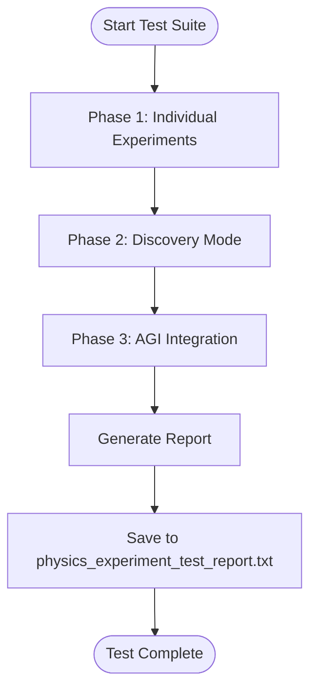

# Physics Experimentation


## Table of Contents
1. [Introduction](#introduction)
2. [Project Structure and Key Components](#project-structure-and-key-components)
3. [Hypothesis Formulation and LLM Integration](#hypothesis-formulation-and-llm-integration)
4. [Experiment Execution via physics_cli.py](#experiment-execution-via-physics_clipy)
5. [Test Framework and Validation in run_physics_tests.py](#test-framework-and-validation-in-run_physics_testspy)
6. [Configuration Options for Simulations](#configuration-options-for-simulations)
7. [Running Experiments: Single and Batch Modes](#running-experiments-single-and-batch-modes)
8. [Common Issues and Troubleshooting](#common-issues-and-troubleshooting)
9. [Performance Optimization Tips](#performance-optimization-tips)
10. [Conclusion](#conclusion)

## Introduction

The AGI Physics Experimentation System enables autonomous scientific research by formulating hypotheses, running simulations, and validating results. This system integrates large language models (LLMs) with physics-based simulations to explore both established and novel physical phenomena. The framework supports structured experimentation through predefined prompts and discovery mode for innovative hypothesis generation. Experiments are executed safely in sandboxed environments, with results interpreted, validated, and stored in the AGI’s knowledge base.

This document details the architecture, workflow, configuration, and usage patterns of the physics experimentation module. It covers how hypotheses are generated using LLMs, how experiments are executed via the command-line interface, and how outcomes are validated through a comprehensive test suite.

**Section sources**
- [PHYSICS_EXPERIMENTS.md](file://PHYSICS_EXPERIMENTS.md#L1-L170)

## Project Structure and Key Components

The physics experimentation module is organized around several core files that define its functionality:

- **physics_cli.py**: Command-line interface for launching experiments.
- **run_physics_tests.py**: Test runner for validating experiment execution.
- **physics_experiment_prompts.py**: Contains structured prompts for hypothesis generation.
- **core/llm.py**: Implements the `agi_experimentation_engine`, which orchestrates experiment execution.
- **tests/test_physics_experiments.py**: Comprehensive test suite for physics experiments.
- **core/config.py**: Configuration parameters affecting simulation behavior.

The system follows a modular design where the CLI delegates execution to the main AGI system (`main.py`), which uses the `agi_experimentation_engine` to process experiment ideas, generate code, execute simulations, and validate results.


**Diagram sources**
- [physics_cli.py](file://physics_cli.py#L1-L140)
- [core/llm.py](file://core/llm.py#L583-L767)

**Section sources**
- [physics_cli.py](file://physics_cli.py#L1-L140)
- [run_physics_tests.py](file://run_physics_tests.py#L1-L89)
- [core/llm.py](file://core/llm.py#L583-L767)

## Hypothesis Formulation and LLM Integration

Hypotheses are formulated using structured prompts defined in `physics_experiment_prompts.py`. These prompts guide the LLM to generate scientifically valid experiment designs based on physics principles.

### Physics Experiment Prompts Structure

Each prompt includes:
- **name**: Human-readable experiment title
- **prompt**: Detailed instruction for the LLM
- **expected_concepts**: Key physics concepts to be used
- **difficulty**: Complexity level (intermediate, advanced, expert)

Example:
```python
{
    "name": "Quantum Tunneling Barrier Analysis",
    "prompt": "Design an experiment to simulate quantum tunneling through a potential barrier...",
    "expected_concepts": ["wave function", "Schrödinger equation", "transmission coefficient"],
    "difficulty": "advanced"
}
```

The `agi_experimentation_engine` in `core/llm.py` processes these prompts through a multi-step reasoning pipeline:

1. **Idea Refinement**: Clarifies ambiguous experiment concepts.
2. **Simulation Type Classification**: Determines if the experiment can be simulated in Python.
3. **Code Generation**: Produces executable Python code using NumPy, Matplotlib, or SciPy.
4. **Dependency Management**: Installs missing packages automatically.
5. **Sandboxed Execution**: Runs code safely with timeout protection.
6. **Result Interpretation**: Analyzes output scientifically.
7. **Online Validation**: Cross-checks findings with real-world knowledge.
8. **Final Verdict**: Provides success/failure assessment.


**Diagram sources**
- [physics_experiment_prompts.py](file://physics_experiment_prompts.py#L1-L108)
- [core/llm.py](file://core/llm.py#L583-L767)

**Section sources**
- [physics_experiment_prompts.py](file://physics_experiment_prompts.py#L1-L108)
- [core/llm.py](file://core/llm.py#L583-L767)

## Experiment Execution via physics_cli.py

The `physics_cli.py` script provides a user-friendly interface for running physics experiments. It supports four main commands:

| Command | Description |
|--------|-------------|
| `list` | Displays all available experiments grouped by difficulty |
| `run <experiment_name>` | Executes a specific experiment |
| `discovery` | Runs discovery mode with random novel physics questions |
| `test` | Launches the comprehensive test suite |

When an experiment is run, the CLI invokes `main.py` with appropriate flags:
```bash
python physics_cli.py run "Quantum Tunneling"
# Translates to:
python main.py --physics-experiment "Quantum Tunneling"
```

The execution flow involves:
1. Parsing command-line arguments
2. Loading experiment prompts
3. Invoking the AGI system via `os.system`
4. Streaming output to the user

For discovery mode, one of ten predefined speculative prompts (e.g., "Could there be a fifth fundamental force?") is selected randomly to stimulate innovative thinking.

**Section sources**
- [physics_cli.py](file://physics_cli.py#L1-L140)

## Test Framework and Validation in run_physics_tests.py

The `run_physics_tests.py` script serves as the primary test runner for validating physics experiments. It supports multiple execution modes:

- **Full suite**: Runs comprehensive tests
- **Single**: Quick test of one experiment
- **Discovery**: Tests discovery mode only
- **Specific experiment**: Targeted testing by name

The test framework uses `PhysicsExperimentTester` from `test_physics_experiments.py` to evaluate experiments across three phases:

1. **Individual Experiment Testing**: Runs one experiment per difficulty level
2. **Discovery Mode Testing**: Evaluates creativity and plausibility of novel ideas
3. **AGI Integration Testing**: Verifies end-to-end system functionality

Each test produces a structured result containing:
- Execution success/failure status
- Scientific validity assessment
- Creativity and plausibility scores
- Execution time metrics
- Error details (if any)

After testing, a comprehensive report is generated with statistics on success rates by difficulty level and detailed logs of each experiment.



**Diagram sources**
- [run_physics_tests.py](file://run_physics_tests.py#L1-L89)
- [tests/test_physics_experiments.py](file://tests/test_physics_experiments.py#L1-L375)

**Section sources**
- [run_physics_tests.py](file://run_physics_tests.py#L1-L89)
- [tests/test_physics_experiments.py](file://tests/test_physics_experiments.py#L1-L375)

## Configuration Options for Simulations

The system provides several configuration options that control simulation behavior, precision, and safety:

### Core Configuration Parameters

**[core/config.py](file://core/config.py)**
- `MAX_EXPERIMENT_LOOPS`: Maximum number of steps in an experiment loop (default: 10)
- `RESEARCH_TASK_TIMEOUT`: Maximum duration for research tasks (default: 600 seconds)

### Sandbox Execution Settings

- `sandbox_timeout`: Execution timeout in seconds
  - Default: 10 seconds (`core/llm.py`)
  - Testing: 15–30 seconds depending on complexity
- Timeout prevents infinite loops and ensures system responsiveness

### Precision and Divergence Handling

While explicit numerical precision thresholds are not configured, the system handles divergence through:
- **Code validation**: Generated code is checked for stability
- **Execution monitoring**: Runtime errors trigger graceful recovery
- **Result interpretation**: Unstable outputs are flagged during analysis

These settings ensure that computationally intensive simulations do not compromise system stability while allowing sufficient time for complex calculations.

**Section sources**
- [core/config.py](file://core/config.py#L1-L42)
- [core/llm.py](file://core/llm.py#L588)
- [tests/simple_physics_test.py](file://tests/simple_physics_test.py#L51)

## Running Experiments: Single and Batch Modes

### Single Experiment Mode

To run a single experiment:
```bash
python physics_cli.py run "Quantum Tunneling Barrier Analysis"
```

This triggers:
1. Prompt refinement by LLM
2. Python code generation with physics formulas
3. Dependency installation (if needed)
4. Sandboxed execution
5. Result visualization and interpretation
6. Knowledge base integration

### Batch Discovery Mode

For exploratory research:
```bash
python physics_cli.py discovery
```

This randomly selects from speculative prompts like:
- "Could consciousness affect quantum systems?"
- "Is time quantized at fundamental scales?"

Discovery mode evaluates:
- **Creativity Score**: Based on use of innovative terminology
- **Scientific Plausibility**: Presence of theoretical grounding
- **Feasibility**: Potential for real-world validation

### Programmatic Access

Experiments can also be run programmatically:
```python
from core.llm import agi_experimentation_engine

result = agi_experimentation_engine(
    experiment_idea="Simulate quantum tunneling",
    use_chain_of_thought=True,
    online_validation=True
)
```

**Section sources**
- [physics_cli.py](file://physics_cli.py#L1-L140)
- [PHYSICS_EXPERIMENTS.md](file://PHYSICS_EXPERIMENTS.md#L1-L170)

## Common Issues and Troubleshooting

### Numerical Instability

**Symptoms**: Runtime warnings, overflow errors, non-convergent results  
**Solutions**:
- Scale variables to appropriate magnitudes
- Use logarithmic transformations for exponential ranges
- Implement adaptive step sizes in simulations

### Incorrect Assumptions

**Symptoms**: Physically implausible results, violation of conservation laws  
**Prevention**:
- Enable `online_validation=True` for real-world fact-checking
- Review `expected_concepts` in prompts to ensure proper physics foundation
- Manually verify initial conditions and boundary constraints

### LLM Hallucination in Hypothesis Formulation

**Symptoms**: Invented physical laws, incorrect formulas, non-existent constants  
**Mitigation Strategies**:
- Use chain-of-thought reasoning (`use_chain_of_thought=True`)
- Cross-validate with online sources (`online_validation=True`)
- Limit scope to well-defined physics domains
- Review generated code before execution

### Failed Experiment Execution

**Troubleshooting Steps**:
1. Check sandbox timeout settings
2. Verify required dependencies are installed
3. Inspect generated code for syntax errors
4. Review LLM refinement steps for misinterpretation
5. Examine execution logs in `physics_experiments.log`

**Section sources**
- [core/llm.py](file://core/llm.py#L583-L767)
- [tests/test_physics_experiments.py](file://tests/test_physics_experiments.py#L1-L375)

## Performance Optimization Tips

For computationally intensive simulations:

### Code-Level Optimizations
- Use NumPy vectorization instead of Python loops
- Pre-allocate arrays for large datasets
- Leverage SciPy’s optimized solvers for differential equations
- Cache intermediate results when possible

### System Configuration
- Increase `sandbox_timeout` for complex calculations
- Run experiments during off-peak system usage
- Use high-performance computing environments when available

### Resource Management
- Monitor memory usage during long simulations
- Break large problems into smaller, sequential experiments
- Use approximate methods for preliminary exploration before high-precision runs

### Parallel Execution
While not currently implemented, future enhancements could include:
- Running multiple experiments concurrently
- Distributing calculations across cores
- Using GPU acceleration for numerical computations

**Section sources**
- [core/llm.py](file://core/llm.py#L583-L767)
- [tests/test_physics_experiments.py](file://tests/test_physics_experiments.py#L1-L375)

## Conclusion

The AGI Physics Experimentation System provides a robust framework for autonomous scientific inquiry. By integrating LLM-driven hypothesis generation with safe code execution and rigorous validation, it enables both structured experimentation and creative discovery. The system’s modular architecture, comprehensive testing framework, and configurable parameters make it suitable for exploring a wide range of physical phenomena—from quantum mechanics to general relativity.

Key strengths include:
- Seamless CLI interface for easy access
- Multi-layer reasoning with online validation
- Automatic dependency management
- Structured knowledge integration
- Comprehensive test coverage

Future enhancements could expand real-world integration, enable peer review between AGI instances, and support automated publication of findings.

**Referenced Files in This Document**   
- [physics_cli.py](file://physics_cli.py)
- [run_physics_tests.py](file://run_physics_tests.py)
- [physics_experiment_prompts.py](file://physics_experiment_prompts.py)
- [PHYSICS_EXPERIMENTS.md](file://PHYSICS_EXPERIMENTS.md)
- [core/llm.py](file://core/llm.py)
- [tests/test_physics_experiments.py](file://tests/test_physics_experiments.py)
- [core/config.py](file://core/config.py)
- [modules/agi_experimentation_engine.py](file://modules/agi_experimentation_engine.py)
- [modules/experimentation_module.py](file://modules/experimentation_module.py)