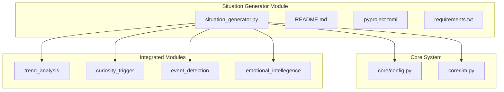
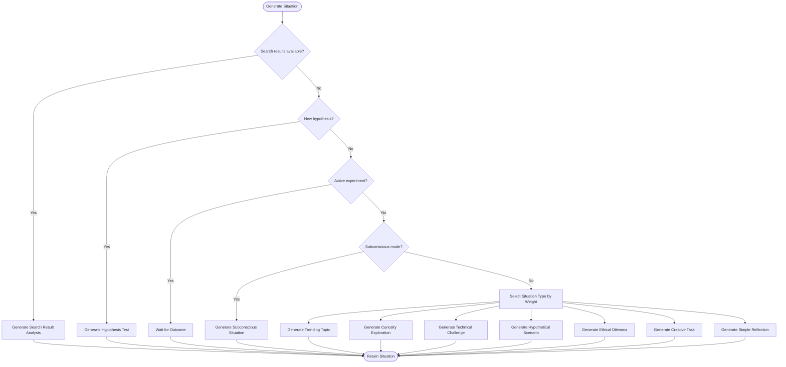
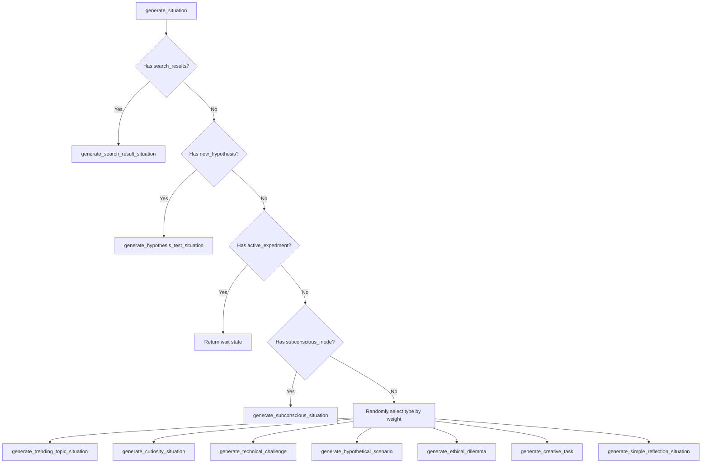
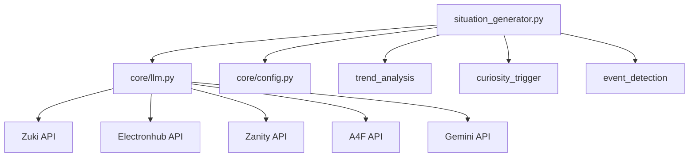

# Situation Generator


## Table of Contents
1. [Introduction](#introduction)
2. [Project Structure](#project-structure)
3. [Core Components](#core-components)
4. [Architecture Overview](#architecture-overview)
5. [Detailed Component Analysis](#detailed-component-analysis)
6. [Dependency Analysis](#dependency-analysis)
7. [Performance Considerations](#performance-considerations)
8. [Troubleshooting Guide](#troubleshooting-guide)
9. [Conclusion](#conclusion)

## Introduction
The Situation Generator is a core module within the Ravana AGI system designed to autonomously create diverse, challenging, and contextually relevant scenarios to stimulate the artificial general intelligence's problem-solving, learning, and self-reflection capabilities. It operates continuously without user input, leveraging internal state, external data, and modular integrations to generate tasks across multiple domains. This document provides a comprehensive analysis of its design, functionality, and integration mechanisms.

## Project Structure
The Situation Generator resides within the `modules/situation_generator/` directory of the Ravana repository. It is a self-contained module with its own configuration, dependencies, and test suite. The module interacts with several other components in the system, including trend analysis, curiosity triggers, event detection, and emotional intelligence, to gather context for situation generation.



**Diagram sources**
- [situation_generator.py](file://modules/situation_generator/situation_generator.py#L53-L834)
- [config.py](file://core/config.py#L0-L41)
- [trend_engine.py](file://modules/information_processing/trend_analysis/trend_engine.py#L0-L90)

## Core Components
The core of the Situation Generator is the `SituationGenerator` class, which encapsulates the logic for creating various types of challenges. It uses probabilistic selection to determine the type of situation to generate, with weights favoring more engaging tasks like curiosity exploration and trending topics. The generator can be influenced by behavior modifiers, which allow other modules to force specific types of situations, such as testing a new hypothesis or taking a break.

**Section sources**
- [situation_generator.py](file://modules/situation_generator/situation_generator.py#L53-L834)

## Architecture Overview
The Situation Generator operates as a central orchestrator, pulling data from various sources and using the LLM to synthesize novel scenarios. It follows a decision tree based on the current state of the AGI, including search results, active experiments, and behavior modifiers. If none of these conditions are met, it proceeds with a probabilistic selection of a situation type.



**Diagram sources**
- [situation_generator.py](file://modules/situation_generator/situation_generator.py#L751-L834)

## Detailed Component Analysis

### Situation Generation Logic
The `generate_situation` method is the main entry point. It first checks for high-priority conditions like search results or a new hypothesis before falling back to probabilistic selection. The weights for each situation type are defined in a dictionary, with curiosity exploration having the highest weight (0.3), followed by trending topics (0.2).



**Diagram sources**
- [situation_generator.py](file://modules/situation_generator/situation_generator.py#L751-L834)

### Generation Strategies
The Situation Generator employs several distinct strategies for creating scenarios:

#### Random Perturbation of Known Problems
The generator uses the LLM to create variations of known problem types. For example, the `generate_technical_challenge` method prompts the LLM to suggest a high-level challenge (e.g., "Optimize an inefficient algorithm") and then asks it to generate a detailed, specific problem based on that theme.

#### Adversarial Challenge Creation
Ethical dilemmas are generated to present nuanced problems with no obvious right answer. The `generate_ethical_dilemma` method instructs the LLM to create scenarios that present multiple valid perspectives, requiring careful ethical reasoning.

#### Simulation of Real-World Events
The generator uses the `trend_analysis` module to monitor RSS feeds from sources like CNN, BBC, and TechCrunch. It queries a local SQLite database (`trends.db`) for recent article titles and uses an event detection system to identify emerging trends or events, which are then used as the basis for a situation.

```python
# Example from situation_generator.py
c.execute('SELECT title FROM articles ORDER BY timestamp DESC LIMIT 20')
articles = [row[0] for row in c.fetchall()]
events_data = process_data_for_events(articles, embedding_model=self.embedding_model)
```

**Section sources**
- [situation_generator.py](file://modules/situation_generator/situation_generator.py#L109-L139)
- [trend_engine.py](file://modules/information_processing/trend_analysis/trend_engine.py#L0-L90)

### Scoring and Validation
While explicit scoring functions for difficulty, novelty, and educational value are not implemented, the generator uses implicit mechanisms. The probabilistic selection weights favor more engaging and novel tasks. The use of external data (trends, curiosity topics) ensures contextual relevance. Solvability is ensured by using the LLM to generate the scenarios, which inherently creates problems within its own knowledge domain.

### Integration with the Decision Engine
The generated situations are structured as prompts with a type and context, which are then fed into the Decision Engine. The Decision Engine uses these prompts to formulate plans and execute actions. The `generate_situation` method returns a dictionary with a `type` and `prompt`, which the Decision Engine can interpret and act upon.

### Example Scenarios
- **Physics-based puzzle**: "Design a system to generate renewable energy using only materials found on a deserted island."
- **Social dilemma**: "A self-driving car must choose between saving its passenger or a group of pedestrians. How should it decide, and what factors should influence its decision?"
- **Abstract reasoning challenge**: "If all A are B, and some B are C, can we conclude that some A are C? Explain your reasoning."

### Configuration Options
The generator is configured through the core `config.py` file and environment variables. Key configuration options include:
- **Domain focus**: The `FEED_URLS` list in `config.py` defines the sources for trending topics, allowing focus on technology, news, or other domains.
- **Complexity levels**: While not directly configurable, complexity is influenced by the LLM's mood and recent memories, which are used as context for generating challenges.
- **Safety constraints**: The generator has a fallback mechanism that defaults to a simple reflection if any error occurs during the generation of a more complex situation.

```python
# From core/config.py
FEED_URLS = [
    "http://rss.cnn.com/rss/cnn_latest.rss",
    "https://feeds.bbci.co.uk/news/rss.xml",
    "https://www.reddit.com/r/worldnews/.rss",
    "https://techcrunch.com/feed/",
    "https://www.npr.org/rss/rss.php?id=1001",
]
```

**Section sources**
- [config.py](file://core/config.py#L0-L41)

### Validation Mechanisms
The generator includes several validation mechanisms:
- **Database checks**: Before querying for articles, it verifies that the `articles` table exists in `trends.db`.
- **Error handling**: Each generation method is wrapped in a try-except block, with a fallback to a simpler situation type if an error occurs.
- **State validation**: It checks for an active experiment and pauses generation if one is in progress, preventing conflicting tasks.

### Extensibility
The generator can be extended by adding new situation types. This involves:
1. Adding a new key to the `weights` dictionary in `generate_situation`.
2. Implementing a new `generate_*` method (e.g., `generate_domain_specific_challenge`).
3. Adding the new type to the `situation_types` list in the `__init__` method.

## Dependency Analysis
The Situation Generator has a well-defined set of dependencies, primarily on other modules and core system components. It uses the LLM via the `call_llm` function in `core/llm.py`, which provides a unified interface to multiple LLM providers (Zuki, Electronhub, Zanity, A4F, and Gemini as a fallback).



**Diagram sources**
- [situation_generator.py](file://modules/situation_generator/situation_generator.py#L53-L834)
- [llm.py](file://core/llm.py#L296-L313)

## Performance Considerations
The generator is designed for asynchronous operation, using `asyncio` to handle non-blocking calls to the LLM and other services. The use of probabilistic selection and fallback mechanisms ensures that the system remains responsive even if external services are slow or unavailable. The local SQLite database for trend analysis provides fast access to recent articles without requiring real-time web requests.

## Troubleshooting Guide
Common issues and their solutions:
- **No trending topics generated**: Verify that the `trends.db` file exists and contains the `articles` table. Check that the RSS feeds in `FEED_URLS` are accessible.
- **LLM calls failing**: The `call_llm` function in `core/llm.py` has a fallback mechanism to Gemini. If all providers fail, check the API keys in `core/config.json`.
- **Subconscious generation not triggering**: The subconscious mode is triggered either by a behavior modifier or with a 5% probability. Ensure the `behavior_modifiers` parameter is set correctly.

**Section sources**
- [situation_generator.py](file://modules/situation_generator/situation_generator.py#L751-L834)
- [llm.py](file://core/llm.py#L296-L313)
- [test_subconscious_generator.py](file://tests/test_subconscious_generator.py#L0-L34)

## Conclusion
The Situation Generator is a sophisticated component that plays a crucial role in the autonomous operation of the Ravana AGI system. By continuously generating diverse and challenging scenarios, it drives the AGI's learning and self-improvement processes. Its modular design, robust error handling, and integration with other system components make it a reliable and extensible foundation for autonomous AI operation.

**Referenced Files in This Document**   
- [situation_generator.py](file://modules/situation_generator/situation_generator.py#L53-L834)
- [README.md](file://modules/situation_generator/README.md#L0-L39)
- [config.py](file://core/config.py#L0-L41)
- [llm.py](file://core/llm.py#L296-L313)
- [trend_engine.py](file://modules/information_processing/trend_analysis/trend_engine.py#L0-L90)
- [test_subconscious_generator.py](file://tests/test_subconscious_generator.py#L0-L34)