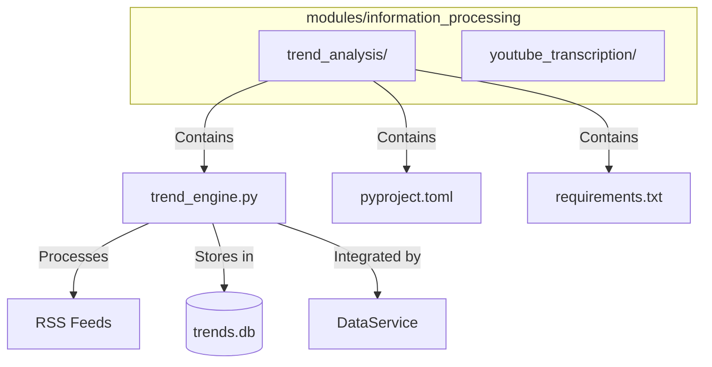
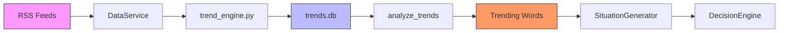
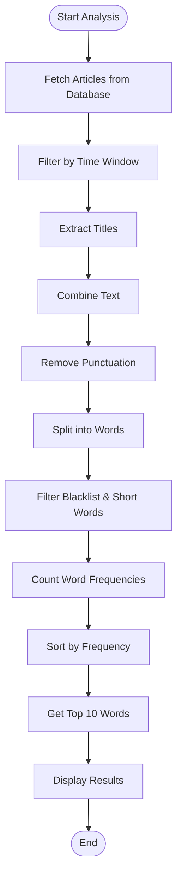
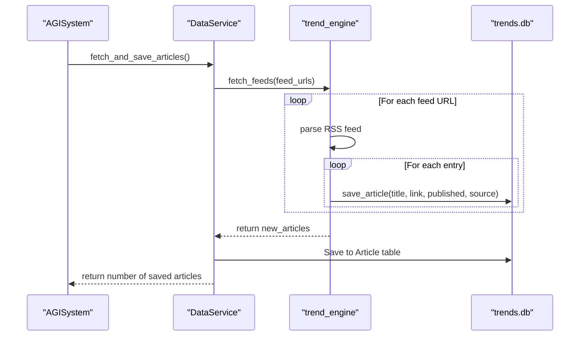
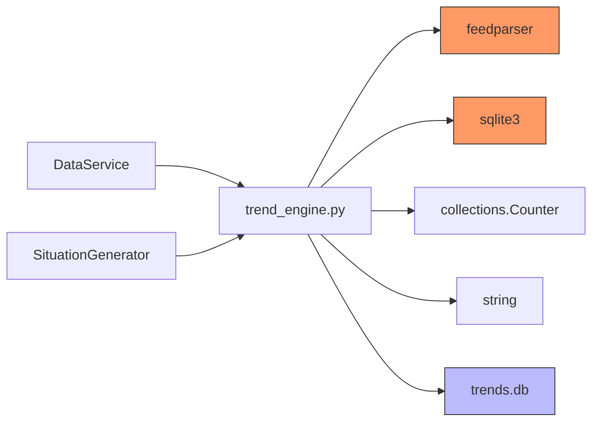

# Trend Analysis

## Table of Contents
1. [Introduction](#introduction)
2. [Project Structure](#project-structure)
3. [Core Components](#core-components)
4. [Architecture Overview](#architecture-overview)
5. [Detailed Component Analysis](#detailed-component-analysis)
6. [Dependency Analysis](#dependency-analysis)
7. [Performance Considerations](#performance-considerations)
8. [Troubleshooting Guide](#troubleshooting-guide)
9. [Conclusion](#conclusion)

## Introduction
The Trend Analysis module is a core component of the RAVANA system, responsible for identifying emerging patterns, long-term shifts, and statistical anomalies in temporal data. It processes large volumes of information from RSS feeds to detect trending topics through keyword frequency analysis. The module integrates with other system components to provide situational awareness and trigger higher-level cognitive processes. This document provides a comprehensive analysis of the trend_engine.py implementation, covering its algorithms, configuration, integration points, limitations, and optimization strategies.

## Project Structure
The trend analysis functionality is located within the information_processing module, specifically in the trend_analysis subdirectory. This modular structure separates data ingestion, processing, and analysis concerns from other system components.

**Diagram sources**
- [trend_engine.py](file://modules/information_processing/trend_analysis/trend_engine.py)
- [data_service.py](file://services/data_service.py)

**Section sources**
- [trend_engine.py](file://modules/information_processing/trend_analysis/trend_engine.py)
- [data_service.py](file://services/data_service.py)

## Core Components
The core functionality of the trend analysis module is implemented in trend_engine.py, which provides four main functions: database setup, article saving, feed fetching, and trend analysis. The module uses SQLite for local data storage and feedparser for RSS feed processing. The DataService class integrates this functionality into the broader system, enabling centralized data management and cross-module coordination.

**Section sources**
- [trend_engine.py](file://modules/information_processing/trend_analysis/trend_engine.py#L1-L90)
- [data_service.py](file://services/data_service.py#L1-L27)

## Architecture Overview
The trend analysis system follows a data pipeline architecture, where information flows from external sources through ingestion, storage, processing, and finally to analysis and consumption by other system components.

**Diagram sources**
- [trend_engine.py](file://modules/information_processing/trend_analysis/trend_engine.py)
- [data_service.py](file://services/data_service.py)
- [situation_generator.py](file://modules/situation_generator/situation_generator.py)

## Detailed Component Analysis
The trend analysis module implements a straightforward but effective approach to identifying trending topics by analyzing the frequency of words in recently published articles from configured RSS feeds.

### Trend Engine Analysis
The trend_engine.py module implements a time-series analysis system that identifies emerging patterns through word frequency counting. The system processes temporal data by collecting article titles over time and analyzing their content for recurring terms.

#### Algorithm Implementation

**Diagram sources**
- [trend_engine.py](file://modules/information_processing/trend_analysis/trend_engine.py#L45-L90)

**Section sources**
- [trend_engine.py](file://modules/information_processing/trend_analysis/trend_engine.py#L45-L90)

### Data Ingestion Integration
The trend analysis module integrates with the data service to ingest articles from various sources. The DataService class provides a clean interface for fetching and saving articles, abstracting the underlying implementation details of the trend engine.

#### Data Flow Sequence

**Diagram sources**
- [data_service.py](file://services/data_service.py#L1-L27)
- [trend_engine.py](file://modules/information_processing/trend_analysis/trend_engine.py)

**Section sources**
- [data_service.py](file://services/data_service.py#L1-L27)
- [trend_engine.py](file://modules/information_processing/trend_analysis/trend_engine.py)

### Configuration Options
The trend analysis module supports several configuration options that control its behavior, including time windows for analysis, data sources, and processing parameters. These are primarily configured through environment variables and configuration files.

#### Configuration Parameters
- **Time Window**: Controlled by the `last_hours` parameter in `analyze_trends()` function, defaulting to 24 hours
- **Data Sources**: RSS feed URLs configured in `Config.FEED_URLS` in core/config.py
- **Processing Parameters**: Word filtering through blacklist and minimum length (3 characters)
- **Update Frequency**: Main loop sleeps for 900 seconds (15 minutes) between iterations

The system uses a configuration-driven approach where feed URLs are defined in the Config class and injected into components that need them, promoting flexibility and ease of modification without code changes.

**Section sources**
- [config.py](file://core/config.py#L1-L31)
- [trend_engine.py](file://modules/information_processing/trend_analysis/trend_engine.py#L45-L90)
- [situation_generator.py](file://modules/situation_generator/situation_generator.py#L76-L113)

### Practical Examples
The trend analysis module can be used to detect various types of trends across different domains:

#### Technological Trends
By monitoring technology-focused RSS feeds (e.g., TechCrunch), the system can identify emerging technologies by tracking the frequency of terms like "AI", "blockchain", or "quantum computing". A sudden spike in mentions of "generative AI" would indicate growing interest in this technology area.

#### Behavioral Shifts
Monitoring news and social media feeds allows the system to detect changes in public sentiment or behavior. For example, increased mentions of "remote work", "hybrid office", or "work-life balance" could indicate evolving workplace norms.

#### Physics Anomalies
Though not currently implemented, the system could be adapted to detect anomalies in experimental physics data by treating measurement results as "articles" and looking for unusual patterns or frequently occurring anomalous values that deviate from expected results.

**Section sources**
- [trend_engine.py](file://modules/information_processing/trend_analysis/trend_engine.py)
- [config.py](file://core/config.py#L1-L31)

### Limitations
The current implementation of the trend analysis module has several limitations that affect its effectiveness and reliability:

#### Data Quality Issues
The system relies on article titles from RSS feeds, which may be sensationalized or misleading. This can lead to inaccurate trend detection based on clickbait headlines rather than substantive content. Additionally, the lack of article content analysis limits the depth of understanding.

#### Lag in Trend Recognition
The system has inherent latency due to its polling mechanism (15-minute intervals) and the 24-hour analysis window. This means emerging trends may not be detected until they are already well-established, reducing the system's ability to identify truly nascent developments.

#### Over-interpretation of Noise
The simple frequency-based approach can elevate random fluctuations to the status of "trends". Without statistical significance testing, the system may report minor variations in word frequency as important trends, leading to false positives and over-interpretation of noise.

**Section sources**
- [trend_engine.py](file://modules/information_processing/trend_analysis/trend_engine.py)
- [situation_generator.py](file://modules/situation_generator/situation_generator.py#L109-L139)

## Dependency Analysis
The trend analysis module depends on several external libraries and internal system components to function properly.

**Diagram sources**
- [trend_engine.py](file://modules/information_processing/trend_analysis/trend_engine.py)
- [data_service.py](file://services/data_service.py)

**Section sources**
- [trend_engine.py](file://modules/information_processing/trend_analysis/trend_engine.py)
- [data_service.py](file://services/data_service.py)

## Performance Considerations
The current implementation has several performance characteristics and potential bottlenecks:

### Memory Usage
The system loads all relevant article titles into memory for analysis, which could lead to memory bloat with high-frequency data streams or long analysis windows. The use of Counter for word frequency tracking is efficient but could become problematic with very large datasets.

### Processing Efficiency
The text processing pipeline involves multiple steps (punctuation removal, splitting, filtering) that are applied to all text data. For high-volume data streams, this could create processing bottlenecks. The current 15-minute sleep interval suggests the system was designed with these limitations in mind.

### Optimization Recommendations
To handle high-frequency data streams more efficiently:
1. Implement incremental processing rather than batch analysis
2. Use streaming text processing to reduce memory footprint
3. Apply database-level filtering and aggregation when possible
4. Consider using more efficient data structures for frequency counting
5. Implement caching mechanisms for recent analysis results
6. Add configurable sampling for very high-volume data sources

**Section sources**
- [trend_engine.py](file://modules/information_processing/trend_analysis/trend_engine.py)
- [core/system.py](file://core/system.py#L124)

## Troubleshooting Guide
Common issues with the trend analysis module and their solutions:

### Stalled Analysis
If trend analysis appears to be stalled:
1. Check that the main loop in trend_engine.py is running and not blocked
2. Verify that the feeds.txt file exists and contains valid RSS URLs
3. Ensure the trends.db database file is writable and not locked by another process
4. Check system logs for any error messages related to feed parsing or database operations

### Memory Bloat
If memory usage grows excessively:
1. Reduce the analysis time window using the last_hours parameter
2. Implement periodic cleanup of old articles from the database
3. Process articles in smaller batches rather than loading all at once
4. Monitor for memory leaks in the feedparser library or database connections

### Incorrect Trend Classifications
If the system reports irrelevant or inaccurate trends:
1. Review and update the word blacklist to filter out common but irrelevant terms
2. Consider implementing TF-IDF (Term Frequency-Inverse Document Frequency) weighting to reduce the impact of overly common words
3. Validate the quality of RSS feed sources and consider adding more reliable sources
4. Implement sentiment analysis to distinguish between positive and negative mentions of trending terms

**Section sources**
- [trend_engine.py](file://modules/information_processing/trend_analysis/trend_engine.py)
- [situation_generator.py](file://modules/situation_generator/situation_generator.py#L109-L139)

## Conclusion
The trend analysis module provides a foundational capability for identifying emerging patterns in temporal data through a straightforward frequency-based approach. While effective for basic trend detection, the system has limitations in terms of latency, noise sensitivity, and analytical depth. Future improvements could include more sophisticated statistical analysis, sentiment detection, and correlation identification between different trending terms. The modular design allows for incremental enhancements without disrupting the overall system architecture.

**Referenced Files in This Document**   
- [trend_engine.py](file://modules/information_processing/trend_analysis/trend_engine.py)
- [data_service.py](file://services/data_service.py)
- [config.py](file://core/config.py)
- [event_detector.py](file://modules/event_detection/event_detector.py)
- [situation_generator.py](file://modules/situation_generator/situation_generator.py)