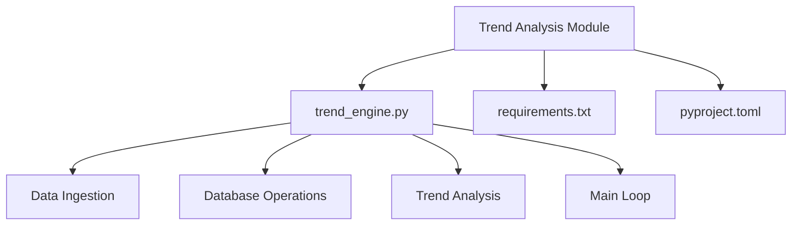
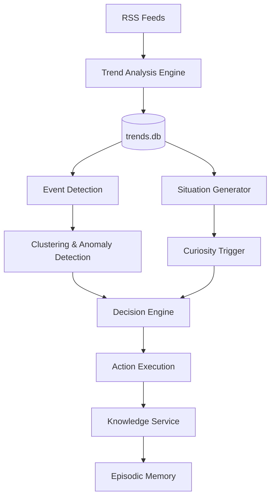
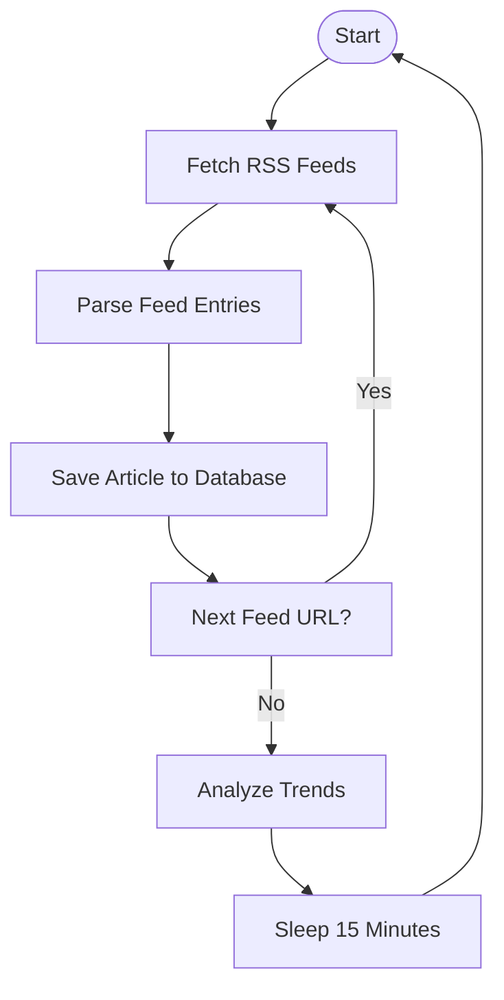
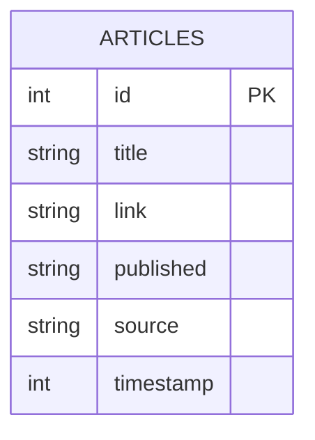
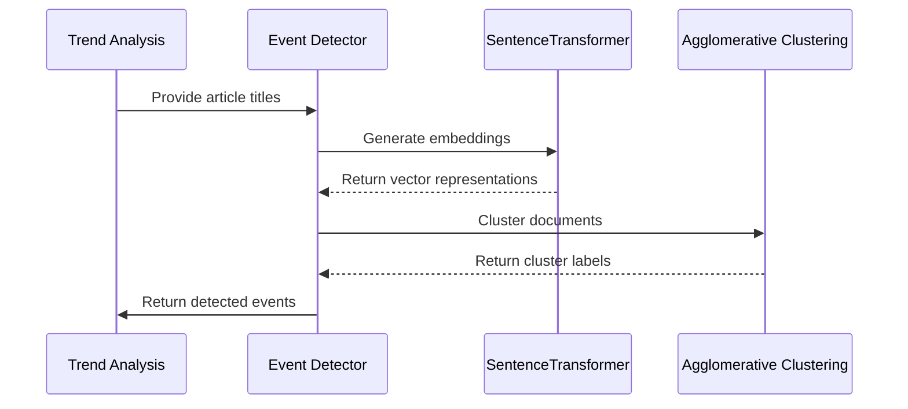
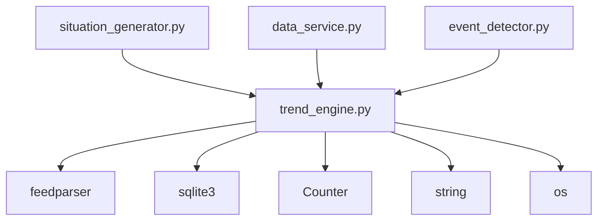

# Trend Analysis

## Table of Contents
1. [Introduction](#introduction)
2. [Project Structure](#project-structure)
3. [Core Components](#core-components)
4. [Architecture Overview](#architecture-overview)
5. [Detailed Component Analysis](#detailed-component-analysis)
6. [Dependency Analysis](#dependency-analysis)
7. [Performance Considerations](#performance-considerations)
8. [Troubleshooting Guide](#troubleshooting-guide)
9. [Conclusion](#conclusion)

## Introduction
The Trend Analysis engine is a core component of the RAVANA AGI system, responsible for identifying emerging patterns and topics from external data streams such as news, research papers, and social media. This document provides a comprehensive analysis of the engine's architecture, data processing pipeline, integration points, and operational parameters. The system processes RSS feeds to detect trending topics, leverages vectorization and clustering techniques for deeper analysis, and integrates with other modules like Curiosity Trigger to initiate deep dives into high-potential trends. The documentation covers configuration options, data flow, and strategies for addressing challenges like noise filtering and source reliability.

## Project Structure
The Trend Analysis module is organized within the information_processing directory of the RAVANA repository. It follows a modular design with clear separation of concerns, where each component handles a specific aspect of the trend detection pipeline.

**Diagram sources**
- [trend_engine.py](file://modules/information_processing/trend_analysis/trend_engine.py#L1-L90)

**Section sources**
- [trend_engine.py](file://modules/information_processing/trend_analysis/trend_engine.py#L1-L90)

## Core Components
The Trend Analysis engine consists of several key components that work together to process external data and identify emerging trends. The core functionality is implemented in trend_engine.py, which handles data ingestion from RSS feeds, storage in a local SQLite database, and basic trend analysis through keyword frequency analysis.

The system uses a simple but effective approach to trend detection by analyzing article titles from configured RSS feeds. It stores articles in a local database and performs text analysis to identify the most frequently mentioned words, excluding common stop words. The engine runs in a continuous loop, periodically fetching new data and analyzing trends over a configurable time window.

**Section sources**
- [trend_engine.py](file://modules/information_processing/trend_analysis/trend_engine.py#L1-L90)
- [config.py](file://core/config.py#L1-L60)

## Architecture Overview
The Trend Analysis engine operates as part of a larger ecosystem within the RAVANA AGI system. It serves as a data source for higher-level cognitive functions, providing input for situation generation, event detection, and curiosity-driven exploration.

**Diagram sources**
- [trend_engine.py](file://modules/information_processing/trend_analysis/trend_engine.py#L1-L90)
- [situation_generator.py](file://modules/situation_generator/situation_generator.py#L1-L200)
- [event_detector.py](file://modules/event_detection/event_detector.py#L1-L188)

## Detailed Component Analysis

### Trend Engine Analysis
The trend_engine.py module implements the core functionality for data ingestion and basic trend analysis. It follows a straightforward pipeline from data collection to trend identification.

#### Data Ingestion Flow

**Diagram sources**
- [trend_engine.py](file://modules/information_processing/trend_analysis/trend_engine.py#L1-L90)

**Section sources**
- [trend_engine.py](file://modules/information_processing/trend_analysis/trend_engine.py#L1-L90)

### Database Schema
The Trend Analysis engine uses a SQLite database to store ingested articles. The schema is simple but effective for the use case, capturing essential metadata about each article.

**Diagram sources**
- [trend_engine.py](file://modules/information_processing/trend_analysis/trend_engine.py#L10-L25)

### Integration with Event Detection
The Trend Analysis engine integrates with the event_detection module to perform more sophisticated analysis using vectorization and clustering. This enables the system to identify meaningful events from the stream of articles.

**Diagram sources**
- [event_detector.py](file://modules/event_detection/event_detector.py#L1-L188)
- [trend_engine.py](file://modules/information_processing/trend_analysis/trend_engine.py#L1-L90)

**Section sources**
- [event_detector.py](file://modules/event_detection/event_detector.py#L1-L188)

## Dependency Analysis
The Trend Analysis engine has several dependencies that enable its functionality. These include both direct code dependencies and data flow dependencies with other modules in the system.

**Diagram sources**
- [trend_engine.py](file://modules/information_processing/trend_analysis/trend_engine.py#L1-L10)
- [situation_generator.py](file://modules/situation_generator/situation_generator.py#L1-L200)
- [data_service.py](file://services/data_service.py#L1-L27)

**Section sources**
- [trend_engine.py](file://modules/information_processing/trend_analysis/trend_engine.py#L1-L90)
- [situation_generator.py](file://modules/situation_generator/situation_generator.py#L1-L200)
- [data_service.py](file://services/data_service.py#L1-L155)

## Performance Considerations
The Trend Analysis engine is designed for simplicity and reliability rather than high performance. It uses a synchronous design with periodic polling, which is adequate for the use case but has some limitations.

The engine fetches data every 15 minutes, which provides a good balance between freshness and resource usage. The use of SQLite as a local database ensures reliable storage without the complexity of external dependencies. However, the current implementation processes all articles in memory, which could become a bottleneck with high data volumes.

The integration with the event_detection module leverages the SentenceTransformer model for vectorization, which is computationally intensive but necessary for meaningful clustering. The system uses caching and lazy loading to minimize the performance impact of model loading.

## Troubleshooting Guide
When troubleshooting issues with the Trend Analysis engine, consider the following common problems and solutions:

**Section sources**
- [trend_engine.py](file://modules/information_processing/trend_analysis/trend_engine.py#L1-L90)
- [situation_generator.py](file://modules/situation_generator/situation_generator.py#L1-L200)
- [data_service.py](file://services/data_service.py#L1-L155)

### Common Issues
- **Missing feeds.txt file**: The engine expects a feeds.txt file in the module directory containing the RSS feed URLs. If this file is missing, the engine will fail to start.
- **Database connection issues**: Ensure that the application has write permissions to the directory where trends.db is stored.
- **Network connectivity problems**: The engine relies on external RSS feeds, so network issues can prevent data ingestion.
- **Memory usage**: With a large number of articles, the in-memory processing in analyze_trends() could consume significant memory.

### Debugging Steps
1. Check that the feeds.txt file exists and contains valid RSS feed URLs
2. Verify that the application has write permissions for the trends.db file
3. Monitor the console output for error messages during feed fetching
4. Check network connectivity to the configured RSS feed sources
5. Review the SQLite database directly to confirm articles are being stored correctly

## Conclusion
The Trend Analysis engine provides a solid foundation for detecting emerging topics from external data sources. Its simple design makes it reliable and easy to maintain, while its integration with other modules enables sophisticated cognitive functions. The engine effectively bridges the gap between raw data ingestion and higher-level analysis, serving as a crucial input source for the AGI system's decision-making processes. Future enhancements could include more sophisticated trend scoring, source reliability weighting, and real-time processing capabilities.

**Referenced Files in This Document**   
- [trend_engine.py](file://modules/information_processing/trend_analysis/trend_engine.py)
- [config.py](file://core/config.py)
- [data_service.py](file://services/data_service.py)
- [situation_generator.py](file://modules/situation_generator/situation_generator.py)
- [event_detector.py](file://modules/event_detection/event_detector.py)
- [curiosity_trigger.py](file://modules/curiosity_trigger/curiosity_trigger.py)