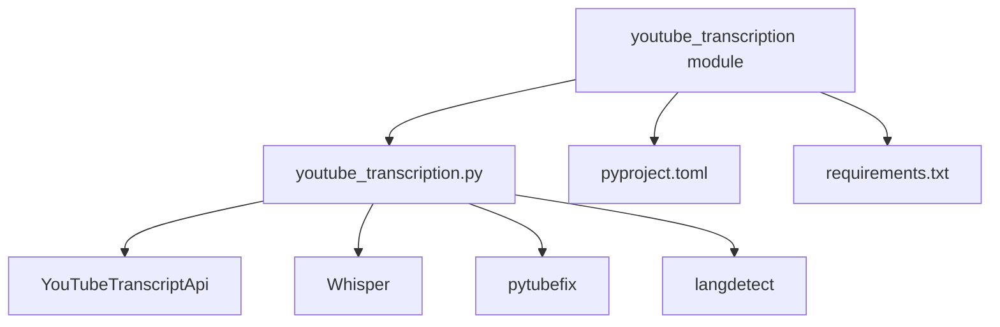
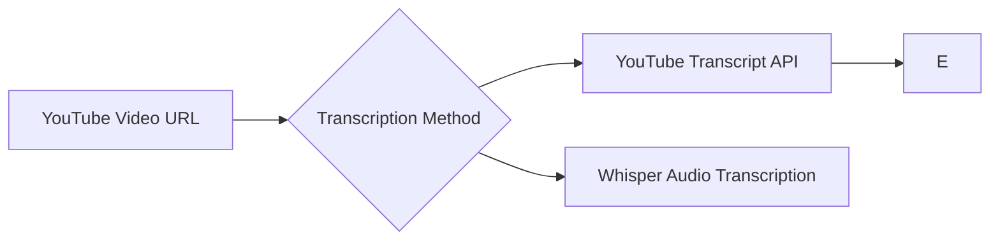

# YouTube Transcription

## Table of Contents
1. [Introduction](#introduction)
2. [Project Structure](#project-structure)
3. [Core Components](#core-components)
4. [Architecture Overview](#architecture-overview)
5. [Detailed Component Analysis](#detailed-component-analysis)
6. [Dependency Analysis](#dependency-analysis)
7. [Performance Considerations](#performance-considerations)
8. [Troubleshooting Guide](#troubleshooting-guide)
9. [Conclusion](#conclusion)

## Introduction
The YouTube Transcription module enables the conversion of spoken content from YouTube videos into textual format for downstream processing. It supports both direct transcript retrieval via the YouTube Transcript API and audio-to-text fallback using Whisper when transcripts are unavailable. The transcribed text is then processed through language detection, stored, and integrated with the knowledge service for semantic indexing and long-term retention. This document details the implementation, configuration, integration points, usage patterns, and limitations of the system.

## Project Structure
The YouTube transcription functionality resides within the `modules/information_processing/youtube_transcription` directory. It follows a modular design with clear separation between transcription logic, dependency management, and external service integration.

**Diagram sources**
- [youtube_transcription.py](file://modules/information_processing/youtube_transcription/youtube_transcription.py)
- [pyproject.toml](file://modules/information_processing/youtube_transcription/pyproject.toml)

**Section sources**
- [youtube_transcription.py](file://modules/information_processing/youtube_transcription/youtube_transcription.py#L1-L60)
- [pyproject.toml](file://modules/information_processing/youtube_transcription/pyproject.toml#L1-L15)

## Core Components
The core functionality of the YouTube transcription system is implemented in `youtube_transcription.py`. It provides a primary function `transcribe_youtube_video(url)` that orchestrates the entire process: downloading audio, transcribing speech, detecting language, and returning structured text output. The module uses multiple third-party libraries to support different transcription methods and fallbacks.

**Section sources**
- [youtube_transcription.py](file://modules/information_processing/youtube_transcription/youtube_transcription.py#L1-L60)

## Architecture Overview
The YouTube transcription system integrates with the broader RAVANA architecture through a pipeline that includes transcription, language processing, knowledge compression, and semantic indexing. Transcribed content flows from the transcription module into the knowledge service via the compression layer, enabling persistent storage and searchability.

**Referenced Files in This Document**   
- [youtube_transcription.py](file://modules/information_processing/youtube_transcription/youtube_transcription.py)
- [pyproject.toml](file://modules/information_processing/youtube_transcription/pyproject.toml)
- [requirements.txt](file://modules/information_processing/youtube_transcription/requirements.txt)
- [knowledge_service.py](file://services/knowledge_service.py)
- [main.py](file://modules/knowledge_compression/main.py)
- [compression_prompts.py](file://modules/knowledge_compression/compression_prompts.py)
- [llm.py](file://core/llm.py)
- [config.json](file://core/config.json)
- [database/models.py](file://database/models.py)
